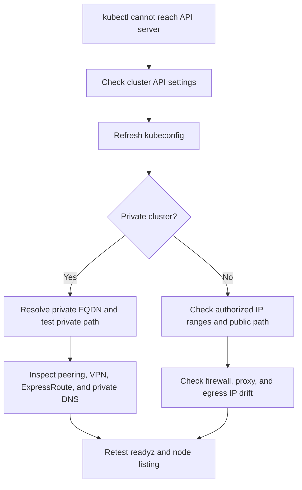

---
content_sources:
  diagrams:
    - id: troubleshooting-networking-api-server-unreachable
      type: flowchart
      source: self-generated
      justification: Diagnostic flow synthesized from Microsoft Learn guidance for private clusters, API server VNet Integration, authorized IP ranges, and restricted egress.
      based_on:
        - https://learn.microsoft.com/en-us/azure/aks/private-clusters
        - https://learn.microsoft.com/en-us/azure/aks/api-server-vnet-integration
        - https://learn.microsoft.com/en-us/azure/aks/api-server-authorized-ip-ranges
        - https://learn.microsoft.com/en-us/azure/aks/limit-egress-traffic
content_validation:
  status: verified
  last_reviewed: 2026-07-18
  reviewer: agent
  core_claims:
    - claim: "An AKS private cluster uses a private IP address for the API server endpoint."
      source: https://learn.microsoft.com/en-us/azure/aks/private-clusters
      verified: true
    - claim: "Private clusters require network connectivity from the client environment to the private API endpoint through options such as VNet connectivity, peering, VPN, or ExpressRoute."
      source: https://learn.microsoft.com/en-us/azure/aks/private-clusters
      verified: true
    - claim: "AKS supports API server authorized IP ranges to limit which public IP addresses can access the API server."
      source: https://learn.microsoft.com/en-us/azure/aks/api-server-authorized-ip-ranges
      verified: true
    - claim: "API Server VNet Integration enables API-server-to-node communication through a delegated subnet."
      source: https://learn.microsoft.com/en-us/azure/aks/api-server-vnet-integration
      verified: true
---

# API Server / kubectl Unreachable

## Symptom

`kubectl` commands time out, fail TLS handshakes, or return unreachable-host errors even though the cluster still appears provisioned in Azure.

## Possible Causes

- Wrong or stale kubeconfig endpoint.
- Valid RBAC but blocked network path to the API server.
- Private DNS does not resolve the private API FQDN from the operator network.
- Missing or broken private endpoint, peering, VPN, or ExpressRoute path.
- Authorized IP ranges no longer include the operator egress IP.
- Firewall, UDR, or proxy blocks API traffic.

## Diagnosis Steps

<!-- diagram-id: troubleshooting-networking-api-server-unreachable -->


1. Confirm the cluster API exposure model and the FQDN currently published by AKS.

    ```bash
    az aks show \
        --resource-group "$RG" \
        --name "$CLUSTER_NAME" \
        --query "{fqdn:fqdn,privateFqdn:privateFqdn,apiServerAccessProfile:apiServerAccessProfile,enablePrivateCluster:apiServerAccessProfile.enablePrivateCluster}" \
        --output yaml
    ```

    | Command | Purpose |
    | --- | --- |
    | `az aks show` | Show the API server FQDN and access profile. |
    | `--resource-group` | Resource group that contains the AKS cluster. |
    | `--name` | Name of the AKS cluster. |
    | `--query` | Selects FQDN, private FQDN, and API server access profile. |
    | `--output` | Output format for the result. |

2. Re-download kubeconfig to eliminate a stale endpoint hypothesis.

    ```bash
    az aks get-credentials \
        --resource-group "$RG" \
        --name "$CLUSTER_NAME" \
        --overwrite-existing
    ```

    | Command | Purpose |
    | --- | --- |
    | `az aks get-credentials` | Merge cluster credentials into the local kubeconfig. |
    | `--resource-group` | Resource group that contains the AKS cluster. |
    | `--name` | Name of the AKS cluster. |
    | `--overwrite-existing` | Overwrite any existing kubeconfig entry for the cluster. |

3. Test whether the client can reach the API server at all.

    ```bash
    kubectl cluster-info
    kubectl get --raw=/readyz
    kubectl get nodes --request-timeout=10s
    ```

4. For private clusters, verify private DNS resolution from the operator environment.

    ```bash
    nslookup <private-api-fqdn>
    az network private-dns zone list \
        --resource-group "$RG" \
        --output table
    az network vnet peering list \
        --resource-group "$RG" \
        --vnet-name "$VNET_NAME" \
        --output table
    ```

    | Command | Purpose |
    | --- | --- |
    | `nslookup` | Resolve the private API server FQDN. |
    | `az network private-dns zone list` | List private DNS zones in the resource group. |
    | `--resource-group` | Resource group that contains the private DNS zones. |
    | `--output` | Output format for the result. |
    | `az network vnet peering list` | List virtual network peerings. |
    | `--resource-group` | Resource group that contains the virtual network. |
    | `--vnet-name` | Name of the virtual network. |
    | `--output` | Output format for the result. |

5. For public endpoints, compare the operator egress IP with the authorized IP range configuration and inspect any firewall, proxy, or UDR path in front of the API traffic.

## Resolution

- Re-download kubeconfig if the local endpoint or certificate data is stale.
- Fix private DNS zone links, forwarding rules, or resolver paths for the private API FQDN.
- Connect from a network that actually reaches the private endpoint through VNet, peering, VPN, or ExpressRoute.
- Update authorized IP ranges when operator egress IPs change.
- Correct firewall, UDR, or proxy rules that block TCP 443 to the API endpoint.
- Document and test a break-glass operator path from a known-good reachable network.

## Prevention

- Treat operator API access as a supported platform path with named owners.
- Include private DNS resolution checks in private-cluster runbooks.
- Review authorized IP ranges whenever outbound internet or VPN egress changes.
- Avoid assuming API Server VNet Integration removes the need to validate operator connectivity.

## See Also

- [Private Cluster API Connectivity](../../../best-practices/private-cluster-api-connectivity.md)
- [Outbound Networking](../../../platform/outbound-networking.md)
- [Webhook / Control-Plane Calls Blocked](webhook-control-plane-blocked.md)

## Sources

- [Create a private Azure Kubernetes Service cluster](https://learn.microsoft.com/en-us/azure/aks/private-clusters)
- [Secure access to the API server using authorized IP address ranges in AKS](https://learn.microsoft.com/en-us/azure/aks/api-server-authorized-ip-ranges)
- [API Server VNet Integration in AKS](https://learn.microsoft.com/en-us/azure/aks/api-server-vnet-integration)
- [Use a network isolated cluster in AKS](https://learn.microsoft.com/en-us/azure/aks/limit-egress-traffic)
