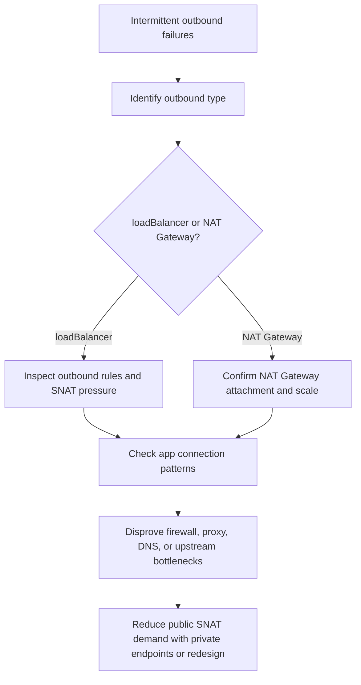

---
content_sources:
  diagrams:
    - id: troubleshooting-networking-snat-exhaustion
      type: flowchart
      source: self-generated
      justification: Diagnostic flow synthesized from Microsoft Learn guidance for AKS outbound types, NAT Gateway, and outbound dependency requirements.
      based_on:
        - https://learn.microsoft.com/en-us/azure/aks/egress-outboundtype
        - https://learn.microsoft.com/en-us/azure/aks/nat-gateway
        - https://learn.microsoft.com/en-us/azure/aks/outbound-rules-control-egress
content_validation:
  status: verified
  last_reviewed: 2026-07-18
  reviewer: agent
  core_claims:
    - claim: "The loadBalancer outbound type uses an AKS-managed Standard Load Balancer for egress."
      source: https://learn.microsoft.com/en-us/azure/aks/egress-outboundtype
      verified: true
    - claim: "AKS can use Azure NAT Gateway for egress with the managedNATGateway and userAssignedNATGateway outbound types."
      source: https://learn.microsoft.com/en-us/azure/aks/nat-gateway
      verified: true
    - claim: "Restricted-egress AKS clusters must allow the required outbound network rules and FQDNs for cluster dependencies."
      source: https://learn.microsoft.com/en-us/azure/aks/outbound-rules-control-egress
      verified: true
---

# SNAT Port Exhaustion

## Symptom

Outbound calls fail intermittently, image pulls or external API calls time out under load, and retries succeed later without a clear application change.

## Possible Causes

- SNAT ports are exhausted on Standard Load Balancer outbound rules.
- NAT Gateway is undersized or attached to the wrong subnet.
- Applications create excessive short-lived outbound connections.
- Egress firewall or NVA is the real bottleneck rather than AKS SNAT.
- DNS, proxy, or upstream throttling is being misread as SNAT exhaustion.
- Missing private endpoints force unnecessary public SNAT use.

## Diagnosis Steps

This playbook covers SNAT concepts, symptoms, evidence collection, and mitigation decisions. The [Ingress and Networking Metrics](../../../reference/metrics/ingress-networking-metrics.md) reference remains authoritative for SNAT metric definitions and tables, including `snatConnectionsCount`, `allocatedSnatPorts`, `usedSnatPorts`, and SNAT capacity notes — consult it there instead of duplicating those tables here.

<!-- diagram-id: troubleshooting-networking-snat-exhaustion -->


1. Identify the outbound configuration the cluster is actually using.

    ```bash
    az aks show \
        --resource-group "$RG" \
        --name "$CLUSTER_NAME" \
        --query "{outboundType:networkProfile.outboundType,loadBalancerProfile:networkProfile.loadBalancerProfile,natGatewayProfile:networkProfile.natGatewayProfile}" \
        --output yaml
    ```

2. Collect cluster events and workload-side symptoms from the same time window.

    ```bash
    kubectl get events --all-namespaces --sort-by=.lastTimestamp
    kubectl logs <pod-name> --namespace <namespace> --since=30m
    ```

3. If `loadBalancer` is in use, inspect the outbound rule configuration.

    ```bash
    az network lb outbound-rule list \
        --resource-group "$NODE_RG" \
        --lb-name "$LOAD_BALANCER_NAME" \
        --output table
    ```

4. If NAT Gateway is in use, confirm the expected gateway and subnet attachment.

    ```bash
    az network nat gateway show \
        --resource-group "$RG" \
        --name "$NAT_GATEWAY_NAME" \
        --output json
    ```

5. Pull the relevant Azure Monitor metrics for the suspected egress resource and compare them with the metric reference page instead of recreating local metric tables.

    ```bash
    az monitor metrics list \
        --resource "$RESOURCE_ID" \
        --metric "SnatConnectionCount" \
        --interval PT5M
    ```

## Resolution

- Move from `loadBalancer` to NAT Gateway when SNAT scale needs are consistently above Standard Load Balancer comfort levels.
- Add outbound IP capacity where the chosen egress design supports it.
- Reduce short-lived outbound connections with client-side pooling and keep-alives.
- Use private endpoints to reduce avoidable public SNAT demand.
- If UDR sends egress through a firewall or NVA, scale and monitor that device as the true bottleneck.

## Prevention

- Choose the outbound type based on expected concurrency, not only initial simplicity.
- Review connection pooling behavior during workload onboarding.
- Keep SNAT metrics and incident runbooks aligned with the shared metrics reference.
- Prefer private endpoints for heavy platform dependencies when restricted-egress design allows them.

## See Also

- [Outbound Networking](../../../platform/outbound-networking.md)
- [Ingress and Networking Metrics](../../../reference/metrics/ingress-networking-metrics.md)
- [Image Pull Fails in Restricted Egress](image-pull-restricted-egress.md)

## Sources

- [Customize cluster egress with outbound types in AKS](https://learn.microsoft.com/en-us/azure/aks/egress-outboundtype)
- [Use a managed or user-assigned NAT gateway in AKS](https://learn.microsoft.com/en-us/azure/aks/nat-gateway)
- [Control egress traffic for cluster nodes in AKS](https://learn.microsoft.com/en-us/azure/aks/outbound-rules-control-egress)
