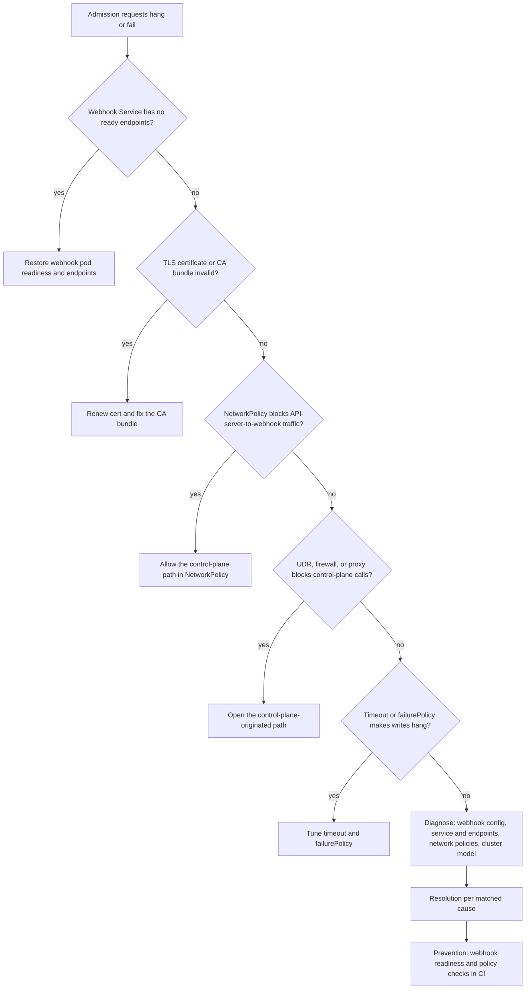

---
content_sources:
  diagrams:
    - id: pb-webhook-control-plane-blocked-flow
      type: flowchart
      source: mslearn-adapted
      mslearn_url: https://learn.microsoft.com/en-us/azure/aks/private-clusters
content_validation:
  status: verified
  last_reviewed: 2026-07-18
  reviewer: agent
  core_claims:
    - claim: "An AKS private cluster uses a private IP address for the API server endpoint."
      source: https://learn.microsoft.com/en-us/azure/aks/private-clusters
      verified: true
    - claim: "API Server VNet Integration enables API-server-to-node communication through a delegated subnet."
      source: https://learn.microsoft.com/en-us/azure/aks/api-server-vnet-integration
      verified: true
    - claim: "Restricted-egress AKS designs still require deliberate outbound dependency handling and do not eliminate control-plane path design work."
      source: https://learn.microsoft.com/en-us/azure/aks/limit-egress-traffic
      verified: true
---

# Webhook / Control-Plane Calls Blocked

Hypothesis triage for control-plane-blocked webhooks:

<!-- diagram-id: pb-webhook-control-plane-blocked-flow -->


## Symptom

Admission requests hang or fail, deployments time out on create or update, or validating and mutating webhooks appear healthy from inside the cluster but fail when the control plane calls them.

## Possible Causes

- Webhook Service has no ready endpoints.
- Webhook TLS certificate or CA bundle is invalid, expired, or mismatched.
- NetworkPolicy blocks API-server-to-webhook traffic.
- Private cluster or API Server VNet Integration behavior is misunderstood.
- UDR, firewall, or proxy controls block control-plane-originated calls to in-cluster webhooks.
- Webhook timeout or `failurePolicy` makes API writes hang or fail broadly.

## Diagnosis Steps

1. Inspect the webhook configuration and timeout behavior.

    ```bash
    kubectl get validatingwebhookconfiguration,mutatingwebhookconfiguration
    kubectl describe validatingwebhookconfiguration <name>
    kubectl describe mutatingwebhookconfiguration <name>
    ```

2. Verify the backing Service and endpoint health.

    ```bash
    kubectl get service,endpoints,endpointslice --namespace <namespace>
    kubectl get pods --namespace <namespace> --output wide
    kubectl logs deployment/<webhook-deployment> --namespace <namespace>
    ```

3. Check whether NetworkPolicy might block the path.

    ```bash
    kubectl get networkpolicy --all-namespaces
    ```

4. Confirm the cluster control-plane networking model before making assumptions about the source path.

    ```bash
    az aks show \
        --resource-group "$RG" \
        --name "$CLUSTER_NAME" \
        --query "{enablePrivateCluster:apiServerAccessProfile.enablePrivateCluster,apiServerAccessProfile:apiServerAccessProfile,networkProfile:networkProfile}" \
        --output yaml
    ```

    | Command | Purpose |
    | --- | --- |
    | `az aks show` | Show the private cluster and API server access profile. |
    | `--resource-group` | Resource group that contains the AKS cluster. |
    | `--name` | Name of the AKS cluster. |
    | `--query` | Selects private cluster flag, access profile, and network profile. |
    | `--output` | Output format for the result. |

5. If the cluster uses UDR, firewall inspection, or a network-isolated path, inspect those controls for control-plane-to-webhook calls in addition to regular pod egress.

## Resolution

- Restore webhook readiness and ensure the Service has healthy endpoints.
- Fix certificate or CA bundle mismatches and rotate expired webhook TLS material.
- Add NetworkPolicy exceptions required for API-server-to-webhook traffic.
- Correct firewall or UDR assumptions when the control plane path is being blocked.
- Adjust `failurePolicy` only with platform approval and with clear blast-radius documentation.
- Keep webhook timeouts short enough to avoid broad control-plane stalls.

## Prevention

- Treat admission webhooks as part of the control-plane dependency chain, not just another app deployment.
- Test webhook reachability after private-cluster, VNet-integration, firewall, or UDR changes.
- Track certificate expiry and CA bundle rotation in routine operations.
- Document which webhook failures are fail-open versus fail-closed and why.

## See Also

- [API Server / kubectl Unreachable](api-server-kubectl-unreachable.md)
- [Private Cluster API Connectivity](../../../best-practices/private-cluster-api-connectivity.md)
- [Outbound Networking](../../../platform/outbound-networking.md)

## Sources

- [Create a private Azure Kubernetes Service cluster](https://learn.microsoft.com/en-us/azure/aks/private-clusters)
- [API Server VNet Integration in AKS](https://learn.microsoft.com/en-us/azure/aks/api-server-vnet-integration)
- [Use a network isolated cluster in AKS](https://learn.microsoft.com/en-us/azure/aks/limit-egress-traffic)
