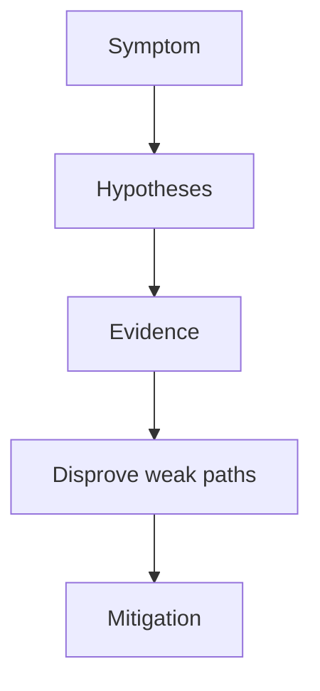

---
content_sources:
  diagrams:
  - id: troubleshooting-playbooks-node-issues-cni-ip-exhaustion
    type: flowchart
    source: self-generated
    justification: Diagnostic flow synthesized from Microsoft Learn troubleshooting
      guidance linked in this page.
    based_on:
    - https://learn.microsoft.com/en-us/troubleshoot/azure/azure-kubernetes/welcome-azure-kubernetes
    - https://learn.microsoft.com/en-us/troubleshoot/azure/azure-kubernetes/
content_validation:
  status: verified
  last_reviewed: 2026-07-18
  reviewer: agent
  core_claims:
    - claim: "CNI plug-ins in AKS are responsible for assigning IP addresses to pods, network routing between pods, and Kubernetes service routing."
      source: https://learn.microsoft.com/en-us/azure/aks/concepts-network-cni-overview
      verified: true
    - claim: "Overlay networking assigns pod IPs from a separate pod CIDR that is distinct from the node subnet in the virtual network."
      source: https://learn.microsoft.com/en-us/azure/aks/concepts-network-cni-overview
      verified: true
    - claim: "In a flat network model, pod IPs are assigned from the same Azure virtual network subnet as the AKS nodes."
      source: https://learn.microsoft.com/en-us/azure/aks/concepts-network-cni-overview
      verified: true
    - claim: "Traffic that leaves an overlay-based AKS cluster is SNAT'd to the node's IP address."
      source: https://learn.microsoft.com/en-us/azure/aks/concepts-network-cni-overview
      verified: true
---


# CNI IP Exhaustion

## 1. Summary

Pods fail to schedule or nodes fail to scale because the subnet or pod IP allocation model has run out of usable addresses.

<!-- diagram-id: troubleshooting-playbooks-node-issues-cni-ip-exhaustion -->


## 2. Common Misreadings

- The first visible symptom is the root cause.
- Restarting the pod proves the issue is fixed.
- If one namespace is affected, the cluster is healthy.

## 3. Competing Hypotheses

- H1: The node subnet has no free IPs.
- H2: Pod subnet or overlay configuration is undersized for growth.
- H3: Old nodes, NICs, or orphaned resources are still consuming addresses.
- H4: The symptom is actually quota-driven, not IP-driven.

## 4. What to Check First

```bash
kubectl describe pod <pod-name> -n <namespace>
az aks show --resource-group $RG --name $CLUSTER_NAME --query networkProfile --output yaml
az network vnet subnet show --resource-group <network-rg> --vnet-name <vnet-name> --name <subnet-name> --output yaml
```

| Command | Purpose |
| --- | --- |
| `kubectl describe pod` | Show pod details and scheduling events. |
| `az aks show` | Show the cluster network profile. |
| `--resource-group` | Resource group that contains the AKS cluster. |
| `--name` | Name of the AKS cluster. |
| `--query` | Selects the network profile. |
| `--output` | Output format for the result. |
| `az network vnet subnet show` | Show the subnet address plan. |
| `--resource-group` | Resource group that contains the virtual network. |
| `--vnet-name` | Name of the virtual network. |
| `--name` | Name of the subnet. |
| `--output` | Output format for the result. |

## 5. Evidence to Collect

- Scheduler and autoscaler events.
- Network profile and plugin mode.
- Subnet size and remaining addresses.
- VMSS or orphaned NIC state in the node resource group.

## 6. Validation and Disproof by Hypothesis

- If node provisioning fails with subnet allocation errors, IP exhaustion is stronger than workload mis-sizing.
- If capacity exists but quota blocks node creation, disprove H1-H3 and handle quota instead.
- If overlay is used, inspect the right address domain before resizing VNets unnecessarily.

## 7. Likely Root Cause Patterns

- Subnet sized for initial cluster only.
- Sudden scale spike with no headroom.
- Orphaned network artifacts after failed operations.
- Wrong assumption about overlay vs direct pod subnet addressing.

## 8. Immediate Mitigations

- Free unused resources and confirm actual IP usage.
- Expand or redesign subnets where supported.
- Lower growth pressure temporarily with workload controls.
- Review whether overlay mode is a better long-term fit.

## 9. Prevention

- Perform IP growth modeling during cluster design.
- Review subnet utilization as part of scaling readiness.
- Keep a clear standard for supported networking models.

## See Also

- [Networking Models](../../../platform/networking-models.md)
- [Scaling Failure](../operations/scaling-failure.md)
- [Networking](../../../best-practices/networking.md)

## Sources

- [Troubleshoot AKS clusters](https://learn.microsoft.com/troubleshoot/azure/azure-kubernetes/welcome-azure-kubernetes)
- [AKS troubleshooting articles](https://learn.microsoft.com/troubleshoot/azure/azure-kubernetes/)
