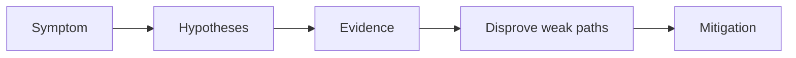

---
content_sources:
  diagrams:
  - id: troubleshooting-playbooks-node-issues-node-not-ready
    type: flowchart
    source: self-generated
    justification: Diagnostic flow synthesized from Microsoft Learn troubleshooting
      guidance linked in this page.
    based_on:
    - https://learn.microsoft.com/en-us/troubleshoot/azure/azure-kubernetes/welcome-azure-kubernetes
    - https://learn.microsoft.com/en-us/troubleshoot/azure/azure-kubernetes/
---


# Node Not Ready

## 1. Summary

A node marked `NotReady` is a cluster-capacity and reliability risk. The cause may be kubelet health, CNI problems, resource pressure, or Azure VM-level issues.

<!-- diagram-id: troubleshooting-playbooks-node-issues-node-not-ready -->


## 2. Common Misreadings

- The first visible symptom is the root cause.
- Restarting the pod proves the issue is fixed.
- If one namespace is affected, the cluster is healthy.

## 3. Competing Hypotheses

- H1: Kubelet or node services are unhealthy.
- H2: Disk, memory, or PID pressure caused readiness degradation.
- H3: CNI or DNS components on the node failed.
- H4: Underlying VM or network resource issues exist in Azure.

## 4. What to Check First

```bash
kubectl get nodes
kubectl describe node <node-name>
kubectl get pods -n kube-system -o wide
```

## 5. Evidence to Collect

- Node conditions and taints.
- Recent events tied to the node.
- kube-system pod health on the affected node.
- Azure VMSS instance or NIC status if the issue persists.

## 6. Validation and Disproof by Hypothesis

- If pressure conditions are present, resource exhaustion is more likely than API auth issues.
- If only one node in one pool is affected, compare it to healthy nodes in the same pool.
- If all nodes in a pool degrade together, inspect pool-wide image or network changes.

## 7. Likely Root Cause Patterns

- Resource pressure from runaway workloads.
- CNI/daemonset failure after upgrade.
- VMSS instance issues or subnet-level networking trouble.
- Node image drift or failed extension updates.

## 8. Immediate Mitigations

- Cordon and drain if the node is unstable.
- Scale the pool out if capacity is tight.
- Repair or replace the node if it does not recover quickly.
- Validate daemonset health after recovery.

## 9. Prevention

- Alert on node conditions before workloads are impacted.
- Keep daemonsets and node images current.
- Review pool isolation for noisy workloads.

## See Also

- [CNI IP Exhaustion](cni-ip-exhaustion.md)
- [Node Pool Operations](../../../operations/node-pool-operations.md)
- [Networking](../../../best-practices/networking.md)

## Sources

- [Troubleshoot AKS clusters](https://learn.microsoft.com/troubleshoot/azure/azure-kubernetes/welcome-azure-kubernetes)
- [AKS troubleshooting articles](https://learn.microsoft.com/troubleshoot/azure/azure-kubernetes/)
