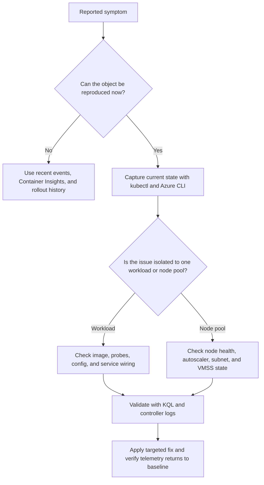

---
hide:
  - toc
content_sources:
  diagrams:
  - id: troubleshooting-playbooks-node-not-ready
    type: flowchart
    source: self-generated
    justification: Diagnostic flow synthesized from Microsoft Learn troubleshooting
      guidance linked in this page.
    based_on:
    - https://learn.microsoft.com/en-us/troubleshoot/azure/azure-kubernetes/welcome-azure-kubernetes
    - https://learn.microsoft.com/en-us/azure/aks/cluster-autoscaler
    - https://learn.microsoft.com/en-us/azure/azure-monitor/containers/container-insights-overview
    - https://learn.microsoft.com/en-us/azure/aks/concepts-network
---


# Node Not Ready

## 1. Summary

Use this playbook when one or more AKS nodes report `NotReady`, workloads are being evicted, or pods stop scheduling on a specific pool. The failure is usually a kubelet health issue, disk or memory pressure, CNI connectivity break, or an Azure infrastructure dependency problem visible through VMSS health and Container Insights.

**Typical incident window**: 10-20 minutes to establish whether the issue is workload-specific, node-specific, or cluster-wide.
**Time to resolution**: 30 minutes to several hours depending on whether the fix is manifest-level, node-level, or Azure control-plane level.

### Symptoms

- `kubectl get nodes` shows one or more nodes in `NotReady` state.
- Pods on the node report `NodeNotReady`, `Unknown`, or repeated eviction events.
- Container Insights shows a node dropping out of `KubeNodeInventory` or disk pressure metrics spiking.
- VMSS instance view or Azure activity history shows recent extension, reboot, or networking changes.

### Diagnostic flowchart

<!-- diagram-id: troubleshooting-playbooks-node-not-ready -->


## 2. Common Misreadings

| Observation | Often Misread As | Actually Means |
|---|---|---|
| Symptom appears in one namespace | Entire cluster outage | The issue may still be isolated to one rollout, one pool, or one ingress class. |
| Azure portal shows cluster healthy | Workload path is healthy | Control plane health does not prove pod, node, or ingress behavior. |
| Restart or reschedule seems to help briefly | Root cause is fixed | Many AKS issues recur until the underlying manifest, node, or network condition is corrected. |
| Monitoring has partial data | Monitoring is the problem | Partial Container Insights data is itself useful evidence about scope and timing. |

## 3. Competing Hypotheses

| Hypothesis | Likelihood | Key Discriminator |
|---|---|---|
| Kubelet or container runtime on the node is unhealthy | High | Node conditions stop updating and kubelet-related events appear first. |
| Disk pressure or image layer buildup prevents normal kubelet behavior | High | Node condition or `InsightsMetrics` shows disk usage saturation. |
| CNI or route failure blocks node heartbeat and pod networking | Medium | Pods lose network reachability and node events align with CNI logs. |
| Underlying VMSS or host maintenance event disrupted the node | Medium | Azure instance view or activity logs show platform action near incident start. |

## 4. What to Check First

1. **Confirm the current object state from Kubernetes**

    ```bash
    kubectl get pods \
        --all-namespaces \
        --output wide
    ```

2. **Describe the affected object to capture recent events**

    ```bash
    kubectl describe pod <pod-name> \
        --namespace <namespace>
    ```

3. **Check AKS cluster and node pool configuration from Azure**

    ```bash
    az aks show \
        --resource-group "$RG" \
        --name "$CLUSTER_NAME" \
        --query "{name:name,provisioningState:provisioningState,kubernetesVersion:kubernetesVersion,nodeResourceGroup:nodeResourceGroup}" \
        --output json
    ```

4. **List node pools and autoscaler settings**

    ```bash
    az aks nodepool list \
        --resource-group "$RG" \
        --cluster-name "$CLUSTER_NAME" \
        --output table
    ```

5. **Run a fast Container Insights control query**

    ```bash
    az monitor log-analytics query \
        --workspace "$WORKSPACE_ID" \
        --analytics-query "KubePodInventory | where TimeGenerated > ago(15m) | summarize Restarts=sum(ContainerRestartCount) by Namespace | order by Restarts desc" \
        --timespan "PT15M"
    ```

## 5. Evidence to Collect

### 5.1 KQL Queries

```kusto
KubePodInventory
| where TimeGenerated > ago(30m)
| summarize Restarts=max(ContainerRestartCount), LastSeen=max(TimeGenerated) by ClusterName, Namespace, PodName, ContainerName
| order by Restarts desc
```

| Column | Example value | Interpretation |
|---|---|---|
| `Restarts` | `14` | Confirms the issue is current and identifies which container is unstable. |
| `LastSeen` | `2026-04-07 09:41:00` | Shows how fresh the inventory signal is. |
| `Namespace` | `payments` | Helps isolate whether blast radius is limited. |

!!! tip "How to Read This"
    Start by proving scope. If restart or state anomalies are limited to one namespace or one pool, avoid cluster-wide changes first.

```kusto
ContainerLogV2
| where TimeGenerated > ago(30m)
| summarize LogLines=count(), LastSeen=max(TimeGenerated) by Namespace, PodName
| order by LastSeen desc
```

| Column | Example value | Interpretation |
|---|---|---|
| `LogLines` | `152` | Confirms whether the pod is emitting logs during failure. |
| `LastSeen` | `recent timestamp` | Stale logs can indicate the container never reaches full runtime. |

!!! tip "How to Read This"
    Pair this query with `kubectl logs --previous` so you do not confuse current healthy logs with the failing previous container instance.

```kusto
KubeEvents
| where TimeGenerated > ago(30m)
| where Reason in ("Failed", "BackOff", "Unhealthy", "NodeNotReady", "FailedScheduling")
| project TimeGenerated, Namespace, Name, Reason, Message
| order by TimeGenerated desc
```

| Column | Example value | Interpretation |
|---|---|---|
| `Reason` | `BackOff` | Indicates repeated restart attempts or scheduling failures depending on the object. |
| `Message` | `Back-off restarting failed container` | Often provides the shortest path to the likely hypothesis. |

!!! tip "How to Read This"
    Events often age out faster than logs. Capture them early in the incident before recreating pods or nodes.

### 5.2 CLI Investigation

```bash
kubectl logs <pod-name> \
    --namespace <namespace> \
    --previous
```

Interpretation: previous logs are usually more valuable than current logs during restart loops because they contain the container exit path.

```bash
kubectl get events \
    --all-namespaces \
    --sort-by=.lastTimestamp
```

Interpretation: look for probe failures, image pull errors, `FailedScheduling`, `NodeNotReady`, or backend controller warnings near the incident start time.

```bash
az vmss list-instances \
    --resource-group "$NODE_RESOURCE_GROUP" \
    --name "$VMSS_NAME" \
    --query "[].{instanceId:instanceId,provisioningState:provisioningState,latestModelApplied:latestModelApplied}" \
    --output table
```

Interpretation: when the problem is node- or ingress-related, VMSS state and model drift provide important Azure-side evidence.

## 6. Validation and Disproof by Hypothesis

### Kubelet or container runtime on the node is unhealthy

**Proves if**: Kubernetes events, previous logs, and Azure-side state all align around this hypothesis.

**Disproves if**: Another signal explains the timing more directly or the expected discriminator is missing.

```bash
kubectl describe pod <pod-name> \
    --namespace <namespace>
```

### Disk pressure or image layer buildup prevents normal kubelet behavior

**Proves if**: Kubernetes events, previous logs, and Azure-side state all align around this hypothesis.

**Disproves if**: Another signal explains the timing more directly or the expected discriminator is missing.

```bash
kubectl describe pod <pod-name> \
    --namespace <namespace>
```

### CNI or route failure blocks node heartbeat and pod networking

**Proves if**: Kubernetes events, previous logs, and Azure-side state all align around this hypothesis.

**Disproves if**: Another signal explains the timing more directly or the expected discriminator is missing.

```bash
kubectl describe pod <pod-name> \
    --namespace <namespace>
```

### Underlying VMSS or host maintenance event disrupted the node

**Proves if**: Kubernetes events, previous logs, and Azure-side state all align around this hypothesis.

**Disproves if**: Another signal explains the timing more directly or the expected discriminator is missing.

```bash
kubectl describe pod <pod-name> \
    --namespace <namespace>
```

## 7. Likely Root Cause Patterns

| Pattern | Evidence | Resolution |
|---|---|---|
| Manifest drift after a rollout | New revision correlates with events, logs, or controller errors | Revert or patch the manifest and validate against staging first |
| Pool-level capacity mismatch | Pending pods, high utilization, or `NotReady` nodes align to one pool | Tune requests, autoscaler limits, or node pool shape |
| Network or DNS drift | Ingress, image pull, or dependency lookups fail while pods otherwise look normal | Correct DNS, NSG, route, or ingress controller configuration |
| Operational blind spot | Teams deleted or recreated resources before collecting evidence | Add a first-response checklist and automation for evidence capture |

## 8. Immediate Mitigations and Step-by-Step Resolution

1. Cordon and drain the unhealthy node if workloads can move safely.
2. Verify kubelet and CNI health, then remediate disk pressure or extension failures on the backing VMSS instance.
3. If networking is broken, inspect subnet routes, NSGs, and CNI daemon logs before forcing image upgrades.
4. Recycle or reimage the node only after capturing evidence required for post-incident learning.
5. Confirm the node returns to `Ready` and that pod density and autoscaler behavior normalize.

Example resolution commands:

```bash
kubectl rollout restart deployment/<deployment-name> \
    --namespace <namespace>
```

```bash
az aks nodepool update \
    --resource-group "$RG" \
    --cluster-name "$CLUSTER_NAME" \
    --name "$NODEPOOL_NAME" \
    --max-count 10
```

## 9. Prevention Checklist

- [ ] Create saved Container Insights queries for the symptom family and link them in the team runbook.
- [ ] Require long-flag CLI examples and standardized evidence capture in incident response docs.
- [ ] Review ingress, autoscaler, probes, and node pool settings during every production readiness review.
- [ ] Alert on restart spikes, `NotReady` nodes, and `FailedScheduling` events before customers report impact.
- [ ] Document which changes require platform-team approval, especially around networking, ingress, and security policy.

## See Also

- [Existing Node Not Ready](node-issues/node-not-ready.md)
- [Networking](../../best-practices/networking.md)
- [Lab 01: AKS Cluster Deployment](../../tutorials/lab-guides/lab-01-aks-cluster-deployment.md)

## Sources

- [Troubleshoot / Azure / Azure Kubernetes / Welcome Azure Kubernetes](https://learn.microsoft.com/troubleshoot/azure/azure-kubernetes/welcome-azure-kubernetes)
- [Azure / Aks / Cluster Autoscaler](https://learn.microsoft.com/azure/aks/cluster-autoscaler)
- [Azure / Azure Monitor / Containers / Container Insights Overview](https://learn.microsoft.com/azure/azure-monitor/containers/container-insights-overview)
- [Azure / Aks / Concepts Network](https://learn.microsoft.com/azure/aks/concepts-network)
