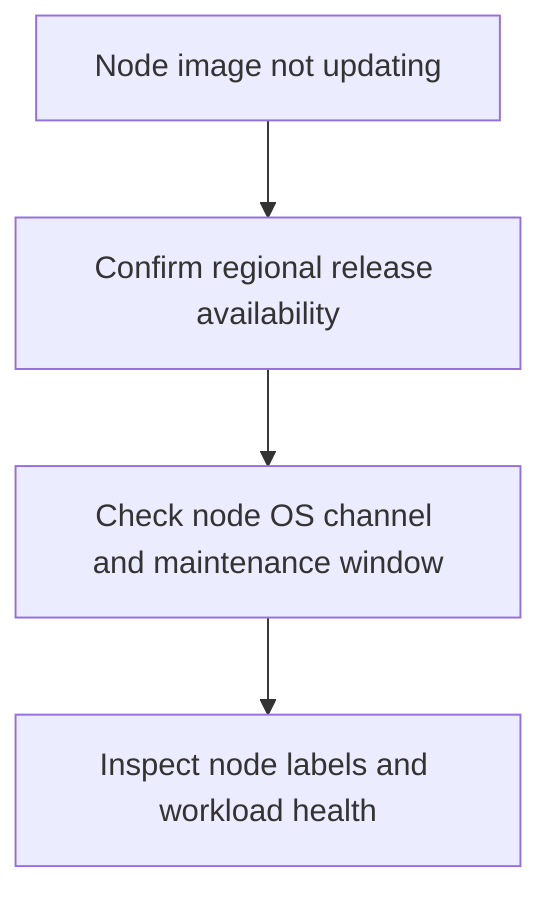

---
content_sources:
  diagrams:
    - id: troubleshooting-operations-node-image-upgrade-stuck
      type: flowchart
      source: self-generated
      justification: Node image upgrade diagnostic flow synthesized from Microsoft Learn node OS autoupgrade and release-tracker guidance.
      based_on:
        - https://learn.microsoft.com/en-us/azure/aks/auto-upgrade-node-os-image
        - https://learn.microsoft.com/en-us/azure/aks/release-tracker
content_validation:
  status: verified
  last_reviewed: 2026-07-18
  reviewer: agent
  core_claims:
    - claim: "Node image and security patch releases are tracked separately in the AKS release tracker by region."
      source: https://learn.microsoft.com/en-us/azure/aks/release-tracker
      verified: true
    - claim: "Node OS auto-upgrade channels are distinct from cluster-level Kubernetes auto-upgrade channels."
      source: https://learn.microsoft.com/en-us/azure/aks/auto-upgrade-node-os-image
      verified: true
---

# Node Image Upgrade Stuck

## Symptom

The cluster or node pool remains on an older node image after the expected maintenance window, or some nodes move while others remain on the previous image version.

## Possible Causes

- The regional node image release has not landed yet.
- The wrong node OS channel is configured.
- The maintenance window did not allow enough time.
- Workloads or platform conditions are slowing or blocking node replacement.

## Diagnosis Steps

<!-- diagram-id: troubleshooting-operations-node-image-upgrade-stuck -->


1. Confirm the node OS channel and current upgrade profile.

    ```bash
    az aks show \
        --resource-group "$RG" \
        --name "$CLUSTER_NAME" \
        --query "autoUpgradeProfile" \
        --output yaml
    ```

2. Inspect node labels and node image versions.

    ```bash
    kubectl get nodes --show-labels
    ```

3. Check whether the expected node image or security patch release is available in the cluster's region.

## Resolution

- Wait for the regional release if the tracker shows the image is not landed yet.
- Correct the node OS channel if the cluster is using a different policy than intended.
- Widen the maintenance window if the rollout consistently overruns the allowed time.
- Resolve workload blockers before expecting the node image rollout to finish.

## Prevention

- Pair node OS channels with explicit maintenance windows.
- Use the release tracker before declaring a rollout “stuck.”
- Keep workload disruption budgets and readiness behavior compatible with node refresh events.

## See Also

- [Node OS Upgrades](../../../operations/node-os-upgrades.md)
- [Maintenance Windows](../../../operations/maintenance-windows.md)
- [Version Support](../../../reference/version-support.md)

## Sources

- [Autoupgrade node OS images in AKS](https://learn.microsoft.com/en-us/azure/aks/auto-upgrade-node-os-image)
- [AKS release tracker](https://learn.microsoft.com/en-us/azure/aks/release-tracker)
