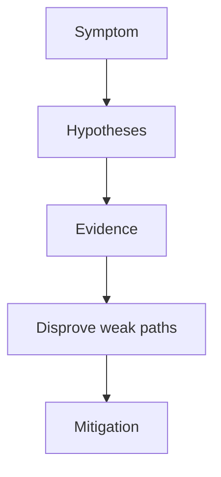

---
content_sources:
  diagrams:
  - id: troubleshooting-playbooks-operations-scaling-failure
    type: flowchart
    source: self-generated
    justification: Diagnostic flow synthesized from Microsoft Learn troubleshooting
      guidance linked in this page.
    based_on:
    - https://learn.microsoft.com/en-us/troubleshoot/azure/azure-kubernetes/welcome-azure-kubernetes
    - https://learn.microsoft.com/en-us/troubleshoot/azure/azure-kubernetes/
content_validation:
  status: verified
  last_reviewed: 2026-07-18
  reviewer: agent
  core_claims:
    - claim: "The horizontal pod autoscaler uses Metrics Server to monitor pod resource demand and automatically scale the number of pods."
      source: https://learn.microsoft.com/en-us/azure/aks/concepts-scale
      verified: true
    - claim: "The cluster autoscaler watches for pods that can't be scheduled because of resource constraints and scales up the node pool when it detects those unscheduled pods."
      source: https://learn.microsoft.com/en-us/azure/aks/cluster-autoscaler-overview
      verified: true
    - claim: "In AKS, the cluster autoscaler scales up based on pending pods rather than CPU or memory pressure on nodes."
      source: https://learn.microsoft.com/en-us/azure/aks/cluster-autoscaler-overview
      verified: true
    - claim: "Cluster autoscaler scale-up failures in AKS can be caused by IP address exhaustion in the subnet, core quota exhaustion, or the node pool reaching its maximum size."
      source: https://learn.microsoft.com/en-us/azure/aks/cluster-autoscaler-overview
      verified: true
---


# Scaling Failure

## 1. Summary

Scaling failures happen when demand rises but pods or nodes cannot grow in time. The bottleneck may be HPA inputs, scheduler constraints, quota, or subnet capacity.

<!-- diagram-id: troubleshooting-playbooks-operations-scaling-failure -->


## 2. Common Misreadings

- The first visible symptom is the root cause.
- Restarting the pod proves the issue is fixed.
- If one namespace is affected, the cluster is healthy.

## 3. Competing Hypotheses

- H1: HPA is not triggering because metrics or targets are wrong.
- H2: Pods scale but cannot schedule due to requests or constraints.
- H3: Cluster autoscaler cannot add nodes because of quota or IP limits.
- H4: Application throughput, not cluster capacity, is the true bottleneck.

## 4. What to Check First

```bash
kubectl get hpa -A
kubectl top pods -A
kubectl get pods -A --field-selector=status.phase=Pending
az aks show --resource-group $RG --name $CLUSTER_NAME --query agentPoolProfiles --output yaml
```

| Command | Purpose |
| --- | --- |
| `kubectl get hpa` | List HorizontalPodAutoscalers across namespaces. |
| `kubectl top pods` | Show current pod CPU and memory usage. |
| `kubectl get pods` | List pending pods awaiting scheduling. |
| `az aks show` | Show the agent pool profiles. |
| `--resource-group` | Resource group that contains the AKS cluster. |
| `--name` | Name of the AKS cluster. |
| `--query` | Selects the agent pool profiles. |
| `--output` | Output format for the result. |

## 5. Evidence to Collect

- HPA status and metrics.
- Pending pod reasons.
- Autoscaler boundaries and node pool counts.
- Subscription quota and subnet usage where growth is blocked.

## 6. Validation and Disproof by Hypothesis

- If HPA never scales, fix metrics or target settings first.
- If replicas increase but pods remain Pending, disprove application-only bottleneck assumptions.
- If nodes cannot scale, inspect quota/IP capacity before modifying workloads.

## 7. Likely Root Cause Patterns

- Metrics pipeline missing or misconfigured.
- Resource requests too large for pool capacity.
- Max node count reached or subnet full.
- Wrong expectation that more replicas fix an application bottleneck.

## 8. Immediate Mitigations

- Restore headroom by expanding safe capacity where possible.
- Temporarily reduce unnecessary load or replica targets if churn is extreme.
- Fix requests, quotas, or autoscaler bounds based on evidence.

## 9. Prevention

- Load test before peak periods.
- Review autoscaler readiness alongside quota and subnet usage.
- Keep HPA targets tied to meaningful saturation signals.

## See Also

- [Scaling](../../../platform/scaling.md)
- [Scaling Operations](../../../operations/scaling-operations.md)
- [Cost Optimization](../../../best-practices/cost-optimization.md)

## Sources

- [Troubleshoot AKS clusters](https://learn.microsoft.com/troubleshoot/azure/azure-kubernetes/welcome-azure-kubernetes)
- [AKS troubleshooting articles](https://learn.microsoft.com/troubleshoot/azure/azure-kubernetes/)
