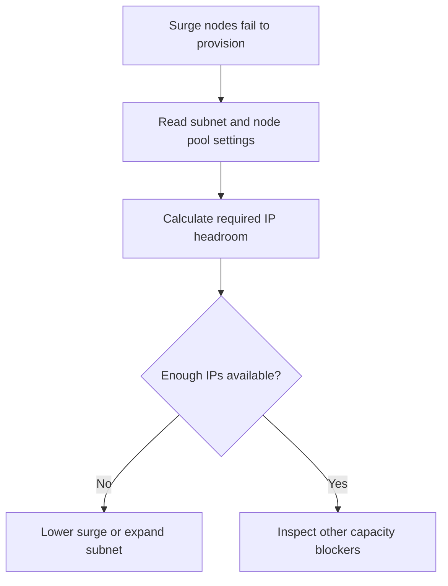

---
content_sources:
  diagrams:
    - id: troubleshooting-operations-surge-upgrade-ip-exhaustion
      type: flowchart
      source: self-generated
      justification: Surge-upgrade IP exhaustion flow synthesized from Microsoft Learn upgrade and networking guidance.
      based_on:
        - https://learn.microsoft.com/en-us/azure/aks/upgrade-options
        - https://learn.microsoft.com/en-us/azure/aks/use-network-policies
content_validation:
  status: verified
  last_reviewed: 2026-07-18
  reviewer: agent
  core_claims:
    - claim: "On Azure CNI (pod-per-subnet-IP) clusters, AKS surge upgrades can fail when the subnet lacks enough IPs for nodes, surge nodes, and pods."
      source: https://learn.microsoft.com/en-us/azure/aks/upgrade-options
      verified: true
    - claim: "AKS documents the subnet sizing formula for surge upgrades as (number of nodes + maxSurge) * (1 + maxPods)."
      source: https://learn.microsoft.com/en-us/azure/aks/upgrade-options
      verified: true
---

# Surge Upgrade IP Exhaustion

## Symptom

The upgrade fails while trying to create surge nodes, often with subnet-capacity errors or stalled node-pool rollout. This applies to networking models that consume subnet IPs per pod (Azure CNI with a pod subnet); Azure CNI Overlay and other non-subnet pod-IP models do not consume node-subnet IPs per pod and use different headroom math.

## Possible Causes

- The subnet has insufficient IP headroom for the planned surge.
- `maxSurge` is too high for the current subnet size.
- `maxPods` and node density assumptions left no upgrade buffer.
- Orphaned or unused network allocations were never reclaimed.

## Diagnosis Steps

<!-- diagram-id: troubleshooting-operations-surge-upgrade-ip-exhaustion -->


1. Read cluster networking and node-pool assumptions.

    ```bash
    az aks show \
        --resource-group "$RG" \
        --name "$CLUSTER_NAME" \
        --query "networkProfile" \
        --output yaml
    ```

    | Command | Purpose |
    | --- | --- |
    | `az aks show` | Show the cluster network profile. |
    | `--resource-group` | Resource group that contains the AKS cluster. |
    | `--name` | Name of the AKS cluster. |
    | `--query` | Selects the network profile. |
    | `--output` | Output format for the result. |

2. Review the backing subnet.

    ```bash
    az network vnet subnet show \
        --resource-group "$VNET_RG" \
        --vnet-name "$VNET_NAME" \
        --name "$AKS_SUBNET_NAME" \
        --output yaml
    ```

    | Command | Purpose |
    | --- | --- |
    | `az network vnet subnet show` | Show the AKS subnet configuration. |
    | `--resource-group` | Resource group that contains the virtual network. |
    | `--vnet-name` | Name of the virtual network. |
    | `--name` | Name of the AKS subnet. |
    | `--output` | Output format for the result. |

3. For Azure CNI with a pod subnet, calculate whether the subnet can satisfy `(nodes + maxSurge) * (1 + maxPods)`. (Azure CNI Overlay allocates pod IPs from a separate CIDR, so size the node subnet for nodes plus surge only.)

## Resolution

- Lower `maxSurge` if the current subnet cannot absorb the planned temporary growth.
- Expand the subnet or redesign IP allocation before retrying.
- Reclaim stale or unused allocations if that is part of the pressure.

## Prevention

- Reserve IP headroom for both autoscaler growth and upgrade surge.
- Document subnet math in the production blueprint, not only in the incident review.
- Review surge assumptions whenever node count or `maxPods` changes materially.

## See Also

- [Upgrades](../../../operations/upgrades.md)
- [Reliability](../../../best-practices/reliability.md)
- [Upgrade Failure](upgrade-failure.md)

## Sources

- [Upgrade options and recommendations for AKS clusters](https://learn.microsoft.com/en-us/azure/aks/upgrade-options)
