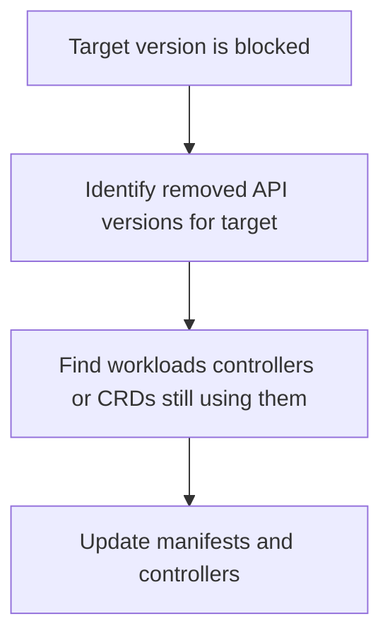

---
content_sources:
  diagrams:
    - id: troubleshooting-operations-upgrade-blocked-deprecated-api
      type: flowchart
      source: self-generated
      justification: Deprecated-API upgrade blocker flow synthesized from Microsoft Learn AKS upgrade validation guidance.
      based_on:
        - https://learn.microsoft.com/en-us/azure/aks/upgrade-options
        - https://learn.microsoft.com/en-us/azure/aks/supported-kubernetes-versions
content_validation:
  status: verified
  last_reviewed: 2026-07-18
  reviewer: agent
  core_claims:
    - claim: "AKS pre-upgrade validations include API breaking-change detection for deprecated Kubernetes APIs."
      source: https://learn.microsoft.com/en-us/azure/aks/upgrade-options
      verified: true
    - claim: "Preview and supported GA versions are distinct lifecycle states, so workload API compatibility should be evaluated against the intended GA target."
      source: https://learn.microsoft.com/en-us/azure/aks/supported-kubernetes-versions
      verified: true
---

# Upgrade Blocked by Deprecated API

## Symptom

The upgrade target is rejected or flagged because the cluster recently used a Kubernetes API that is deprecated or removed in the target version.

## Possible Causes

- Manifests still use deprecated API versions.
- CRDs or admission webhooks are pinned to removed APIs.
- Operators or add-ons were not upgraded before the cluster version move.

## Diagnosis Steps

<!-- diagram-id: troubleshooting-operations-upgrade-blocked-deprecated-api -->


1. Confirm the cluster version and allowed targets.

    ```bash
    az aks get-upgrades \
        --resource-group "$RG" \
        --name "$CLUSTER_NAME" \
        --output table
    ```

2. Review Kubernetes resources and controller inventory.

    ```bash
    kubectl api-resources
    kubectl get crd
    kubectl get deploy --all-namespaces
    ```

3. Compare the target version against the manifests and controllers that still depend on removed APIs.

## Resolution

- Update manifests to supported API versions.
- Upgrade or replace controllers, webhooks, and operators that still depend on removed APIs.
- Re-validate in non-production before retrying production.

## Prevention

- Treat API deprecation review as part of every minor-version planning cycle.
- Do not wait for the oldest supported minor version before cleaning up deprecated objects.
- Keep cluster lifecycle tracking tied to application-controller lifecycle, not just control-plane schedule.

## See Also

- [AKS Version Lifecycle](../../../platform/version-lifecycle.md)
- [Version Support](../../../reference/version-support.md)
- [Upgrades](../../../operations/upgrades.md)

## Sources

- [Upgrade options and recommendations for AKS clusters](https://learn.microsoft.com/en-us/azure/aks/upgrade-options)
- [Supported Kubernetes versions in AKS](https://learn.microsoft.com/en-us/azure/aks/supported-kubernetes-versions)
