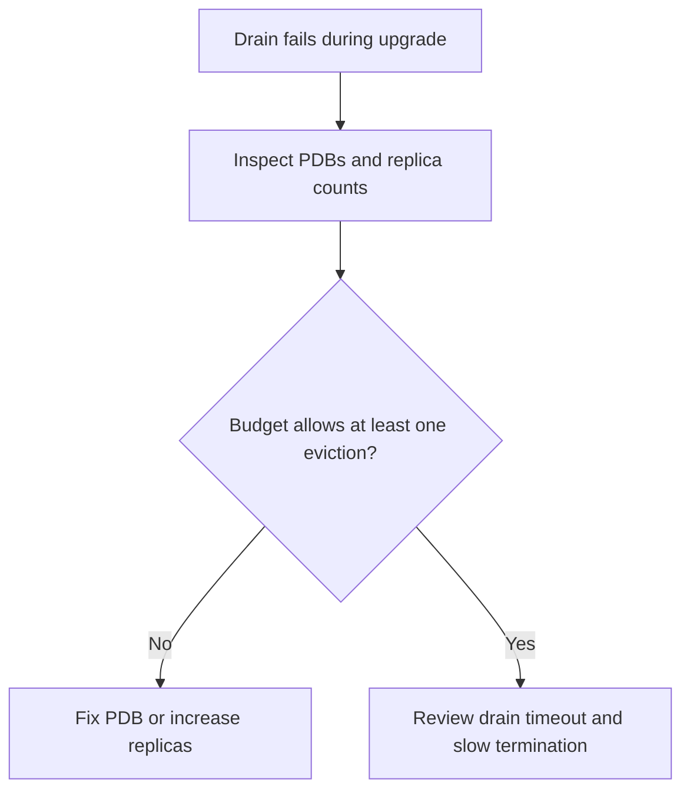

---
content_sources:
  diagrams:
    - id: troubleshooting-operations-upgrade-blocked-pdb
      type: flowchart
      source: self-generated
      justification: PDB-blocked upgrade diagnostic flow synthesized from Microsoft Learn AKS upgrade recommendations.
      based_on:
        - https://learn.microsoft.com/en-us/azure/aks/upgrade-options
content_validation:
  status: verified
  last_reviewed: 2026-07-18
  reviewer: agent
  core_claims:
    - claim: "AKS upgrade drains can fail when Pod Disruption Budgets block pod eviction."
      source: https://learn.microsoft.com/en-us/azure/aks/upgrade-options
      verified: true
    - claim: "When AKS uses the Cordon undrainable-node behavior, blocked nodes are labeled kubernetes.azure.com/upgrade-status=Quarantined."
      source: https://learn.microsoft.com/en-us/azure/aks/upgrade-options
      verified: true
---

# Upgrade Blocked by Pod Disruption Budget

## Symptom

The upgrade reports drain or eviction failure, often with a message that AKS cannot evict a pod because doing so would violate the pod's disruption budget.

## Possible Causes

- `minAvailable` is too strict for the current replica count.
- `maxUnavailable` effectively allows zero disruption.
- Critical workloads run with insufficient replicas for a rolling drain.
- Drain timeout expires before the workload can terminate cleanly.

## Diagnosis Steps

<!-- diagram-id: troubleshooting-operations-upgrade-blocked-pdb -->


1. Inspect budgets and deployment replica counts.

    ```bash
    kubectl get pdb --all-namespaces
    kubectl get deploy --all-namespaces
    ```

2. Check for quarantined nodes when undrainable-node behavior is in use.

    ```bash
    kubectl get nodes --show-labels
    ```

3. Review recent events around the blocked workloads.

    ```bash
    kubectl get events --all-namespaces --sort-by=.lastTimestamp
    ```

## Resolution

- Increase replicas so the PDB can tolerate at least one eviction.
- Relax the PDB so the workload can be drained safely.
- Extend drain timeout if the workload shuts down slowly.
- Re-run the upgrade only after the budget and replica model are compatible with drain.

## Prevention

- Test PDB behavior in staging during real node drains.
- Avoid singleton critical workloads on pools that will be upgraded in place.
- Keep a blue/green option for the most disruption-sensitive services.

## See Also

- [Upgrades](../../../operations/upgrades.md)
- [Blue-Green Upgrades](../../../operations/blue-green-upgrades.md)
- [Upgrade Failure](upgrade-failure.md)

## Sources

- [Upgrade options and recommendations for AKS clusters](https://learn.microsoft.com/en-us/azure/aks/upgrade-options)
