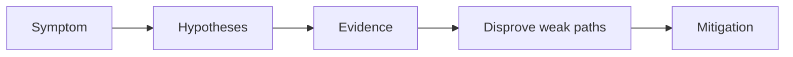

---
hide:
  - toc
content_sources:
  diagrams:
  - id: troubleshooting-playbooks-operations-upgrade-failure
    type: flowchart
    source: self-generated
    justification: Diagnostic flow synthesized from Microsoft Learn troubleshooting
      guidance linked in this page.
    based_on:
    - https://learn.microsoft.com/en-us/troubleshoot/azure/azure-kubernetes/welcome-azure-kubernetes
    - https://learn.microsoft.com/en-us/troubleshoot/azure/azure-kubernetes/
---


# Upgrade Failure

## 1. Summary

An AKS upgrade stalls, partially completes, or leaves workloads unhealthy. The problem is usually compatibility, disruption controls, or insufficient pre-checking.

<!-- diagram-id: troubleshooting-playbooks-operations-upgrade-failure -->


## 2. Common Misreadings

- The first visible symptom is the root cause.
- Restarting the pod proves the issue is fixed.
- If one namespace is affected, the cluster is healthy.

## 3. Competing Hypotheses

- H1: Deprecated APIs, controllers, or CRDs are incompatible with the target version.
- H2: PDBs or workload topology block draining.
- H3: Node image or daemonset components fail during rollout.
- H4: The cluster was upgraded, but workload validation was insufficient.

## 4. What to Check First

```bash
az aks get-upgrades --resource-group $RG --name $CLUSTER_NAME --output table
kubectl get events -A --sort-by=.lastTimestamp
kubectl get pdb -A
```

## 5. Evidence to Collect

- Upgrade history and current version.
- Event stream during drain and rescheduling.
- Controller and daemonset health.
- Application readiness after node replacement.

## 6. Validation and Disproof by Hypothesis

- If nodes cannot drain because of PDBs, disprove version-compatibility-only theories.
- If platform upgrade succeeded but workloads fail later, focus on workload or controller compatibility.
- If only one pool fails, isolate node image or pool-specific constraints.

## 7. Likely Root Cause Patterns

- Deprecated APIs or unsupported operators.
- Singleton workloads with strict disruption budgets.
- Node-level add-on incompatibility.
- No staged upgrade process.

## 8. Immediate Mitigations

- Pause expansion of the change.
- Stabilize affected workloads or pools.
- Restore capacity and validate critical controllers.
- Rework the upgrade plan before the next attempt.

## 9. Prevention

- Track support windows continuously.
- Test upgrades in lower environments.
- Keep workload APIs and controllers current.

## See Also

- [Upgrades](../../../operations/upgrades.md)
- [Version Support](../../../reference/version-support.md)
- [Reliability](../../../best-practices/reliability.md)

## Sources

- [Troubleshoot AKS clusters](https://learn.microsoft.com/troubleshoot/azure/azure-kubernetes/welcome-azure-kubernetes)
- [AKS troubleshooting articles](https://learn.microsoft.com/troubleshoot/azure/azure-kubernetes/)
