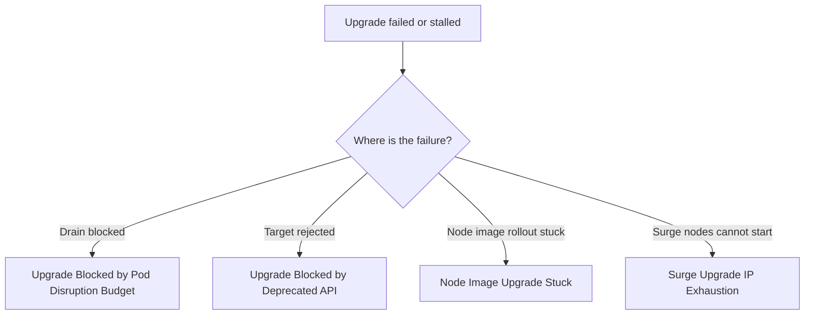

---
content_sources:
  diagrams:
    - id: troubleshooting-operations-upgrade-failure-router
      type: flowchart
      source: self-generated
      justification: Upgrade-failure routing flow synthesized from Microsoft Learn AKS upgrade validation, PDB, subnet, and node image guidance.
      based_on:
        - https://learn.microsoft.com/en-us/azure/aks/upgrade-options
        - https://learn.microsoft.com/en-us/azure/aks/auto-upgrade-node-os-image
content_validation:
  status: verified
  last_reviewed: 2026-07-18
  reviewer: agent
  core_claims:
    - claim: "AKS upgrade failures commonly map to validation blockers such as deprecated APIs, Pod Disruption Budget constraints, and subnet or capacity shortages."
      source: https://learn.microsoft.com/en-us/azure/aks/upgrade-options
      verified: true
    - claim: "Node OS and node image rollout issues are a distinct operational path from Kubernetes minor-version upgrade issues."
      source: https://learn.microsoft.com/en-us/azure/aks/auto-upgrade-node-os-image
      verified: true
---

# Upgrade Failure

## Symptom

An AKS upgrade does not start, stalls mid-rollout, or completes on the control plane while one or more node pools remain unhealthy.

## Possible Causes

- PodDisruptionBudgets block drain and surge progression.
- Deprecated APIs or incompatible controllers block the target Kubernetes version.
- Node image rollout is stuck after the version move is accepted.
- Surge nodes cannot be created because subnet or IP capacity is exhausted.

## Diagnosis Steps

<!-- diagram-id: troubleshooting-operations-upgrade-failure-router -->


1. Review the control-plane result and node-pool state.

    ```bash
    az aks show \
        --resource-group "$RG" \
        --name "$CLUSTER_NAME" \
        --query "{version:currentKubernetesVersion,autoUpgradeProfile:autoUpgradeProfile,provisioningState:provisioningState}" \
        --output yaml
    ```

2. Review cluster events and the current node and PDB picture.

    ```bash
    kubectl get events --all-namespaces --sort-by=.lastTimestamp
    kubectl get nodes
    kubectl get pdb --all-namespaces
    ```

3. Route to the focused playbook that matches the first hard failure:

- [Upgrade Blocked by Pod Disruption Budget](upgrade-blocked-pdb.md)
- [Upgrade Blocked by Deprecated API](upgrade-blocked-deprecated-api.md)
- [Node Image Upgrade Stuck](node-image-upgrade-stuck.md)
- [Surge Upgrade IP Exhaustion](surge-upgrade-ip-exhaustion.md)

## Resolution

- Use the focused playbook that matches the actual blocker.
- Do not keep retrying the same upgrade path until the blocking condition is removed.

## Prevention

- Keep support-window tracking continuous, not quarterly.
- Rehearse upgrade and validation in non-production with the same PDB and surge assumptions.
- Prefer blue/green for the highest-risk production upgrades.

## See Also

- [Upgrades](../../../operations/upgrades.md)
- [Auto-Upgrade Channels](../../../operations/auto-upgrade-channels.md)
- [Blue-Green Upgrades](../../../operations/blue-green-upgrades.md)

## Sources

- [Upgrade options and recommendations for AKS clusters](https://learn.microsoft.com/en-us/azure/aks/upgrade-options)
- [Autoupgrade node OS images in AKS](https://learn.microsoft.com/en-us/azure/aks/auto-upgrade-node-os-image)
