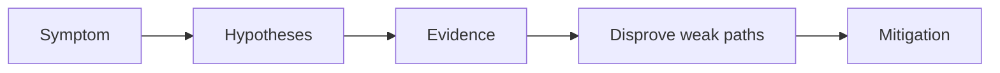

---
hide:
  - toc
content_sources:
  diagrams:
  - id: troubleshooting-playbooks-pod-issues-crashloop
    type: flowchart
    source: self-generated
    justification: Diagnostic flow synthesized from Microsoft Learn troubleshooting
      guidance linked in this page.
    based_on:
    - https://learn.microsoft.com/en-us/troubleshoot/azure/azure-kubernetes/welcome-azure-kubernetes
    - https://learn.microsoft.com/en-us/troubleshoot/azure/azure-kubernetes/
---


# CrashLoop

## 1. Summary

A pod starts and repeatedly exits or fails health checks. The immediate symptom is restart churn, but the real cause may be application configuration, dependency startup, or probe design.

<!-- diagram-id: troubleshooting-playbooks-pod-issues-crashloop -->


## 2. Common Misreadings

- The first visible symptom is the root cause.
- Restarting the pod proves the issue is fixed.
- If one namespace is affected, the cluster is healthy.

## 3. Competing Hypotheses

- H1: The container process exits due to application error.
- H2: Liveness/readiness/startup probes are misconfigured.
- H3: Required configuration or secret data is missing.
- H4: The process is OOMKilled or resource starved.

## 4. What to Check First

```bash
kubectl get pods -A
kubectl logs <pod-name> -n <namespace> --previous
kubectl describe pod <pod-name> -n <namespace>
```

## 5. Evidence to Collect

- Previous container logs.
- Exit code and termination reason.
- Probe configuration and timing.
- Secret, ConfigMap, and dependency readiness state.

## 6. Validation and Disproof by Hypothesis

- If exit code and stack trace exist, H1 is strongest.
- If logs are clean but probes fail, disprove application crash first and inspect probes.
- If termination reason is `OOMKilled`, prioritize requests/limits and memory use.

## 7. Likely Root Cause Patterns

- Invalid app config or missing secret.
- Startup work taking longer than probe thresholds.
- Memory limits too low for workload behavior.
- Dependency endpoints unavailable at startup.

## 8. Immediate Mitigations

- Scale down noisy rollout if needed.
- Fix configuration or probe settings.
- Increase limits only if evidence supports it.
- Use `startupProbe` for slow initialization instead of weakening liveness blindly.

## 9. Prevention

- Add startup validation in CI/CD.
- Keep probe design workload-specific.
- Capture restart alerts with namespace and owner labels.

## See Also

- [Pending Pods](pending-pods.md)
- [Reliability](../../../best-practices/reliability.md)
- [Pod Failures](../../first-10-minutes/pod-failures.md)

## Sources

- [Troubleshoot AKS clusters](https://learn.microsoft.com/troubleshoot/azure/azure-kubernetes/welcome-azure-kubernetes)
- [AKS troubleshooting articles](https://learn.microsoft.com/troubleshoot/azure/azure-kubernetes/)
