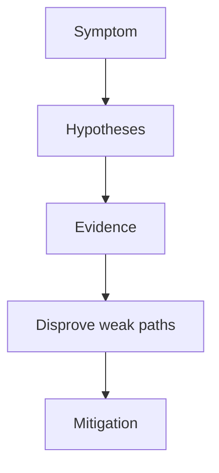

---
content_sources:
  diagrams:
  - id: troubleshooting-playbooks-pod-issues-image-pull-failure
    type: flowchart
    source: self-generated
    justification: Diagnostic flow synthesized from Microsoft Learn troubleshooting
      guidance linked in this page.
    based_on:
    - https://learn.microsoft.com/en-us/troubleshoot/azure/azure-kubernetes/welcome-azure-kubernetes
    - https://learn.microsoft.com/en-us/troubleshoot/azure/azure-kubernetes/
content_validation:
  status: verified
  last_reviewed: 2026-07-18
  reviewer: agent
  core_claims:
    - claim: "AKS to ACR integration assigns the AcrPull role to the Microsoft Entra managed identity associated with the AKS agent pool."
      source: https://learn.microsoft.com/en-us/azure/aks/cluster-container-registry-integration
      verified: true
    - claim: "If you need to pull an image from a private external registry instead of ACR, Kubernetes uses an image pull secret rather than AKS-ACR automatic authentication."
      source: https://learn.microsoft.com/en-us/azure/aks/cluster-container-registry-integration
      verified: true
    - claim: "If an AKS cluster uses an HTTP proxy and ACR uses Private Link, both ACR endpoints must be added to the cluster noProxy list."
      source: https://learn.microsoft.com/en-us/azure/aks/cluster-container-registry-integration
      verified: true
    - claim: "AKS requires HTTPS access to mcr.microsoft.com and *.data.mcr.microsoft.com so nodes can pull first-party images that are required for correct cluster creation and operation."
      source: https://learn.microsoft.com/en-us/azure/aks/outbound-rules-control-egress
      verified: true
---


# Image Pull Failure

## 1. Summary

A pod cannot start because the node cannot pull the required image. In AKS, this usually points to registry authentication, image reference, network reachability, or policy issues.

<!-- diagram-id: troubleshooting-playbooks-pod-issues-image-pull-failure -->


## 2. Common Misreadings

- The first visible symptom is the root cause.
- Restarting the pod proves the issue is fixed.
- If one namespace is affected, the cluster is healthy.

## 3. Competing Hypotheses

- H1: Image name or tag is wrong.
- H2: ACR or external registry authentication failed.
- H3: The node cannot reach the registry endpoint.
- H4: Admission policy or image allow-list blocked the pull.

## 4. What to Check First

```bash
kubectl describe pod <pod-name> -n <namespace>
kubectl get secret -n <namespace>
az aks check-acr --resource-group $RG --name $CLUSTER_NAME --acr <acr-name>.azurecr.io
```

| Command | Purpose |
| --- | --- |
| `kubectl describe pod` | Show pod details and image pull events. |
| `kubectl get secret` | List secrets in the namespace. |
| `az aks check-acr` | Test cluster connectivity to a container registry. |
| `--resource-group` | Resource group that contains the AKS cluster. |
| `--name` | Name of the AKS cluster. |
| `--acr` | Container registry login server to test. |

## 5. Evidence to Collect

- Pod events showing `ErrImagePull` or `ImagePullBackOff`.
- Image reference in the workload manifest.
- ACR integration or imagePullSecrets configuration.
- Node egress and DNS evidence if registry reachability is suspected.

## 6. Validation and Disproof by Hypothesis

- If `manifest unknown` appears, disprove H2-H4 first and fix the image reference.
- If `unauthorized` appears, focus on identity or secret issues.
- If timeouts or name resolution failures appear, prioritize network investigation.

## 7. Likely Root Cause Patterns

- Missing ACR role assignment.
- Image tag deleted or never pushed.
- Private DNS or proxy issues affecting registry access.
- Secret drift after credential rotation.

## 8. Immediate Mitigations

- Correct the image reference.
- Reconnect the cluster to ACR or fix imagePullSecrets.
- Test registry resolution from a node or debug pod.
- Restart the deployment only after the root issue is fixed.

## 9. Prevention

- Standardize image publishing and retention.
- Prefer managed identity-based ACR access.
- Add pre-deployment image existence checks in CI.

## See Also

- [CrashLoop](crashloop.md)
- [Credential Rotation](../../../operations/credential-rotation.md)
- [Identity and Secrets](../../../platform/identity-and-secrets.md)

## Sources

- [Troubleshoot AKS clusters](https://learn.microsoft.com/troubleshoot/azure/azure-kubernetes/welcome-azure-kubernetes)
- [AKS troubleshooting articles](https://learn.microsoft.com/troubleshoot/azure/azure-kubernetes/)
