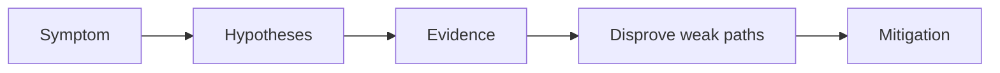

# Pending Pods

## 1. Summary

Pending pods usually indicate a scheduling boundary: no matching nodes, insufficient capacity, quota limits, or volume attachment constraints.



## 2. Common Misreadings

- The first visible symptom is the root cause.
- Restarting the pod proves the issue is fixed.
- If one namespace is affected, the cluster is healthy.

## 3. Competing Hypotheses

- H1: No nodes satisfy selectors, taints, or affinity.
- H2: CPU or memory requests exceed available capacity.
- H3: Cluster autoscaler cannot add nodes.
- H4: Persistent volume binding is blocking scheduling.

## 4. What to Check First

```bash
kubectl describe pod <pod-name> -n <namespace>
kubectl get nodes -L kubernetes.azure.com/agentpool
kubectl get pvc -A
```

## 5. Evidence to Collect

- Scheduler events from `kubectl describe pod`.
- Node labels, taints, and allocatable resources.
- Autoscaler status and node pool min/max bounds.
- PVC binding status.

## 6. Validation and Disproof by Hypothesis

- `0/NN nodes are available` messages usually disprove image-related causes.
- If pods request impossible resources, fix requests before expanding the cluster.
- If autoscaler is enabled but no nodes appear, inspect quota and subnet capacity.

## 7. Likely Root Cause Patterns

- Over-sized resource requests.
- Too-restrictive affinity or toleration design.
- Max node count reached.
- Storage class or PVC mismatch.

## 8. Immediate Mitigations

- Reduce constraints or add the correct node pool.
- Expand autoscaler bounds if quota allows.
- Resolve PVC binding issues.
- Re-run scheduling validation after each change.

## 9. Prevention

- Review scheduler events during every release.
- Keep namespace quotas aligned with real capacity.
- Test new affinity or taint strategies outside production first.

## See Also

- [Scaling Failure](../operations/scaling-failure.md)
- [Node Pools](../../../platform/node-pools.md)
- [Scaling Operations](../../../operations/scaling-operations.md)

## Sources

- [Troubleshoot AKS clusters](https://learn.microsoft.com/troubleshoot/azure/azure-kubernetes/welcome-azure-kubernetes)
- [AKS troubleshooting articles](https://learn.microsoft.com/troubleshoot/azure/azure-kubernetes/)
