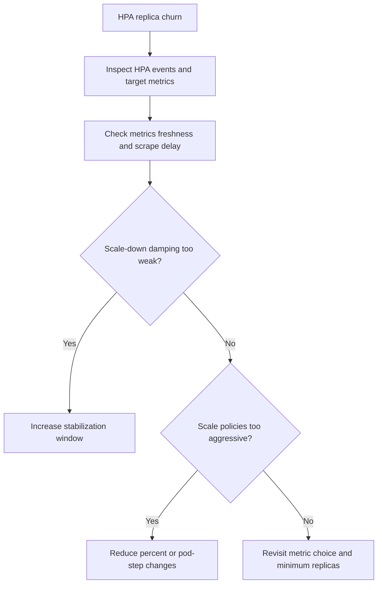

---
content_sources:
  diagrams:
    - id: troubleshooting-scaling-hpa-flapping
      type: flowchart
      source: self-generated
      justification: HPA flapping diagnostic flow synthesized from Microsoft Learn AKS scaling and monitoring guidance.
      based_on:
        - https://learn.microsoft.com/en-us/azure/aks/concepts-scale
        - https://learn.microsoft.com/en-us/azure/aks/monitor-aks
content_validation:
  status: verified
  last_reviewed: 2026-07-18
  reviewer: agent
  core_claims:
    - claim: "By default, the HPA checks the Metrics API every 15 seconds."
      source: https://learn.microsoft.com/en-us/azure/aks/concepts-scale
      verified: true
    - claim: "By default, the Metrics API retrieves data from kubelet every 60 seconds."
      source: https://learn.microsoft.com/en-us/azure/aks/concepts-scale
      verified: true
    - claim: "The default delay on HPA scale down events is five minutes."
      source: https://learn.microsoft.com/en-us/azure/aks/concepts-scale
      verified: true
    - claim: "Managed service for Prometheus is the recommended path to collect metrics from AKS clusters."
      source: https://learn.microsoft.com/en-us/azure/aks/monitor-aks
      verified: true
---

# HPA Flapping

## Symptom

An HPA-managed workload repeatedly scales up and down over short intervals, often with latency spikes, pod churn, or customer-visible instability.

## Possible Causes

- `behavior.scaleDown.stabilizationWindowSeconds` is too small or omitted for a bursty workload.
- Scale-up or scale-down policies are too aggressive for pod warm-up time.
- The metric source is delayed, coarse, or noisy.
- The metric being used measures stress after the fact instead of actual demand.

## Diagnosis Steps

<!-- diagram-id: troubleshooting-scaling-hpa-flapping -->


1. Inspect the HPA state.

    ```bash
    kubectl describe hpa <hpa-name> \
        --namespace <namespace>
    ```

2. Compare replica changes with the underlying metric freshness.

3. Look for patterns where pods are removed before the previous scale event has fully converged.

4. If using Prometheus-backed metrics, verify the metric path is updating at the expected interval.

## Resolution

- Increase `behavior.scaleDown.stabilizationWindowSeconds`.
- Use smaller scale steps for `Percent` or `Pods` policies.
- Raise minimum replicas for latency-sensitive services.
- Replace a lagging or ambiguous metric with one that reflects demand earlier.

## Prevention

- Treat HPA tuning as a control-loop problem, not only a threshold problem.
- Test scaling policies under burst and cooldown patterns before production rollout.
- Prefer managed Prometheus or another well-understood metrics path with known freshness.
- Record accepted stabilization defaults per workload archetype.

## See Also

- [Scaling](../../../platform/scaling.md)
- [Custom Metrics Scaling](../../../platform/custom-metrics-scaling.md)
- [Best Practices: Autoscaling](../../../best-practices/autoscaling.md)
- [Scaling Operations](../../../operations/scaling-operations.md)

## Sources

- [Scaling options for applications in AKS](https://learn.microsoft.com/en-us/azure/aks/concepts-scale)
- [Monitor AKS](https://learn.microsoft.com/en-us/azure/aks/monitor-aks)
