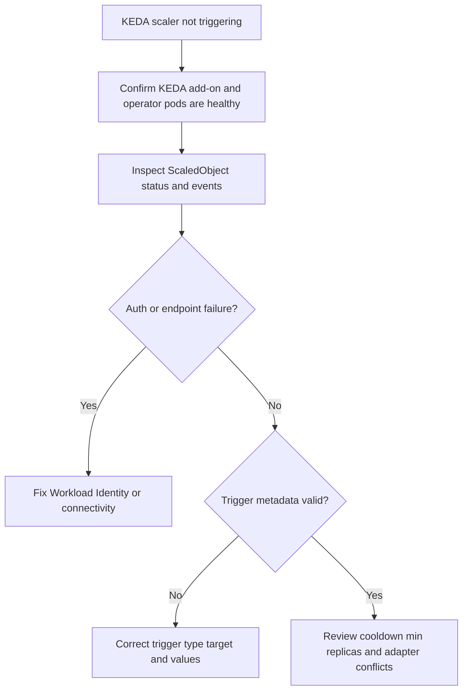

---
content_sources:
  diagrams:
    - id: troubleshooting-scaling-keda-scaler-not-triggering
      type: flowchart
      source: self-generated
      justification: KEDA trigger diagnostic flow synthesized from Microsoft Learn AKS KEDA overview, add-on, and integration guidance.
      based_on:
        - https://learn.microsoft.com/en-us/azure/aks/keda-about
        - https://learn.microsoft.com/en-us/azure/aks/keda-deploy-add-on-cli
        - https://learn.microsoft.com/en-us/azure/aks/keda-integrations
content_validation:
  status: verified
  last_reviewed: 2026-07-18
  reviewer: agent
  core_claims:
    - claim: "KEDA scales workloads based on events received."
      source: https://learn.microsoft.com/en-us/azure/aks/concepts-scale
      verified: true
    - claim: "KEDA integrates with Microsoft Entra Workload ID for authentication."
      source: https://learn.microsoft.com/en-us/azure/aks/keda-about
      verified: true
    - claim: "KEDA automatically emits Kubernetes events for autoscaling operations."
      source: https://learn.microsoft.com/en-us/azure/aks/keda-integrations
      verified: true
    - claim: "KEDA should be the only external metrics server inside the cluster."
      source: https://learn.microsoft.com/en-us/azure/aks/keda-about
      verified: true
---

# KEDA Scaler Not Triggering

## Symptom

A KEDA-managed workload stays at the same replica count even though queue depth, event lag, or the external trigger condition shows work pending.

## Possible Causes

- Workload Identity or secret-based authentication is failing.
- The metric source is unreachable from the cluster.
- The `ScaledObject` points at the wrong workload or has incorrect trigger metadata.
- Another external metrics adapter is conflicting with the managed KEDA add-on.
- The event source is healthy, but cooldown or min replica settings make the behavior look stuck.

## Diagnosis Steps

<!-- diagram-id: troubleshooting-scaling-keda-scaler-not-triggering -->


1. Verify the managed add-on is enabled.

    ```bash
    az aks show \
        --resource-group "$RG" \
        --name "$CLUSTER_NAME" \
        --query "workloadAutoScalerProfile.keda.enabled" \
        --output tsv
    ```

    | Command | Purpose |
    | --- | --- |
    | `az aks show` | Check whether the KEDA add-on is enabled. |
    | `--resource-group` | Resource group that contains the AKS cluster. |
    | `--name` | Name of the AKS cluster. |
    | `--query` | Selects the KEDA enabled flag. |
    | `--output` | Output format for the result. |

2. Confirm the operator and metrics API pods are healthy.

    ```bash
    kubectl get pods \
        --namespace kube-system \
        --selector app.kubernetes.io/part-of=keda-operator
    ```

3. Inspect the `ScaledObject` and recent events.

    ```bash
    kubectl describe scaledobject.keda.sh <scaledobject-name> \
        --namespace <namespace>
    ```

4. Look for typical failure patterns:

    - authentication or token errors,
    - connection failures to Service Bus, Storage, Event Hubs, Kafka, or Prometheus,
    - target workload name mismatch,
    - threshold values that never actually trip.

5. If Workload Identity was enabled after KEDA, restart the operator so the expected environment variables are injected.

    ```bash
    kubectl rollout restart deployment keda-operator \
        --namespace kube-system
    ```

## Resolution

- Fix the federated identity credential, role assignment, or referenced secret path.
- Correct the `scaleTargetRef`, trigger type, or trigger metadata.
- Restore network reachability to the metric source.
- Remove conflicting external metrics adapters and keep the KEDA add-on as the only external metrics server.
- Increase observability by reviewing Kubernetes events alongside the `ScaledObject` status.

## Prevention

- Standardize scaler templates for each event source type.
- Prefer Workload Identity over deprecated pod identity patterns.
- Keep one owner for KEDA add-on lifecycle and scaler definitions.
- Test trigger activation in pre-production with synthetic backlog before production rollout.

## See Also

- [KEDA on AKS](../../../platform/keda-on-aks.md)
- [Custom Metrics Scaling](../../../platform/custom-metrics-scaling.md)
- [Scaling Operations](../../../operations/scaling-operations.md)
- [Scaling Failure](../operations/scaling-failure.md)

## Sources

- [KEDA on AKS](https://learn.microsoft.com/en-us/azure/aks/keda-about)
- [Install the KEDA add-on using Azure CLI](https://learn.microsoft.com/en-us/azure/aks/keda-deploy-add-on-cli)
- [KEDA integrations on AKS](https://learn.microsoft.com/en-us/azure/aks/keda-integrations)
- [Scaling options for applications in AKS](https://learn.microsoft.com/en-us/azure/aks/concepts-scale)
