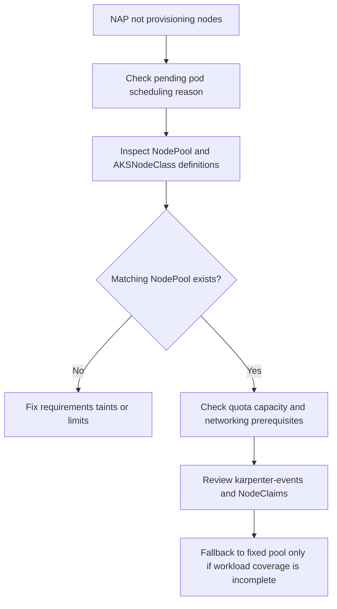

---
content_sources:
  diagrams:
    - id: troubleshooting-scaling-nap-fails-to-provision
      type: flowchart
      source: self-generated
      justification: NAP provisioning failure flow synthesized from Microsoft Learn node auto-provisioning overview, node pool, and migration guidance.
      based_on:
        - https://learn.microsoft.com/en-us/azure/aks/node-auto-provisioning
        - https://learn.microsoft.com/en-us/azure/aks/node-auto-provisioning-node-pools
        - https://learn.microsoft.com/en-us/azure/aks/use-node-auto-provisioning
        - https://learn.microsoft.com/en-us/azure/aks/migrate-from-autoscaler-to-node-auto-provisioning
content_validation:
  status: verified
  last_reviewed: 2026-07-18
  reviewer: agent
  core_claims:
    - claim: "NAP provisions and manages nodes in response to pending pod pressure."
      source: https://learn.microsoft.com/en-us/azure/aks/node-auto-provisioning
      verified: true
    - claim: "NAP requires at least one NodePool to function."
      source: https://learn.microsoft.com/en-us/azure/aks/node-auto-provisioning-node-pools
      verified: true
    - claim: "By default, NAP attempts to schedule workloads within the Azure quota available to the subscription."
      source: https://learn.microsoft.com/en-us/azure/aks/node-auto-provisioning-node-pools
      verified: true
    - claim: "You can view node auto-provisioning events on the CLI with kubectl get events --field-selector source=karpenter-events."
      source: https://learn.microsoft.com/en-us/azure/aks/use-node-auto-provisioning
      verified: true
---

# NAP Fails to Provision

## Symptom

Pods remain pending after NAP is enabled, and no suitable NAP-managed nodes appear even though workload demand should have triggered provisioning.

## Possible Causes

- Azure quota or regional capacity blocks the requested VM family.
- No `NodePool` matches the pod's resource, taint, or affinity requirements.
- The referenced `AKSNodeClass` is misconfigured.
- Networking or identity prerequisites for NAP are not satisfied.
- The cluster still depends on fixed-size pools for workloads that NAP rules do not cover.

## Diagnosis Steps

<!-- diagram-id: troubleshooting-scaling-nap-fails-to-provision -->


1. Inspect the pending pod event stream.

    ```bash
    kubectl describe pod <pod-name> \
        --namespace <namespace>
    ```

2. List NodePools and confirm at least one exists.

    ```bash
    kubectl get nodepools.karpenter.sh
    ```

3. Inspect the matching NodePool and AKSNodeClass.

    ```bash
    kubectl describe nodepool.karpenter.sh <nodepool-name>
    ```

    ```bash
    kubectl describe aksnodeclass.karpenter.azure.com <aksnodeclass-name>
    ```

4. Review Karpenter events.

    ```bash
    kubectl get events \
        --field-selector source=karpenter-events
    ```

5. Confirm whether the workload actually matches NAP rules for SKU family, priority type, subnet expectations, and taints.

## Resolution

- Expand or correct `NodePool` requirements and limits.
- Fix the `AKSNodeClass` reference, subnet, OS, or kubelet settings.
- Request additional Azure quota or relax SKU family constraints.
- Keep a fixed-size fallback pool temporarily while migrating workloads whose NAP rules are incomplete.

## Prevention

- Create mutually understandable NodePools instead of overlapping ambiguous ones.
- Validate new NodePool and AKSNodeClass combinations with a synthetic pending workload.
- Review quota and capacity assumptions before introducing new VM families.
- Migrate from Cluster Autoscaler to NAP deliberately, not mid-incident.

## See Also

- [Node Autoprovisioning](../../../platform/node-autoprovisioning.md)
- [Node Pools](../../../platform/node-pools.md)
- [Best Practices: Autoscaling](../../../best-practices/autoscaling.md)
- [Cluster Autoscaler Issues](../cluster-autoscaler-issues.md)

## Sources

- [Overview of node auto-provisioning in AKS](https://learn.microsoft.com/en-us/azure/aks/node-auto-provisioning)
- [Configure NodePools for node auto-provisioning in AKS](https://learn.microsoft.com/en-us/azure/aks/node-auto-provisioning-node-pools)
- [Enable or disable node auto-provisioning in AKS](https://learn.microsoft.com/en-us/azure/aks/use-node-auto-provisioning)
- [Migrate from cluster autoscaler to node auto-provisioning](https://learn.microsoft.com/en-us/azure/aks/migrate-from-autoscaler-to-node-auto-provisioning)
