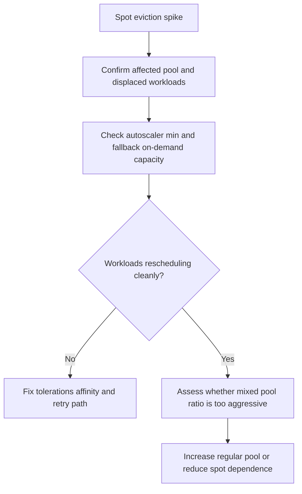

---
content_sources:
  diagrams:
    - id: troubleshooting-scaling-spot-eviction-storm
      type: flowchart
      source: self-generated
      justification: Spot eviction diagnostic and mitigation flow synthesized from Microsoft Learn spot node pool and cluster autoscaler guidance.
      based_on:
        - https://learn.microsoft.com/en-us/azure/aks/spot-node-pool
        - https://learn.microsoft.com/en-us/azure/aks/cluster-autoscaler
content_validation:
  status: verified
  last_reviewed: 2026-07-18
  reviewer: agent
  core_claims:
    - claim: "There is no SLA for Spot nodes in AKS."
      source: https://learn.microsoft.com/en-us/azure/aks/spot-node-pool
      verified: true
    - claim: "A Spot node pool has the taint kubernetes.azure.com/scalesetpriority=spot:NoSchedule."
      source: https://learn.microsoft.com/en-us/azure/aks/spot-node-pool
      verified: true
    - claim: "The cluster autoscaler will scale up the number of nodes in a Spot node pool after an eviction if more nodes are still needed."
      source: https://learn.microsoft.com/en-us/azure/aks/spot-node-pool
      verified: true
    - claim: "The cluster autoscaler enforces the minimum count if actual nodes drop below minimum because of external factors such as spot eviction."
      source: https://learn.microsoft.com/en-us/azure/aks/cluster-autoscaler
      verified: true
---

# Spot Eviction Storm

## Symptom

Many spot-backed nodes are evicted in a short period, causing a sudden wave of pod rescheduling, backlog growth, or degraded service quality.

## Possible Causes

- The workload mix depends too heavily on spot capacity without on-demand fallback.
- The region or VM family experiences a temporary capacity squeeze.
- Retry or checkpoint logic is weak, so normal spot churn becomes application failure.
- Autoscaler minimums and fallback pools are too small for the resulting displacement.

## Diagnosis Steps

<!-- diagram-id: troubleshooting-scaling-spot-eviction-storm -->


1. Identify the impacted spot pool and the workloads running there.

2. Confirm whether the workloads have the expected spot toleration and affinity, rather than accidentally landing on spot through broad selectors.

3. Check autoscaler settings for both the spot pool and any regular fallback pool.

    ```bash
    az aks nodepool show \
        --resource-group "$RG" \
        --cluster-name "$CLUSTER_NAME" \
        --name "$NODEPOOL_NAME" \
        --query "{priority:scaleSetPriority,min:minCount,max:maxCount,count:count,eviction:scaleSetEvictionPolicy}" \
        --output yaml
    ```

4. Review pod retry and reschedule behavior.

## Resolution

- Shift critical or customer-facing workloads back to on-demand pools.
- Increase on-demand fallback capacity or autoscaler minimums.
- Improve queue checkpointing, retries, and graceful shutdown behavior for interruptible workers.
- Reduce spot dependence for VM families with repeated eviction pressure.

## Prevention

- Keep spot workloads explicitly isolated and interruption tolerant.
- Use mixed pools so evictions degrade throughput before they degrade availability.
- Rehearse eviction scenarios during load testing, not during incidents.
- Review whether the chosen spot ratio still matches business tolerance for delayed work.

## See Also

- [Best Practices: Autoscaling](../../../best-practices/autoscaling.md)
- [Scaling](../../../platform/scaling.md)
- [Scaling Operations](../../../operations/scaling-operations.md)
- [Cluster Autoscaler Issues](../cluster-autoscaler-issues.md)

## Sources

- [Add an Azure Spot node pool to an AKS cluster](https://learn.microsoft.com/en-us/azure/aks/spot-node-pool)
- [Cluster autoscaler in AKS](https://learn.microsoft.com/en-us/azure/aks/cluster-autoscaler)
