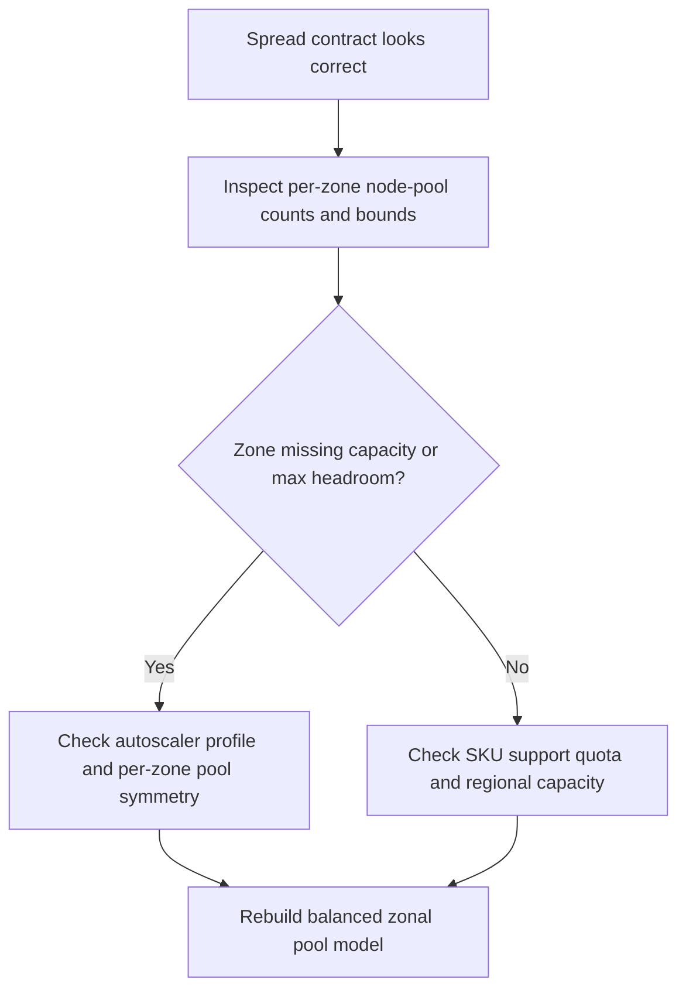

# Availability-Zone-Imbalanced Node Pools and Spread Failures

## Symptom

The workload's placement rules are reasonable, but AZ recovery still fails because one zone has fewer nodes, zero nodes, a lower `max-count`, or a zone-specific quota or SKU constraint that prevents AKS from restoring balanced capacity.

## Possible Causes

- One zone has no dedicated node pool or its pool scaled down much further than the others.
- `max-count` is lower in the zone that must absorb the missing replicas.
- The requested VM SKU is unavailable in one of the target zones.
- Cluster autoscaler is enabled, but zonal scale behavior is misaligned with the workload's strict spread constraints.
- The cluster relies on a multi-zone pool when the workload actually needs zone-aligned scaling control.

## Diagnosis Steps

<!-- diagram-id: troubleshooting-scheduling-az-imbalanced-node-pools-spread -->


1. Map the current node inventory by zone and pool.

    ```bash
    kubectl get nodes \
        --label-columns=topology.kubernetes.io/zone,kubernetes.azure.com/agentpool
    ```

2. Compare Azure-side pool counts, zones, and autoscaler bounds.

    ```bash
    az aks nodepool list \
        --resource-group "$RG" \
        --cluster-name "$CLUSTER_NAME" \
        --query "[].{name:name,zones:availabilityZones,count:count,enableAutoScaling:enableAutoScaling,minCount:minCount,maxCount:maxCount,vmSize:vmSize}" \
        --output table
    ```

3. If a zone looks empty or permanently smaller, check whether the pool design itself is asymmetric.

    Look for patterns such as:

    - zone 1 pool `max-count` 6, zone 2 pool `max-count` 2, zone 3 pool absent
    - one shared multi-zone pool plus one extra zone-aligned pool that biases recovery

4. Verify that the requested VM family is actually accepted in the needed zones.

    ```bash
    az aks list-vm-skus \
        --location "$LOCATION" \
        --output table
    ```

5. Check the cluster autoscaler design if the workload depends on zone-aligned recovery.

    ```bash
    az aks show \
        --resource-group "$RG" \
        --name "$CLUSTER_NAME" \
        --query "autoScalerProfile"
    ```

6. If a zone cannot scale because of quota or broader capacity, pivot to Azure-side capacity evidence.

    ```bash
    az vm list-usage \
        --location "$LOCATION" \
        --output table
    ```

    If the cluster uses node auto-provisioning for some workloads, also cross-check [NAP Fails to Provision](../scaling/nap-fails-to-provision.md).

## Resolution

- Rebuild the zonal pool model so each required zone has explicit, reachable headroom.
- Raise `max-count` symmetrically across per-zone pools when the workload requires even recovery behavior.
- Enable `balance-similar-node-groups` when multiple similar zonal pools back the same workload.
- Move from one multi-zone pool to one pool per zone when strict zonal behavior matters more than simplified pool management.
- Relax the accepted VM family or request additional quota when one zone cannot provision the current SKU.

## Prevention

- Treat zonal node-pool symmetry as part of the workload contract, not as an incidental scaling detail.
- Review node-pool counts and bounds after every cost-optimization or autoscaler-policy change.
- Validate the chosen VM size in every target zone before standardizing on it for strict spread workloads.
- Keep [Topology Spread Skew Under Capacity](topology-spread-skew-under-capacity.md) linked in incident runbooks so responders distinguish manifest intent from cluster-shape defects.

## See Also

- [Topology Spread Skew Under Capacity](topology-spread-skew-under-capacity.md)
- [When You Need Explicit Placement and Disruption Control](../../../best-practices/explicit-placement-disruption-control.md)
- [Cluster Autoscaler Issues](../cluster-autoscaler-issues.md)
- [NAP Fails to Provision](../scaling/nap-fails-to-provision.md)
- [Node Pools](../../../platform/node-pools.md)

## Sources

- [Configure availability zones in Azure Kubernetes Service (AKS)](https://learn.microsoft.com/en-us/azure/aks/reliability-availability-zones-configure)
- [Zone resiliency recommendations for Azure Kubernetes Service (AKS)](https://learn.microsoft.com/en-us/azure/aks/reliability-zone-resiliency-recommendations)
- [Use the cluster autoscaler in Azure Kubernetes Service (AKS)](https://learn.microsoft.com/en-us/azure/aks/cluster-autoscaler)
