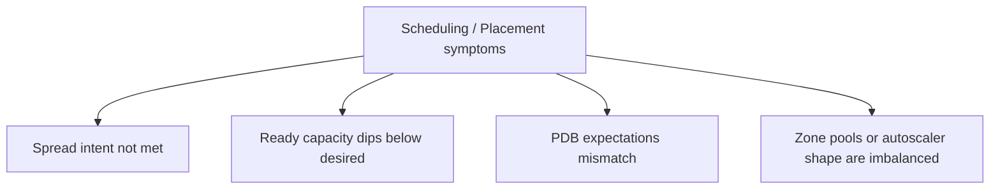

---
content_sources:
  diagrams:
    - id: troubleshooting-playbooks-scheduling-index
      type: flowchart
      source: self-generated
      justification: Scheduling and placement playbook map synthesized from Microsoft Learn AKS reliability, autoscaler, and availability-zone guidance.
      based_on:
        - https://learn.microsoft.com/en-us/azure/aks/reliability-zone-resiliency-recommendations
        - https://learn.microsoft.com/en-us/azure/aks/cluster-autoscaler-overview
        - https://learn.microsoft.com/en-us/azure/aks/best-practices-app-cluster-reliability
---

# Scheduling / Placement

Use these playbooks when the workload already declares placement or disruption intent, but the real AKS cluster shape, scheduler decisions, or drain mechanics produce an outcome you didn't expect.

<!-- diagram-id: troubleshooting-playbooks-scheduling-index -->

## Playbooks

| Scenario | Start Here |
|---|---|
| Pods cluster in one zone, remain Pending, or violate intended spread under capacity pressure | [Topology Spread Skew Under Capacity](topology-spread-skew-under-capacity.md) |
| Desired replicas stay constant but Ready or Available capacity dips during failure or recovery | [Ready Capacity Drops Below Desired](ready-capacity-drops-below-desired.md) |
| You need to confirm what a Pod Disruption Budget does and does not protect | [Pod Disruption Budget Drain Contract](pdb-drain-disruption-contract.md) |
| The scheduler rules are sound, but zonal node pools and autoscaler limits are shaped incorrectly | [Availability-Zone-Imbalanced Node Pools and Spread Failures](az-imbalanced-node-pools-spread.md) |

## See Also

- [Playbooks](../index.md)
- [When You Need Explicit Placement and Disruption Control](../../../best-practices/explicit-placement-disruption-control.md)
- [Cluster Autoscaler Issues](../cluster-autoscaler-issues.md)

## Sources

- [Zone resiliency recommendations for Azure Kubernetes Service (AKS)](https://learn.microsoft.com/en-us/azure/aks/reliability-zone-resiliency-recommendations)
- [Cluster autoscaling in Azure Kubernetes Service (AKS) overview](https://learn.microsoft.com/en-us/azure/aks/cluster-autoscaler-overview)
- [Deployment and cluster reliability best practices for Azure Kubernetes Service (AKS)](https://learn.microsoft.com/en-us/azure/aks/best-practices-app-cluster-reliability)
