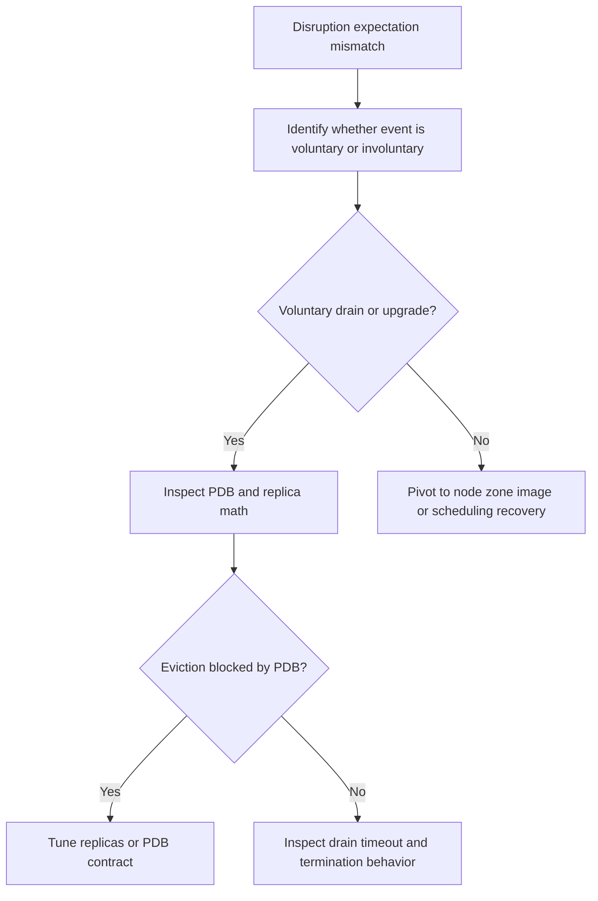

# Pod Disruption Budget Drain Contract

## Symptom

Teams expect a Pod Disruption Budget (PDB) to guarantee steady capacity during every incident, but AKS still shows blocked drains during upgrades or dips in Ready capacity during crashes, node failure, or zone impairment.

## Possible Causes

- The workload owner is using PDB as a generic availability guarantee instead of a voluntary-disruption contract.
- `minAvailable` or `maxUnavailable` is stricter than the workload's actual replica model allows.
- The workload has too few replicas for both safe drain and acceptable steady-state availability.
- The incident path was involuntary, so PDB never had a chance to protect it.

## Diagnosis Steps

<!-- diagram-id: troubleshooting-scheduling-pdb-drain-disruption-contract -->


1. List the PDBs that apply to the workload.

    ```bash
    kubectl get pdb \
        --all-namespaces
    ```

2. Inspect the PDB's contract and current allowance.

    ```bash
    kubectl describe pdb <pdb-name> \
        --namespace <namespace>
    ```

    Focus on:

    - `minAvailable` or `maxUnavailable`
    - the current healthy pod count
    - `Allowed disruptions`

3. Compare the PDB to real replica counts.

    ```bash
    kubectl get deployment <deployment-name> \
        --namespace <namespace> \
        --output wide
    ```

4. Check whether the evidence came from a voluntary path.

    ```bash
    kubectl get events \
        --all-namespaces \
        --sort-by=.lastTimestamp
    ```

    Typical voluntary-disruption failure signature:

    - `cannot evict pod as it would violate the pod's disruption budget`

5. If the incident was node loss, node crash, or zone impairment, pivot immediately.

    PDB does **not** protect against:

    - node failure
    - zone outage
    - kubelet crash
    - image pull failure on the replacement pod

    For those cases, continue with [Ready Capacity Drops Below Desired](ready-capacity-drops-below-desired.md), [Node Not Ready](../node-issues/node-not-ready.md), or [Topology Spread Skew Under Capacity](topology-spread-skew-under-capacity.md).

## Resolution

- Rewrite the workload contract so PDB is described as **voluntary disruption only**.
- Increase replicas if the current deployment cannot both serve traffic and allow at least one safe eviction.
- Relax `minAvailable` or `maxUnavailable` when the current setting makes all drains impossible.
- Pair PDB with `preStop` and `terminationGracePeriodSeconds` for cleaner drain behavior, while keeping separate mitigation for involuntary failures.
- If the real issue is upgrade stalling, use [Upgrade Blocked by Pod Disruption Budget](../operations/upgrade-blocked-pdb.md) for the node-upgrade workflow itself.

## Prevention

- Review every critical workload with two questions: what disruption is voluntary, and what disruption is involuntary?
- Document PDB math beside replica count so operators understand the expected drain budget before maintenance begins.
- Test drain behavior and node-loss behavior separately; they are not the same contract.
- Do not use PDB as a substitute for spread, spare capacity, or zonal topology design.

## See Also

- [Upgrade Blocked by Pod Disruption Budget](../operations/upgrade-blocked-pdb.md)
- [Ready Capacity Drops Below Desired](ready-capacity-drops-below-desired.md)
- [Topology Spread Skew Under Capacity](topology-spread-skew-under-capacity.md)
- [Node Not Ready](../node-issues/node-not-ready.md)
- [When You Need Explicit Placement and Disruption Control](../../../best-practices/explicit-placement-disruption-control.md)

## Sources

- [Deployment and cluster reliability best practices for Azure Kubernetes Service (AKS)](https://learn.microsoft.com/en-us/azure/aks/best-practices-app-cluster-reliability)
- [Upgrade options and recommendations for AKS clusters](https://learn.microsoft.com/en-us/azure/aks/upgrade-options)
- [Pod Disruptions](https://kubernetes.io/docs/concepts/workloads/pods/disruptions/)
