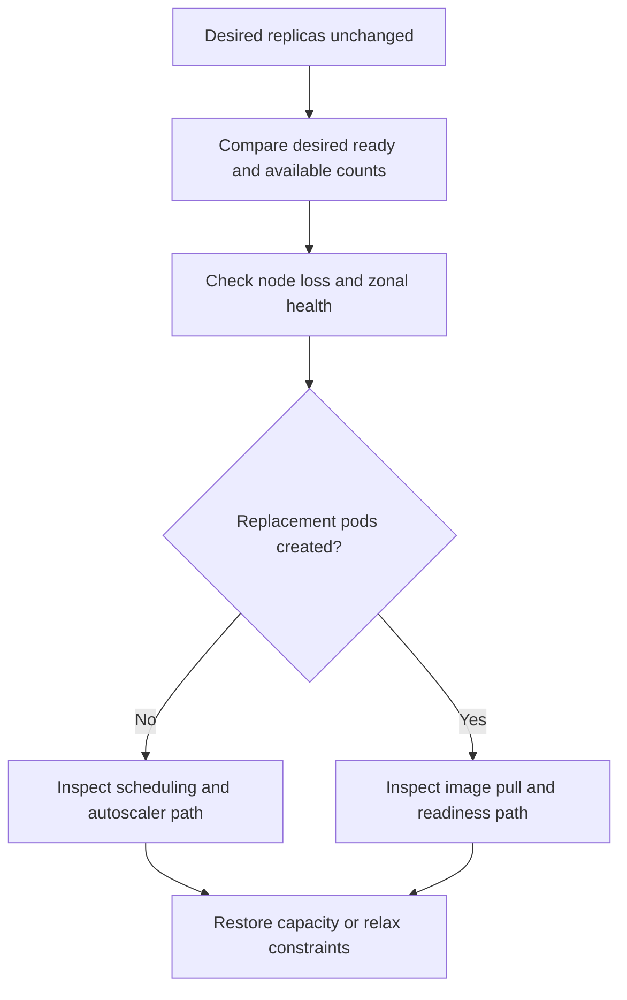

# Ready Capacity Drops Below Desired

## Symptom

`deployment.spec.replicas` still shows the desired count, but `readyReplicas` or `availableReplicas` dips during node loss, zonal impairment, replacement image pull failure, unschedulable recovery, or autoscaler lag.

## Possible Causes

- A node crash or node pool impairment removed running pods faster than replacement pods could start.
- A zonal incident reduced available nodes in one failure domain and the workload could not rebalance immediately.
- Replacement pods exist but cannot become Ready because of image pull failure, probe failure, or missing capacity.
- The cluster autoscaler is enabled, but recovery takes longer than the application's tolerance window.
- The workload relies on PDBs or graceful termination to avoid a gap, even though the actual incident path is involuntary.

## Diagnosis Steps

<!-- diagram-id: troubleshooting-scheduling-ready-capacity-drops-below-desired -->


1. Confirm the deployment-level gap.

    ```bash
    kubectl get deployment <deployment-name> \
        --namespace <namespace> \
        --output wide
    ```

2. Inspect pod placement and current readiness state.

    ```bash
    kubectl get pods \
        --namespace <namespace> \
        --selector app=<label> \
        --output wide
    ```

3. Check whether a node or zone event preceded the dip.

    ```bash
    kubectl get nodes \
        --label-columns=topology.kubernetes.io/zone,kubernetes.azure.com/agentpool
    ```

    ```bash
    kubectl get events \
        --all-namespaces \
        --sort-by=.lastTimestamp
    ```

4. If replacement pods are missing, inspect scheduling failure and autoscaler bounds.

    ```bash
    az aks nodepool list \
        --resource-group "$RG" \
        --cluster-name "$CLUSTER_NAME" \
        --query "[].{name:name,zones:availabilityZones,count:count,enableAutoScaling:enableAutoScaling,minCount:minCount,maxCount:maxCount}" \
        --output table
    ```

5. If replacement pods exist but are not Ready, inspect their exact failure path.

    ```bash
    kubectl describe pod <replacement-pod-name> \
        --namespace <namespace>
    ```

    Common pivots:

    - `ImagePullBackOff` or `ErrImagePull` -> [Image Pull Failure](../pod-issues/image-pull-failure.md)
    - `0/NN nodes are available` -> [Pending Pods](../pod-issues/pending-pods.md)
    - `NodeNotReady` or mass pod eviction after node loss -> [Node Not Ready](../node-issues/node-not-ready.md)

6. Check whether the workload is expecting PDBs or graceful termination to solve an involuntary failure path.

    ```bash
    kubectl get pdb \
        --namespace <namespace>
    ```

    PDBs and `preStop` can reduce some **voluntary** disruption paths, but they do **not** eliminate the gap after crashes, zone loss, image pull failure, or unschedulable replacements.

## Resolution

- Restore lost node capacity first when the incident began with node or zone impairment.
- Fix image pull or readiness failures on replacement pods before tuning disruption settings.
- Increase replica count and spread replicas across zones if the current steady-state count cannot absorb one-node or one-zone loss.
- Reduce scheduler strictness or rebalance per-zone capacity if replacements stay pending.
- Tune autoscaler bounds and headroom so the cluster can recover fast enough for the workload's recovery objective.

## Prevention

- Run enough replicas to survive at least one node loss without dropping below the minimum usable capacity.
- Combine spread rules, autoscaler bounds, and image delivery design so replacement pods can actually start in another zone.
- Use PDBs, `preStop`, and `terminationGracePeriodSeconds` for voluntary drain paths, while documenting that involuntary failure still needs spare capacity and fast replacement.
- Rehearse node-loss, zonal-pressure, and image-registry failure scenarios separately.

## See Also

- [When You Need Explicit Placement and Disruption Control](../../../best-practices/explicit-placement-disruption-control.md)
- [Pod Disruption Budget Drain Contract](pdb-drain-disruption-contract.md)
- [Node Not Ready](../node-issues/node-not-ready.md)
- [Image Pull Failure](../pod-issues/image-pull-failure.md)
- [Pending Pods](../pod-issues/pending-pods.md)
- [Cluster Autoscaler Issues](../cluster-autoscaler-issues.md)

## Sources

- [Deployment and cluster reliability best practices for Azure Kubernetes Service (AKS)](https://learn.microsoft.com/en-us/azure/aks/best-practices-app-cluster-reliability)
- [Use the cluster autoscaler in Azure Kubernetes Service (AKS)](https://learn.microsoft.com/en-us/azure/aks/cluster-autoscaler)
- [Zone resiliency recommendations for Azure Kubernetes Service (AKS)](https://learn.microsoft.com/en-us/azure/aks/reliability-zone-resiliency-recommendations)
