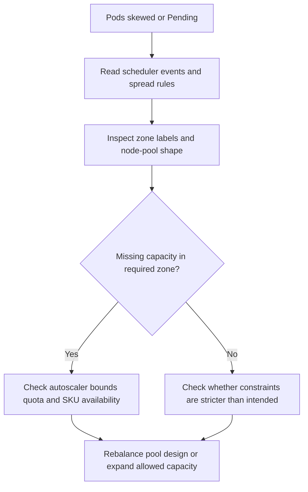

# Topology Spread Skew Under Capacity

## Symptom

Replicas cluster into one zone or one node pool, new pods remain `Pending`, or the workload only partially recovers because the declared `topologySpreadConstraints` cannot be satisfied by the zonal capacity AKS has right now.

## Possible Causes

- `whenUnsatisfiable: DoNotSchedule` is correct for the workload intent, but there is no matching capacity in the missing zone.
- A single multi-zone node pool is being used with strict zonal spread, and the cluster autoscaler cannot make a zone-specific scale-up decision.
- Per-zone node pools exist, but one zone has hit `max-count`, quota, or SKU capacity before the others.
- The cluster shape drifted over time and no longer matches the workload's spread contract.

## Diagnosis Steps

<!-- diagram-id: troubleshooting-scheduling-topology-spread-skew-under-capacity -->


1. Confirm the failure signature from the pending or skewed pod.

    ```bash
    kubectl describe pod <pod-name> \
        --namespace <namespace>
    ```

    Look for scheduler events such as:

    - `0/NN nodes are available`
    - `didn't match pod topology spread constraints`
    - `Insufficient cpu` or `Insufficient memory`

2. Inspect the workload's declared placement rules.

    ```bash
    kubectl get deployment <deployment-name> \
        --namespace <namespace> \
        --output yaml
    ```

    Confirm whether the workload uses:

    - `topologyKey: topology.kubernetes.io/zone`
    - `topologyKey: kubernetes.io/hostname`
    - `whenUnsatisfiable: DoNotSchedule`
    - affinity, anti-affinity, or node selectors that reduce the candidate set even further

3. Inspect the actual zonal node inventory that AKS can schedule onto.

    ```bash
    kubectl get nodes \
        --label-columns=topology.kubernetes.io/zone,kubernetes.azure.com/agentpool
    ```

4. Compare the Azure-side node-pool shape and autoscaler bounds.

    ```bash
    az aks nodepool list \
        --resource-group "$RG" \
        --cluster-name "$CLUSTER_NAME" \
        --query "[].{name:name,zones:availabilityZones,count:count,enableAutoScaling:enableAutoScaling,minCount:minCount,maxCount:maxCount,vmSize:vmSize}" \
        --output table
    ```

    | Command | Purpose |
    | --- | --- |
    | `az aks nodepool list` | List node pools with zones and scaling. |
    | `--resource-group` | Resource group that contains the AKS cluster. |
    | `--cluster-name` | Name of the AKS cluster. |
    | `--query` | Selects name, zones, count, autoscaling, and VM size. |
    | `--output` | Output format for the result. |

5. If a zone is empty or constrained, verify whether the SKU and region can satisfy the request.

    ```bash
    az aks list-vm-skus \
        --location "$LOCATION" \
        --output table
    ```

    | Command | Purpose |
    | --- | --- |
    | `az aks list-vm-skus` | List VM SKUs supported for AKS node pools. |
    | `--location` | Azure region to query. |
    | `--output` | Output format for the result. |

6. If autoscaler is enabled, inspect whether it has a path to restore the missing zone.

    ```bash
    az aks show \
        --resource-group "$RG" \
        --name "$CLUSTER_NAME" \
        --query "autoScalerProfile"
    ```

    | Command | Purpose |
    | --- | --- |
    | `az aks show` | Show the cluster autoscaler profile. |
    | `--resource-group` | Resource group that contains the AKS cluster. |
    | `--name` | Name of the AKS cluster. |
    | `--query` | Selects the autoscaler profile. |

    If the cluster relies on per-zone pools, confirm `balance-similar-node-groups` is enabled where appropriate.

## Resolution

- Keep `DoNotSchedule` only if waiting is safer than violating spread; otherwise switch to `ScheduleAnyway` and accept skew during pressure.
- Prefer one node pool per zone when the workload requires stronger zonal behavior than a single multi-zone pool can provide.
- Raise `max-count`, add quota, or widen acceptable VM families if a specific zone cannot scale.
- Remove overlapping selectors, affinity rules, or taints that accidentally make one zone the only valid target.
- If the cluster autoscaler never attempts recovery because the rules are unsatisfiable, relax the spread contract or redesign the node-pool topology.

## Prevention

- Test strict spread behavior during staged zone pressure instead of assuming production scale-up will be zone-perfect.
- Keep per-zone node pools symmetrical when workloads depend on zonal placement.
- Review scheduler events after every major topology or autoscaler change.
- Cross-link strict spread rollouts with [Pending Pods](../pod-issues/pending-pods.md) and [Cluster Autoscaler Issues](../cluster-autoscaler-issues.md) so first responders know where to pivot when the problem becomes generic scheduling failure.

## See Also

- [When You Need Explicit Placement and Disruption Control](../../../best-practices/explicit-placement-disruption-control.md)
- [Availability-Zone-Imbalanced Node Pools and Spread Failures](az-imbalanced-node-pools-spread.md)
- [Pending Pods](../pod-issues/pending-pods.md)
- [Cluster Autoscaler Issues](../cluster-autoscaler-issues.md)
- [NAP Fails to Provision](../scaling/nap-fails-to-provision.md)

## Sources

- [Zone resiliency recommendations for Azure Kubernetes Service (AKS)](https://learn.microsoft.com/en-us/azure/aks/reliability-zone-resiliency-recommendations)
- [Cluster autoscaling in Azure Kubernetes Service (AKS) overview](https://learn.microsoft.com/en-us/azure/aks/cluster-autoscaler-overview)
- [Configure availability zones in Azure Kubernetes Service (AKS)](https://learn.microsoft.com/en-us/azure/aks/reliability-availability-zones-configure)
- [Pod Topology Spread Constraints](https://kubernetes.io/docs/concepts/scheduling-eviction/topology-spread-constraints/)
