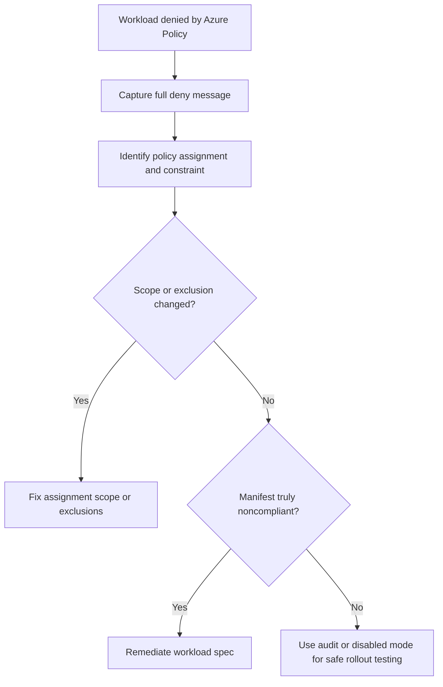

# Azure Policy Denies Workload

## Symptom

A deployment, StatefulSet, Job, or Pod admission request fails with an Azure Policy or Gatekeeper denial message even though the workload previously deployed or appears valid to the application team.

## Possible Causes

- The assignment effect was changed from `audit` to `deny`.
- The workload violates a built-in initiative such as baseline or restricted pod security.
- The assignment scope now includes this cluster or namespace when it did not before.
- Expected namespace exclusions were never configured or were removed.
- A custom Gatekeeper-backed constraint has stricter logic than the team expects.

## Diagnosis Steps

<!-- diagram-id: troubleshooting-security-azure-policy-denies-workload -->


1. Capture the exact error text from `kubectl apply` or the controller event.

2. Inspect the related workload events.

    ```bash
    kubectl describe deployment <deployment-name> \
        --namespace <namespace>
    ```

3. List constraint templates to confirm Azure Policy objects are present.

    ```bash
    kubectl get constrainttemplates
    ```

4. Inspect the failing constraint object and look for Azure Policy annotations.

    ```bash
    kubectl get <constraint-kind> <constraint-name> \
        --output yaml
    ```

5. In Azure Policy, confirm:

    - assignment scope,
    - assignment effect,
    - namespace exclusions,
    - whether the definition is built-in or custom.

6. If the deny started during rollout, compare whether the assignment should temporarily be `audit` or `disabled` while the team fixes manifests.

## Resolution

- Fix the manifest if the workload is genuinely violating the intended policy.
- Restore or add namespace exclusions only when the exception is approved and time-bound.
- Narrow assignment scope if the cluster or resource group was included by mistake.
- Move a new policy assignment back to `audit` or `disabled` when the problem is rollout sequencing rather than workload risk.
- Correct or retest custom constraint logic if the deny reason does not match intended policy semantics.

## Prevention

- Roll out new initiatives in `audit` before `deny`.
- Track exclusions with owner, expiry, and removal plan.
- Keep one inventory of built-in versus custom constraints applied to each cluster.
- Require platform review for scope expansion at subscription or management-group level.

## See Also

- [Azure Policy Add-on](../../../platform/azure-policy-addon.md)
- [Pod Security Standards](../../../platform/pod-security-standards.md)
- [Best Practices: Governance](../../../best-practices/governance.md)
- [Best Practices: Security](../../../best-practices/security.md)

## Sources

- [Learn Azure Policy for Kubernetes](https://learn.microsoft.com/en-us/azure/governance/policy/concepts/policy-for-kubernetes)
- [Use Azure Policy to secure your Azure Kubernetes Service (AKS) clusters](https://learn.microsoft.com/en-us/azure/aks/use-azure-policy)
