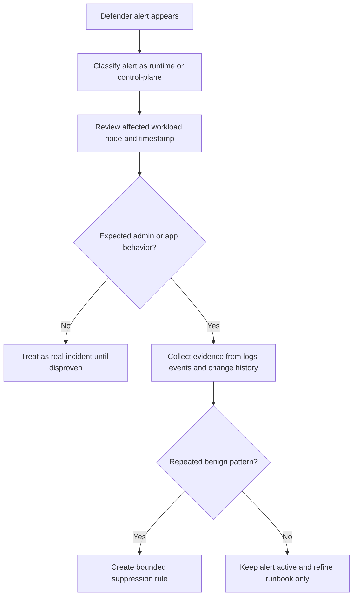

# Defender Alert False Positive

## Symptom

Microsoft Defender for Containers raises a runtime or control-plane alert that the platform or security team believes does not represent malicious activity.

## Possible Causes

- A legitimate admin action matched a high-risk behavior pattern.
- A debugging workflow temporarily resembled suspicious runtime behavior.
- Internet exposure was intentional, but not documented.
- The cluster lacks enough context in the triage workflow, so a real but expected action looks malicious.
- Security tooling ownership is split and no one validated the alert against deployment context.

## Diagnosis Steps

<!-- diagram-id: troubleshooting-security-defender-alert-false-positive -->


1. Open the alert in Defender for Cloud and record:

    - alert type,
    - affected cluster,
    - node or workload name,
    - time window,
    - alert narrative.

2. Decide whether it is a **runtime** or **control-plane** alert.

3. Correlate the alert with recent workload and cluster activity.

    ```bash
    kubectl get events \
        --all-namespaces \
        --sort-by=.lastTimestamp
    ```

4. Inspect the affected workload.

    ```bash
    kubectl describe pod <pod-name> \
        --namespace <namespace>
    ```

5. If the alert references public exposure, verify whether the related Service or ingress change was intentional and approved.

6. If the cluster uses Defender sensor coverage, compare the alert timestamp with deployment rollout, restart, or operator maintenance activity.

## Resolution

- Keep the alert as actionable if you cannot clearly prove the behavior was expected.
- If the activity is confirmed benign and recurring, create a suppression rule that is tightly scoped to the cluster, namespace, workload, or alert pattern.
- Update runbooks so future reviewers know why the behavior is expected.
- If the alert points to a legitimate risky practice, remediate the workload even if the triggering event was intended.

## Prevention

- Document internet-facing services and privileged maintenance workflows before they trigger alerts.
- Feed rollout and maintenance windows into the security operations process.
- Prefer narrow suppression rules over broad category suppression.
- Review suppressed alerts periodically to confirm they are still benign.

## See Also

- [Defender for Containers](../../../platform/defender-for-containers.md)
- [Best Practices: Governance](../../../best-practices/governance.md)
- [Monitoring and Logging](../../../operations/monitoring-logging.md)
- [Best Practices: Security](../../../best-practices/security.md)

## Sources

- [Introduction to Microsoft Defender for Containers](https://learn.microsoft.com/en-us/azure/defender-for-cloud/defender-for-containers-introduction)
- [Kubernetes alerts in Defender for Containers](https://learn.microsoft.com/en-us/azure/defender-for-cloud/alerts-containers)
- [Container security architecture](https://learn.microsoft.com/en-us/azure/defender-for-cloud/defender-for-containers-architecture)
