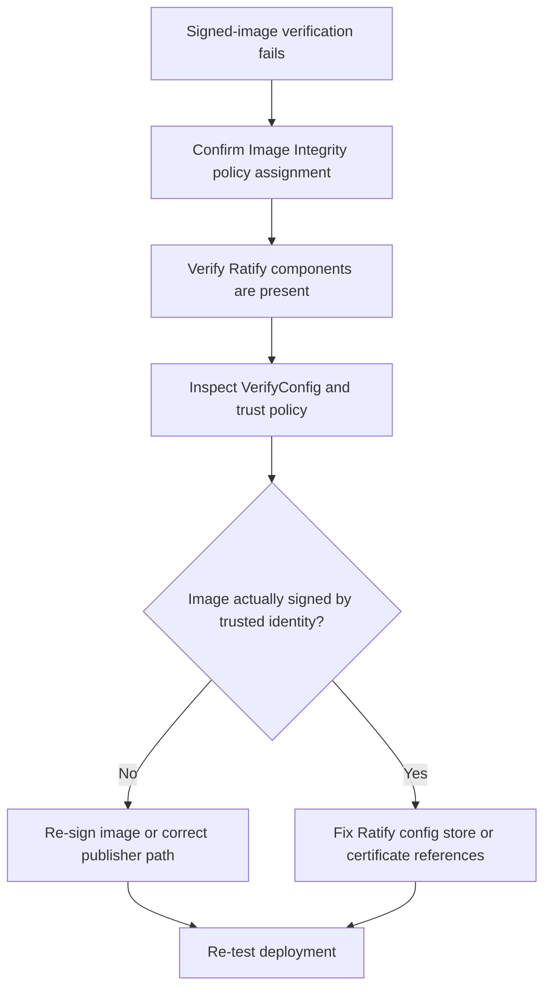

# Image Signature Verification Failure

## Symptom

A deployment that should use trusted images fails image-signature validation, or an image-verification policy reports the workload as noncompliant.

## Possible Causes

- The image is unsigned.
- The image is signed, but the signature chain does not match the configured trust policy.
- Ratify verification objects were not applied or were misconfigured.
- The AKS Image Integrity policy assignment or remediation never deployed the feature on the cluster.
- The workload uses a registry or image path outside the approved verification design.

## Diagnosis Steps

<!-- diagram-id: troubleshooting-security-image-signature-verification-failure -->


1. Confirm the AKS Image Integrity initiative is assigned.

2. If policy deployment was recent, verify remediation was run so the feature was actually pushed to the cluster.

3. Inspect the Ratify-related pods.

    ```bash
    kubectl get pods \
        --all-namespaces
    ```

4. Inspect the verification configuration objects.

    ```bash
    kubectl get keymanagementproviders.config.ratify.deislabs.io

    kubectl get stores.config.ratify.deislabs.io

    kubectl get verifiers.config.ratify.deislabs.io
    ```

5. Validate that the trust policy, certificate store, and registry scope match the image being deployed.

6. Confirm the deployment path is using the supported verifier model for AKS Image Integrity.

## Resolution

- Sign the image with the expected trusted publisher flow if it is unsigned.
- Correct the Ratify verification objects if the certificate store, registry scope, or verifier reference is wrong.
- Re-run policy remediation if Image Integrity was assigned but not yet deployed.
- Align the workload image path with the approved allow-list and trust policy scope.
- If the cluster is still on an older or different signing workflow, document the transition plan instead of mixing incompatible verification expectations.

## Prevention

- Standardize one signing workflow per admission path.
- Keep trust policy documents and certificate stores under change control.
- Test signed-image verification in pre-production before rollout to production namespaces.
- Avoid building new production governance around deprecated Docker Content Trust patterns when AKS admission design is centered on Image Integrity and Notation.

## See Also

- [Best Practices: Governance](../../../best-practices/governance.md)
- [Azure Policy Add-on](../../../platform/azure-policy-addon.md)
- [Pod Security Standards](../../../platform/pod-security-standards.md)
- [Best Practices: Security](../../../best-practices/security.md)

## Sources

- [Use Image Integrity to validate signed images before deploying them to your Azure Kubernetes Service (AKS) clusters (Preview)](https://learn.microsoft.com/en-us/azure/aks/image-integrity)
- [Azure Policy built-in definitions for Azure Kubernetes Service](https://learn.microsoft.com/en-us/azure/aks/policy-reference)
- [Manage Signed Images with Docker Content Trust in Azure Container Registry](https://learn.microsoft.com/en-us/azure/container-registry/container-registry-content-trust)
