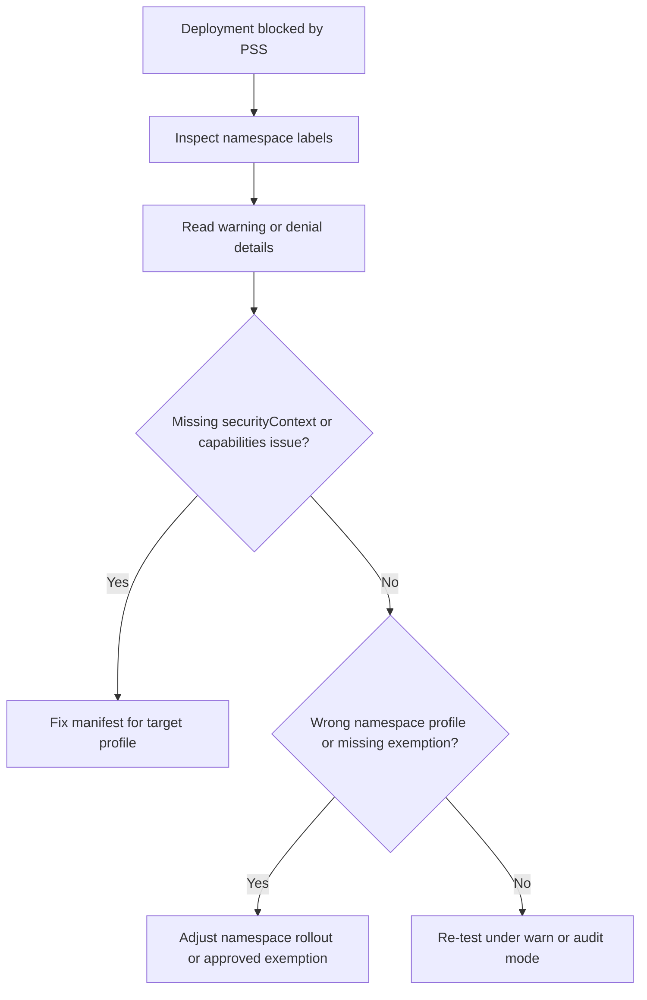

# PSS Enforcement Breaks Deployment

## Symptom

A workload deploys successfully in one namespace but fails or warns in another after Pod Security Standards enforcement is introduced.

## Possible Causes

- The namespace moved from `privileged` to `baseline` or `restricted`.
- The manifest lacks `securityContext` settings required by the target profile.
- The workload adds Linux capabilities or relies on privilege escalation.
- The workload expects host access patterns that the target profile does not allow.
- A namespace exemption that previously existed was removed.

## Diagnosis Steps

<!-- diagram-id: troubleshooting-security-pss-enforcement-breaks-deployment -->


1. Inspect the target namespace labels.

    ```bash
    kubectl get namespace <namespace> \
        --show-labels
    ```

2. Capture the exact warning or denial details from the deployment output.

3. Inspect the workload manifest for common restricted-profile blockers:

    - missing `runAsNonRoot`,
    - missing `allowPrivilegeEscalation: false`,
    - added Linux capabilities,
    - missing `seccompProfile`,
    - broad host access assumptions.

4. Describe the workload object for admission events.

    ```bash
    kubectl describe deployment <deployment-name> \
        --namespace <namespace>
    ```

5. Compare the namespace target profile with the workload's actual trust level.

## Resolution

- Update the workload manifest so it meets the target PSS profile.
- If the namespace was moved too aggressively, step back to `warn` or `audit` while the team remediates manifests.
- Use a tightly scoped namespace exemption only when the workload genuinely requires higher privilege and the exception is approved.
- Keep platform and application teams aligned on whether the namespace should stay `privileged`, `baseline`, or `restricted`.

## Prevention

- Roll out PSS with `warn` or `audit` before `enforce`.
- Publish a standard workload manifest template that already includes compliant `securityContext` defaults.
- Track exemption namespaces with expiry and owner.
- Review privileged or host-access workloads separately before namespace-level promotion to `restricted`.

## See Also

- [Pod Security Standards](../../../platform/pod-security-standards.md)
- [Azure Policy Add-on](../../../platform/azure-policy-addon.md)
- [Best Practices: Governance](../../../best-practices/governance.md)
- [Best Practices: Security](../../../best-practices/security.md)

## Sources

- [Use Pod Security Admission in Azure Kubernetes Service (AKS)](https://learn.microsoft.com/en-us/azure/aks/use-psa)
- [Use Deployment Safeguards to Enforce Best Practices in Azure Kubernetes Service (AKS)](https://learn.microsoft.com/en-us/azure/aks/deployment-safeguards)
- [Developer best practices - Pod security in Azure Kubernetes Services (AKS)](https://learn.microsoft.com/en-us/azure/aks/developer-best-practices-pod-security)
