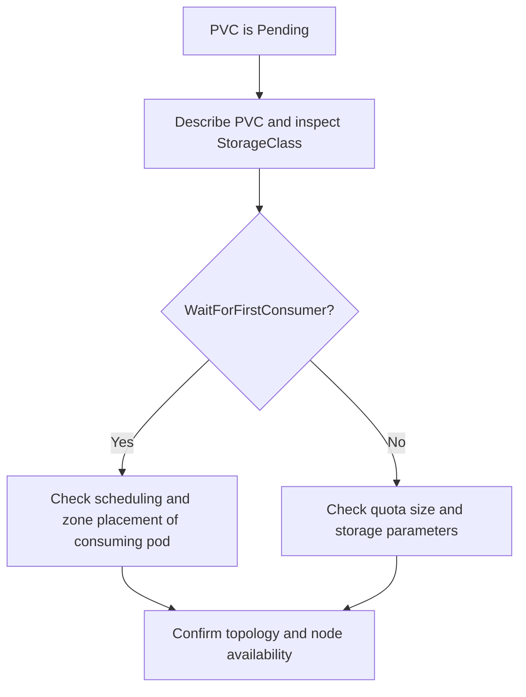

---
content_sources:
  diagrams:
    - id: troubleshooting-storage-pvc-stuck-pending
      type: flowchart
      source: self-generated
      justification: PVC Pending diagnostic flow synthesized from Microsoft Learn AKS Azure Disk and Azure Files provisioning guidance.
      based_on:
        - https://learn.microsoft.com/en-us/azure/aks/create-volume-azure-disk
        - https://learn.microsoft.com/en-us/azure/aks/create-volume-azure-files
        - https://learn.microsoft.com/en-us/azure/aks/concepts-storage
content_validation:
  status: verified
  last_reviewed: 2026-07-18
  reviewer: agent
  core_claims:
    - claim: "AKS default managed disk storage classes use WaitForFirstConsumer to delay provisioning until a consuming pod is scheduled."
      source: https://learn.microsoft.com/en-us/azure/aks/create-volume-azure-disk
      verified: true
    - claim: "A PVC requests storage by storage class, access mode, and size, and Kubernetes dynamically provisions Azure storage when the claim can be satisfied."
      source: https://learn.microsoft.com/en-us/azure/aks/concepts-storage
      verified: true
---

# PVC Stuck in Pending

## Symptom

A PersistentVolumeClaim remains in `Pending`, often with no bound PV and no usable volume attached to the workload.

## Possible Causes

- The StorageClass uses `WaitForFirstConsumer`, but no pod is scheduled yet.
- Zone or topology constraints cannot be satisfied for the requested storage class.
- Quota, capacity, or storage-account constraints prevent provisioning.
- The requested access mode or size does not match the storage family.

## Diagnosis Steps

<!-- diagram-id: troubleshooting-storage-pvc-stuck-pending -->


1. Inspect the PVC and its events.

    ```bash
    kubectl describe pvc "$PVC_NAME" \
        --namespace "$NAMESPACE"
    ```

2. Inspect the referenced StorageClass.

    ```bash
    kubectl get storageclass "$STORAGE_CLASS_NAME" \
        --output yaml
    ```

3. If the class uses `WaitForFirstConsumer`, inspect the consuming pod and its scheduling state.

    ```bash
    kubectl describe pod "$POD_NAME" \
        --namespace "$NAMESPACE"
    ```

4. Verify node-zone labels and workload topology rules when using zonal disk classes.

    ```bash
    kubectl get nodes \
        --show-labels
    ```

## Resolution

- Create or schedule the consuming pod so a `WaitForFirstConsumer` PVC can bind.
- Relax or correct zone constraints so the scheduler and storage class agree.
- Adjust size, access mode, or storage class to match the requested storage family.
- Resolve Azure quota or storage-account limitations before retrying.

## Prevention

- Use `WaitForFirstConsumer` for zonal disk classes unless you have a proven reason not to.
- Standardize storage-class names and allowed sizes per workload tier.
- Keep a zone-placement checklist for StatefulSets that use LRS disks.

## See Also

- [Azure Disk CSI Driver](../../../platform/azure-disk-csi-driver.md)
- [Azure Files CSI Driver](../../../platform/azure-files-csi-driver.md)
- [Volume Attach Failure](volume-attach-failure.md)

## Sources

- [Storage concepts for AKS](https://learn.microsoft.com/en-us/azure/aks/concepts-storage)
- [Create and manage Azure Disk persistent volumes on AKS](https://learn.microsoft.com/en-us/azure/aks/create-volume-azure-disk)
- [Create and manage Azure Files persistent volumes on AKS](https://learn.microsoft.com/en-us/azure/aks/create-volume-azure-files)
