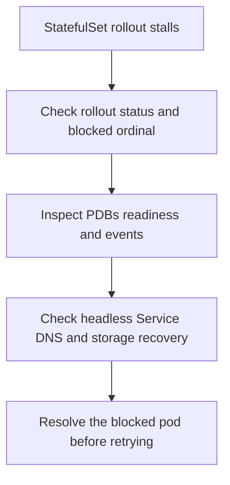

---
content_sources:
  diagrams:
    - id: troubleshooting-storage-statefulset-stuck-rolling-update
      type: flowchart
      source: self-generated
      justification: StatefulSet rolling-update diagnostic flow synthesized from Microsoft Learn AKS upgrade behavior and production-upgrade guidance.
      based_on:
        - https://learn.microsoft.com/en-us/azure/aks/upgrade-aks-faq
        - https://learn.microsoft.com/en-us/azure/aks/upgrade-conceptual
        - https://learn.microsoft.com/en-us/azure/aks/aks-production-upgrade-strategies
content_validation:
  status: verified
  last_reviewed: 2026-07-18
  reviewer: agent
  core_claims:
    - claim: "StatefulSet pods are evicted and rescheduled during AKS node upgrades, and workload disruption control still depends on customer-owned settings such as replicas, readiness behavior, and Pod Disruption Budgets."
      source: https://learn.microsoft.com/en-us/azure/aks/upgrade-aks-faq
      verified: true
    - claim: "Restrictive Pod Disruption Budgets can block eviction during AKS upgrades and delay or prevent node draining."
      source: https://learn.microsoft.com/en-us/azure/aks/upgrade-conceptual
      verified: true
---

# StatefulSet Stuck During Rolling Update

## Symptom

The StatefulSet update stops on one ordinal, one or more pods remain unavailable, or the rollout never progresses to the next pod.

## Possible Causes

- PodDisruptionBudget rules prevent eviction or replacement.
- A prior ordinal never becomes Ready, so later ordinals never roll.
- Headless Service or DNS dependencies are broken.
- Storage attach or mount recovery for the updated pod is incomplete.

## Diagnosis Steps

<!-- diagram-id: troubleshooting-storage-statefulset-stuck-rolling-update -->


1. Inspect StatefulSet rollout status.

    ```bash
    kubectl rollout status statefulset "$STATEFULSET_NAME" \
        --namespace "$NAMESPACE"
    ```

2. Inspect the StatefulSet and blocked pod events.

    ```bash
    kubectl describe statefulset "$STATEFULSET_NAME" \
        --namespace "$NAMESPACE"

    kubectl describe pod "$POD_NAME" \
        --namespace "$NAMESPACE"
    ```

3. Inspect PodDisruptionBudgets in the namespace.

    ```bash
    kubectl get pdb \
        --namespace "$NAMESPACE"
    ```

4. Verify the headless Service and endpoint records.

    ```bash
    kubectl get service "$SERVICE_NAME" \
        --namespace "$NAMESPACE" \
        --output yaml
    ```

## Resolution

- Fix the first blocked ordinal before expecting later pods to update.
- Relax or temporarily adjust the PDB if it blocks the required voluntary disruption.
- Repair headless Service, DNS, or readiness conditions that keep the pod from becoming Ready.
- Resolve underlying attach or mount failures, then re-run or resume the rollout.

## Prevention

- Test StatefulSet rollout behavior in nonproduction with the same PDB and readiness settings.
- Keep storage changes and image changes in separate rollout windows when possible.
- Document whether the workload depends on strict ordered rollout or can tolerate parallelism.

## See Also

- [StatefulSet Day-2 Operations](../../../operations/statefulset-day-2-operations.md)
- [Upgrade Blocked by Pod Disruption Budget](../operations/upgrade-blocked-pdb.md)
- [Volume Attach Failure](volume-attach-failure.md)

## Sources

- [AKS upgrades FAQ](https://learn.microsoft.com/en-us/azure/aks/upgrade-aks-faq)
- [How AKS cluster upgrades work](https://learn.microsoft.com/en-us/azure/aks/upgrade-conceptual)
- [AKS production upgrade strategies](https://learn.microsoft.com/en-us/azure/aks/aks-production-upgrade-strategies)
