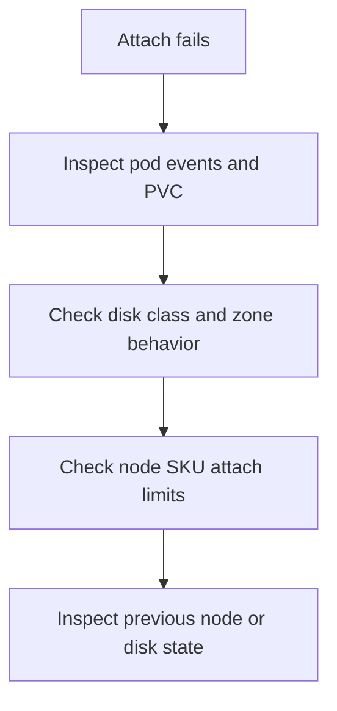

---
content_sources:
  diagrams:
    - id: troubleshooting-storage-volume-attach-failure
      type: flowchart
      source: self-generated
      justification: Volume attach failure diagnostic flow synthesized from Microsoft Learn AKS Azure Disk CSI and storage concepts guidance.
      based_on:
        - https://learn.microsoft.com/en-us/azure/aks/csi-storage-drivers
        - https://learn.microsoft.com/en-us/azure/aks/create-volume-azure-disk
        - https://learn.microsoft.com/en-us/azure/aks/concepts-storage
content_validation:
  status: verified
  last_reviewed: 2026-07-18
  reviewer: agent
  core_claims:
    - claim: "The Azure Disk CSI driver has per-node volume limits that depend on the VM SKU, and some 16-core SKUs support up to 64 volumes per node."
      source: https://learn.microsoft.com/en-us/azure/aks/csi-storage-drivers
      verified: true
    - claim: "Azure Disk CSI supports ZRS disk types that are not restricted to the same zone as the node, unlike zonal disk placement."
      source: https://learn.microsoft.com/en-us/azure/aks/csi-storage-drivers
      verified: true
---

# Volume Attach Failure

## Symptom

The pod is scheduled but the volume never attaches, often surfacing `FailedAttachVolume`, repeated attach retries, or a workload stuck in `ContainerCreating`.

## Possible Causes

- The disk is zonal and the replacement pod landed in a different zone.
- The node has reached the VM SKU’s disk-attach limit.
- The underlying managed disk is in a conflicting Azure state.
- A previous node still holds the disk attachment or detach is delayed.

## Diagnosis Steps

<!-- diagram-id: troubleshooting-storage-volume-attach-failure -->


1. Inspect pod events for attach failures.

    ```bash
    kubectl describe pod "$POD_NAME" \
        --namespace "$NAMESPACE"
    ```

2. Inspect the PVC and StorageClass to determine whether the disk is zonal or ZRS.

    ```bash
    kubectl describe pvc "$PVC_NAME" \
        --namespace "$NAMESPACE"

    kubectl get storageclass "$STORAGE_CLASS_NAME" \
        --output yaml
    ```

3. Inspect node labels and node SKU placement.

    ```bash
    kubectl get nodes \
        --show-labels
    ```

4. Inspect the CSI node object for driver limits on the target node.

    ```bash
    kubectl get csinode "$NODE_NAME" \
        --output yaml
    ```

## Resolution

- Move the workload back into the disk’s zone, or move to a ZRS disk class if cross-zone reattach is a hard requirement.
- Reduce per-node attachment pressure by spreading StatefulSets or changing node SKU.
- Wait for the previous attachment to clear or repair the failed node path before retrying.
- Recreate the pod only after confirming the disk is no longer attached elsewhere.

## Prevention

- Use ZRS disk classes when cross-zone recovery matters more than lowest cost.
- Track per-node attachment density for state-heavy node pools.
- Keep StatefulSet scheduling and disk placement policies consistent.

## See Also

- [Azure Disk CSI Driver](../../../platform/azure-disk-csi-driver.md)
- [PVC Stuck in Pending](pvc-stuck-pending.md)
- [Volume Mount Failure](volume-mount-failure.md)

## Sources

- [Use CSI storage drivers on AKS](https://learn.microsoft.com/en-us/azure/aks/csi-storage-drivers)
- [Create and manage Azure Disk persistent volumes on AKS](https://learn.microsoft.com/en-us/azure/aks/create-volume-azure-disk)
- [Storage concepts for AKS](https://learn.microsoft.com/en-us/azure/aks/concepts-storage)
