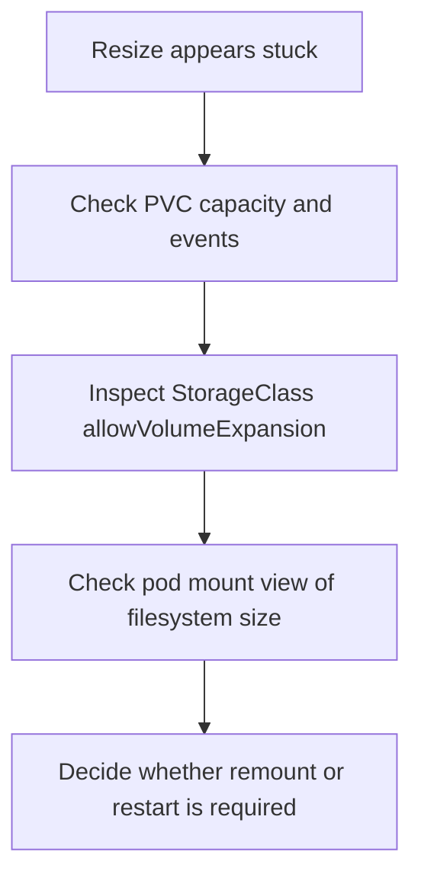

---
content_sources:
  diagrams:
    - id: troubleshooting-storage-volume-expansion-failure
      type: flowchart
      source: self-generated
      justification: Volume expansion failure diagnostic flow synthesized from Microsoft Learn Azure Disk and Azure Files resize guidance.
      based_on:
        - https://learn.microsoft.com/en-us/azure/aks/create-volume-azure-disk
        - https://learn.microsoft.com/en-us/azure/aks/create-volume-azure-files
        - https://learn.microsoft.com/en-us/azure/aks/concepts-storage
content_validation:
  status: verified
  last_reviewed: 2026-07-18
  reviewer: agent
  core_claims:
    - claim: "AKS built-in disk and file StorageClasses support volume expansion when allowVolumeExpansion is enabled."
      source: https://learn.microsoft.com/en-us/azure/aks/concepts-storage
      verified: true
    - claim: "Shrinking persistent volumes is not supported for Azure Disk and Azure Files on AKS."
      source: https://learn.microsoft.com/en-us/azure/aks/create-volume-azure-disk
      verified: true
---

# Volume Expansion Failure

## Symptom

The PVC size is patched upward, but the application still sees the old capacity or the resize stalls partway through the workflow.

## Possible Causes

- The StorageClass does not allow volume expansion.
- The PVC was patched, but the filesystem resize has not completed yet.
- The workload needs a restart or controlled remount to observe the new size.
- The operator attempted an unsupported shrink operation instead of an expansion.

## Diagnosis Steps

<!-- diagram-id: troubleshooting-storage-volume-expansion-failure -->


1. Inspect the PVC and its events.

    ```bash
    kubectl describe pvc "$PVC_NAME" \
        --namespace "$NAMESPACE"
    ```

2. Inspect the StorageClass.

    ```bash
    kubectl get storageclass "$STORAGE_CLASS_NAME" \
        --output yaml
    ```

3. Check the application view of the mounted filesystem.

    ```bash
    kubectl exec "$POD_NAME" \
        --namespace "$NAMESPACE" \
        -- df -h "$MOUNT_PATH"
    ```

## Resolution

- Enable or switch to a StorageClass that supports expansion.
- Wait for filesystem resize to finish before measuring inside the container.
- Restart or roll pods in a controlled way if the workload observes storage size only at startup.
- If the request attempted a shrink, revert the manifest and use a migration plan instead.

## Prevention

- Treat PVC growth as a planned maintenance action with verification steps.
- Standardize expandable storage classes for StatefulSets that are expected to grow.
- Separate storage expansion from unrelated image or configuration rollouts.

## See Also

- [Snapshot Operations](../../../operations/snapshot-operations.md)
- [StatefulSet Day-2 Operations](../../../operations/statefulset-day-2-operations.md)
- [Azure Disk CSI Driver](../../../platform/azure-disk-csi-driver.md)

## Sources

- [Storage concepts for AKS](https://learn.microsoft.com/en-us/azure/aks/concepts-storage)
- [Create and manage Azure Disk persistent volumes on AKS](https://learn.microsoft.com/en-us/azure/aks/create-volume-azure-disk)
- [Create and manage Azure Files persistent volumes on AKS](https://learn.microsoft.com/en-us/azure/aks/create-volume-azure-files)
