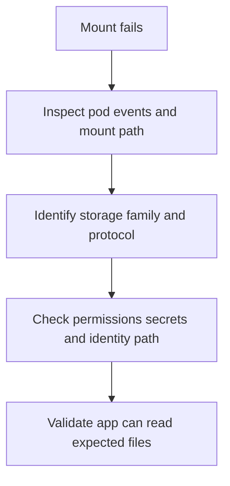

---
content_sources:
  diagrams:
    - id: troubleshooting-storage-volume-mount-failure
      type: flowchart
      source: self-generated
      justification: Volume mount failure diagnostic flow synthesized from Microsoft Learn AKS Azure Files and Azure Disk documentation.
      based_on:
        - https://learn.microsoft.com/en-us/azure/aks/create-volume-azure-files
        - https://learn.microsoft.com/en-us/azure/aks/create-volume-azure-disk
        - https://learn.microsoft.com/en-us/azure/aks/csi-storage-drivers
content_validation:
  status: verified
  last_reviewed: 2026-07-18
  reviewer: agent
  core_claims:
    - claim: "Azure Files CSI supports SMB and NFS on AKS, but SMB mounts are key-based by default while NFS mounts do not require key-based authentication."
      source: https://learn.microsoft.com/en-us/azure/aks/create-volume-azure-files
      verified: true
    - claim: "Azure Disk CSI and Azure Files CSI both support CSI-native persistent-volume lifecycle operations on AKS."
      source: https://learn.microsoft.com/en-us/azure/aks/csi-storage-drivers
      verified: true
---

# Volume Mount Failure

## Symptom

The volume attaches, but the container never gets a usable mount path. Pods often remain in `ContainerCreating`, or the application starts and then fails because the expected files are missing or inaccessible.

## Possible Causes

- Kubelet mount failures on the node.
- Filesystem corruption or incompatible filesystem expectations.
- Azure Files SMB secrets, ACLs, or role assignments are wrong.
- The workload expects a different path, protocol, or permissions model than the mounted volume provides.

## Diagnosis Steps

<!-- diagram-id: troubleshooting-storage-volume-mount-failure -->


1. Inspect pod events for mount failures.

    ```bash
    kubectl describe pod "$POD_NAME" \
        --namespace "$NAMESPACE"
    ```

2. Inspect the PVC and StorageClass to confirm protocol and mount options.

    ```bash
    kubectl describe pvc "$PVC_NAME" \
        --namespace "$NAMESPACE"

    kubectl get storageclass "$STORAGE_CLASS_NAME" \
        --output yaml
    ```

3. For Azure Files SMB, verify secrets or identity path.

    ```bash
    kubectl get secret "$SECRET_NAME" \
        --namespace "$NAMESPACE" \
        --output yaml
    ```

4. Validate the application path inside a healthy test pod where possible.

    ```bash
    kubectl exec "$POD_NAME" \
        --namespace "$NAMESPACE" \
        -- ls -la "$MOUNT_PATH"
    ```

## Resolution

- Fix the secret, SMB role assignment, or workload-identity path for Azure Files SMB mounts.
- Correct mount options or protocol mismatches.
- Repair the application path assumptions so the container reads the actual mounted directory.
- For suspected filesystem issues on block storage, restore from snapshot or rebuild the pod against a validated recovery point.

## Prevention

- Standardize mount paths and storage-class definitions per workload family.
- Use validation pods to test storage classes before rollout.
- Prefer least-privilege identity models over long-lived secrets where supported.

## See Also

- [Azure Files CSI Driver](../../../platform/azure-files-csi-driver.md)
- [Volume Attach Failure](volume-attach-failure.md)
- [Restore Drills](../../../operations/restore-drills.md)

## Sources

- [Create and manage Azure Files persistent volumes on AKS](https://learn.microsoft.com/en-us/azure/aks/create-volume-azure-files)
- [Create and manage Azure Disk persistent volumes on AKS](https://learn.microsoft.com/en-us/azure/aks/create-volume-azure-disk)
- [Use CSI storage drivers on AKS](https://learn.microsoft.com/en-us/azure/aks/csi-storage-drivers)
