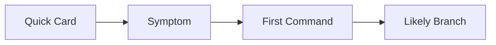

# Quick Diagnosis Cards

Use these cards when you need a 30-second starting point before opening a full playbook.

## Main Content

| Symptom | First Command | Likely Playbook |
|---|---|---|
| `ImagePullBackOff` | `kubectl describe pod <pod-name> -n <namespace>` | [Image Pull Failure](playbooks/pod-issues/image-pull-failure.md) |
| `CrashLoopBackOff` | `kubectl logs <pod-name> -n <namespace> --previous` | [CrashLoop](playbooks/pod-issues/crashloop.md) |
| `Pending` pods | `kubectl describe pod <pod-name> -n <namespace>` | [Pending Pods](playbooks/pod-issues/pending-pods.md) |
| Service returns no response | `kubectl get endpoints <service-name> -n <namespace>` | [Service Unreachable](playbooks/connectivity/service-unreachable.md) |
| Ingress 404/502 | `kubectl describe ingress <ingress-name> -n <namespace>` | [Ingress Failure](playbooks/connectivity/ingress-failure.md) |
| Node `NotReady` | `kubectl describe node <node-name>` | [Node Not Ready](playbooks/node-issues/node-not-ready.md) |

## See Also

- [Decision Tree](decision-tree.md)
- [First 10 Minutes](first-10-minutes/index.md)
- [Playbooks](playbooks/index.md)

## Sources

- [Troubleshoot AKS clusters](https://learn.microsoft.com/troubleshoot/azure/azure-kubernetes/welcome-azure-kubernetes)
- [AKS troubleshooting articles](https://learn.microsoft.com/troubleshoot/azure/azure-kubernetes/)
