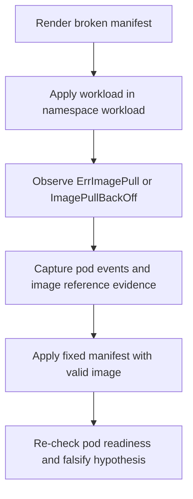

---
content_sources:
  diagrams:
    - id: fault-lab-01-image-pull-failure
      type: flowchart
      source: self-generated
      justification: Synthesized lab flow based on AKS troubleshooting and ACR guidance.
      based_on:
        - https://learn.microsoft.com/en-us/troubleshoot/azure/azure-kubernetes/welcome-azure-kubernetes
        - https://learn.microsoft.com/en-us/azure/aks/cluster-container-registry-integration
        - https://learn.microsoft.com/en-us/azure/container-registry/container-registry-troubleshoot-login-authn-authz
---

# Fault Lab 01: Image Pull Failure

Use this falsification lab to prove that an `ImagePullBackOff` symptom is caused by a bad image reference, not by probe, ingress, or runtime logic.

## Lab Metadata

| Field | Value |
|---|---|
| Difficulty | Intermediate |
| Estimated duration | 20-30 minutes |
| Lab tier | AKS workload-level falsification lab |
| Failure class | Pod start failure / registry image lookup |
| Namespace | `workload` |
| Companion assets | `labs/image-pull-failure/` |
| Paired playbook | [Image Pull Failure](../../troubleshooting/playbooks/pod-issues/image-pull-failure.md) |

## 1) Background

The Python sample in `apps/python/` normally starts a FastAPI container from an image you build and push to a registry. This lab intentionally deploys the same workload name with a broken image reference so the kubelet cannot pull it.

<!-- diagram-id: fault-lab-01-image-pull-failure -->


## 2) Hypothesis

If the pod references an image tag that does not exist, then AKS will keep the pod in `ErrImagePull` or `ImagePullBackOff`, and `kubectl describe pod` will show registry pull errors tied to the image name or tag.

## 3) Runbook

1. Build and push the sample app image from `apps/python/`, then export `IMAGE_REPOSITORY` to that real image reference.
2. Review the shared cluster baseline in `infra/README.md` if you need a lab cluster first.
3. Run the broken scenario:

    ```bash
    ./labs/image-pull-failure/trigger-scenario.sh
    ```

4. Collect evidence before changing anything:

    ```bash
    ./labs/image-pull-failure/verify.sh
    ```

5. Apply the fix:

    ```bash
    ./labs/image-pull-failure/trigger-fix.sh
    ```

6. Re-run verification and compare the before/after evidence pack.

## 4) Experiment Log

Record a real run here after execution. This section is intentionally a template and must not be filled with invented command output.

| Timestamp (UTC) | Action | Expected observation | Actual observation |
|---|---|---|---|
| _fill after real run_ | Apply broken manifest | Pod enters `ErrImagePull` or `ImagePullBackOff` | _fill after real run_ |
| _fill after real run_ | Capture evidence | Events mention manifest lookup or auth failure | _fill after real run_ |
| _fill after real run_ | Apply fixed manifest | New pod reaches `Running` and `Ready` | _fill after real run_ |

## Expected Evidence

- Before remediation, `kubectl describe pod` shows `ErrImagePull` or `ImagePullBackOff` and references the broken image value.
- `kubectl get events --namespace workload --sort-by=.lastTimestamp` shows pull failures before any fix is applied.
- After the fix, the replacement pod becomes `Running` and `Ready`.
- **Falsification-after-fix:** if the pod still fails after restoring a valid image reference, the original hypothesis is false or incomplete, and you should pivot to identity, network, or registry authorization checks in the paired playbook.

## Clean Up

```bash
./labs/image-pull-failure/cleanup.sh
```

Set `DELETE_RESOURCE_GROUP=true` and `RG=<resource-group-name>` only if the whole cluster resource group was created just for this lab.

## Related Playbook

- [Image Pull Failure](../../troubleshooting/playbooks/pod-issues/image-pull-failure.md)

## See Also

- [Evidence Packs](../../troubleshooting/evidence-packs/index.md)
- [Evidence Map](../../troubleshooting/evidence-map.md)
- [Tutorial 03: Azure Key Vault CSI Driver](lab-03-azure-key-vault-csi-driver.md)

## Sources

- [Troubleshoot AKS clusters](https://learn.microsoft.com/en-us/troubleshoot/azure/azure-kubernetes/welcome-azure-kubernetes)
- [Authenticate from AKS to ACR](https://learn.microsoft.com/en-us/azure/aks/cluster-container-registry-integration)
- [Troubleshoot registry login, authentication, and authorization](https://learn.microsoft.com/en-us/azure/container-registry/container-registry-troubleshoot-login-authn-authz)
