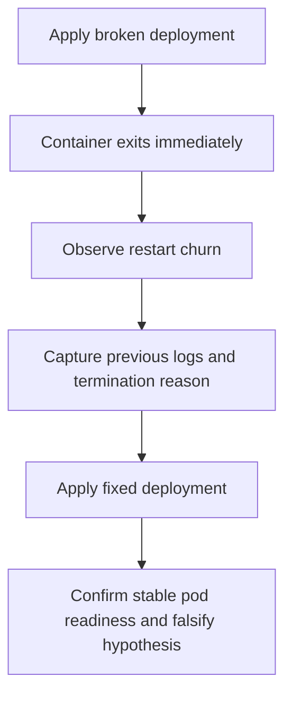

---
content_sources:
  diagrams:
    - id: fault-lab-02-crashloopbackoff
      type: flowchart
      source: self-generated
      justification: Synthesized lab flow based on AKS crash-loop troubleshooting guidance.
      based_on:
        - https://learn.microsoft.com/en-us/troubleshoot/azure/azure-kubernetes/welcome-azure-kubernetes
        - https://learn.microsoft.com/en-us/azure/aks/operator-best-practices-pod-security
        - https://learn.microsoft.com/en-us/azure/aks/developer-best-practices-pod-health
---

# Fault Lab 02: CrashLoopBackOff

Use this falsification lab to prove that a restart loop is caused by the container process exiting immediately, not by image pull, ingress, or scheduler placement.

## Lab Metadata

| Field | Value |
|---|---|
| Difficulty | Intermediate |
| Estimated duration | 20-30 minutes |
| Lab tier | AKS workload-level falsification lab |
| Failure class | Pod restart loop / container process exit |
| Namespace | `workload` |
| Companion assets | `labs/crashloopbackoff/` |
| Paired playbook | [CrashLoop](../../troubleshooting/playbooks/pod-issues/crashloop.md) |

## 1) Background

The Python sample app normally starts and serves `/healthz` and `/readyz`. This lab overrides the container command so the process exits with code `1`, which should produce a `CrashLoopBackOff` sequence that you can disprove after restoring the default startup path.

<!-- diagram-id: fault-lab-02-crashloopbackoff -->


## 2) Hypothesis

If the container command exits immediately, then the pod will enter `CrashLoopBackOff`, and the prior container log plus termination state will show a fast failure unrelated to image retrieval.

## 3) Runbook

1. Build and push the Python sample image, then export `IMAGE_REPOSITORY`.
2. Trigger the broken scenario:

    ```bash
    ./labs/crashloopbackoff/trigger-scenario.sh
    ```

3. Capture evidence before remediation:

    ```bash
    ./labs/crashloopbackoff/verify.sh
    ```

4. Apply the fixed manifest:

    ```bash
    ./labs/crashloopbackoff/trigger-fix.sh
    ```

5. Re-run verification and compare restart counts, logs, and readiness state.

## 4) Experiment Log

Record real observations only after you execute the lab. Do not paste synthetic logs or guessed exit codes here.

| Timestamp (UTC) | Action | Expected observation | Actual observation |
|---|---|---|---|
| _fill after real run_ | Apply broken manifest | Pod enters `CrashLoopBackOff` | _fill after real run_ |
| _fill after real run_ | Capture logs and describe output | Previous log and exit reason show immediate failure | _fill after real run_ |
| _fill after real run_ | Apply fixed manifest | Pod becomes stable and ready | _fill after real run_ |

## Expected Evidence

- `kubectl get pods --namespace workload` shows `CrashLoopBackOff` with a rising restart count.
- `kubectl logs --previous` captures the broken command path before the pod recycles.
- `kubectl describe pod` shows the last state and exit code for the container.
- **Falsification-after-fix:** if the pod still loops after restoring the healthy command path, the process-exit hypothesis is false or incomplete, and you should investigate missing configuration, probe timing, or resource starvation.

## Clean Up

```bash
./labs/crashloopbackoff/cleanup.sh
```

## Related Playbook

- [CrashLoop](../../troubleshooting/playbooks/pod-issues/crashloop.md)

## See Also

- [Evidence Packs](../../troubleshooting/evidence-packs/index.md)
- [Pod Failures: First 10 Minutes](../../troubleshooting/first-10-minutes/pod-failures.md)
- [Tutorial 03: Azure Key Vault CSI Driver](lab-03-azure-key-vault-csi-driver.md)

## Sources

- [Troubleshoot AKS clusters](https://learn.microsoft.com/en-us/troubleshoot/azure/azure-kubernetes/welcome-azure-kubernetes)
- [Pod health best practices for AKS](https://learn.microsoft.com/en-us/azure/aks/developer-best-practices-pod-health)
- [Pod security best practices for AKS](https://learn.microsoft.com/en-us/azure/aks/operator-best-practices-pod-security)
