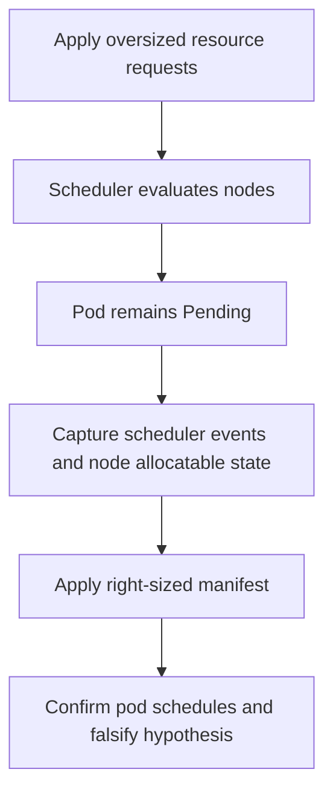

---
content_sources:
  diagrams:
    - id: fault-lab-03-pending-pods-resources
      type: flowchart
      source: self-generated
      justification: Synthesized lab flow based on AKS scheduling and capacity troubleshooting guidance.
      based_on:
        - https://learn.microsoft.com/en-us/troubleshoot/azure/azure-kubernetes/welcome-azure-kubernetes
        - https://learn.microsoft.com/en-us/azure/aks/concepts-scale
        - https://learn.microsoft.com/en-us/azure/aks/cluster-autoscaler-overview
---

# Fault Lab 03: Pending Pods from Oversized Resource Requests

Use this falsification lab to prove that a `Pending` pod is blocked by unrealistic CPU and memory requests rather than by image, ingress, or application startup behavior.

## Lab Metadata

| Field | Value |
|---|---|
| Difficulty | Intermediate |
| Estimated duration | 20-30 minutes |
| Lab tier | AKS workload-level falsification lab |
| Failure class | Scheduling failure / insufficient cluster capacity |
| Namespace | `workload` |
| Companion assets | `labs/pending-pods-resources/` |
| Paired playbook | [Pending Pods](../../troubleshooting/playbooks/pod-issues/pending-pods.md) |

## 1) Background

The sample app is small, but this lab intentionally requests more CPU and memory than a normal lab cluster can schedule. The goal is to capture scheduler evidence before changing the request profile.

<!-- diagram-id: fault-lab-03-pending-pods-resources -->


## 2) Hypothesis

If the pod requests more CPU and memory than any node can satisfy, then the pod will remain `Pending`, and `kubectl describe pod` will show `Insufficient cpu` or `Insufficient memory` style scheduler events.

## 3) Runbook

1. Build and push the Python sample image, then export `IMAGE_REPOSITORY`.
2. Trigger the oversized request scenario:

    ```bash
    ./labs/pending-pods-resources/trigger-scenario.sh
    ```

3. Preserve evidence before remediation:

    ```bash
    ./labs/pending-pods-resources/verify.sh
    ```

4. Apply the right-sized workload:

    ```bash
    ./labs/pending-pods-resources/trigger-fix.sh
    ```

5. Re-run verification and compare scheduler events with the post-fix placement result.

## 4) Experiment Log

This log is a blank template until you run the lab on a real cluster.

| Timestamp (UTC) | Action | Expected observation | Actual observation |
|---|---|---|---|
| _fill after real run_ | Apply broken manifest | Pod stays `Pending` | _fill after real run_ |
| _fill after real run_ | Capture evidence | Scheduler events cite insufficient resources | _fill after real run_ |
| _fill after real run_ | Apply fixed manifest | Pod schedules and reaches `Running` | _fill after real run_ |

## Expected Evidence

- `kubectl describe pod` records scheduling failures such as `0/N nodes are available` and resource insufficiency details.
- `kubectl get nodes --output custom-columns=...` or `kubectl describe node` shows the cluster's allocatable baseline before the fix.
- After the fixed manifest is applied, the same workload schedules without changing the image or startup command.
- **Falsification-after-fix:** if the pod remains `Pending` after right-sizing requests, the resource-request hypothesis is false or incomplete, and you should investigate selectors, taints, autoscaler limits, or PVC binding.

## Clean Up

```bash
./labs/pending-pods-resources/cleanup.sh
```

## Related Playbook

- [Pending Pods](../../troubleshooting/playbooks/pod-issues/pending-pods.md)

## See Also

- [Evidence Packs](../../troubleshooting/evidence-packs/index.md)
- [Scaling](../../platform/scaling.md)
- [Node Pools](../../platform/node-pools.md)

## Sources

- [Troubleshoot AKS clusters](https://learn.microsoft.com/en-us/troubleshoot/azure/azure-kubernetes/welcome-azure-kubernetes)
- [Scaling concepts for AKS](https://learn.microsoft.com/en-us/azure/aks/concepts-scale)
- [Cluster autoscaler on AKS](https://learn.microsoft.com/en-us/azure/aks/cluster-autoscaler-overview)
