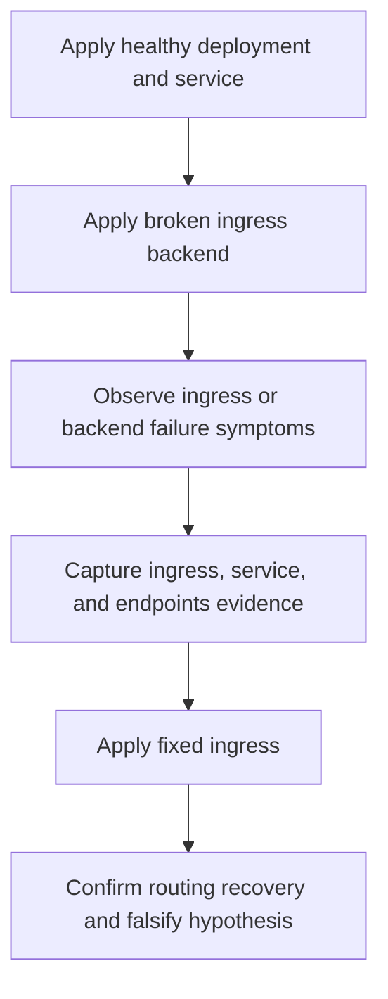

---
content_sources:
  diagrams:
    - id: fault-lab-04-ingress-misconfiguration
      type: flowchart
      source: self-generated
      justification: Synthesized lab flow based on AKS ingress troubleshooting guidance.
      based_on:
        - https://learn.microsoft.com/en-us/troubleshoot/azure/azure-kubernetes/welcome-azure-kubernetes
        - https://learn.microsoft.com/en-us/azure/aks/app-routing
        - https://learn.microsoft.com/en-us/azure/aks/concepts-network-ingress
---

# Fault Lab 04: Ingress Misconfiguration

Use this falsification lab to prove that an ingress failure is caused by a bad backend service reference, not by a crashed application container or a missing deployment.

## Lab Metadata

| Field | Value |
|---|---|
| Difficulty | Intermediate |
| Estimated duration | 25-35 minutes |
| Lab tier | AKS connectivity falsification lab |
| Failure class | Ingress-to-service routing failure |
| Namespace | `workload` |
| Companion assets | `labs/ingress-misconfiguration/` |
| Paired playbook | [Ingress Failure](../../troubleshooting/playbooks/connectivity/ingress-failure.md) |

## 1) Background

The Python sample app exposes port `8000` behind a `Service` on port `80`. This lab keeps the deployment healthy but points the ingress backend to the wrong service port so you can observe a routing break without changing the application process itself.

<!-- diagram-id: fault-lab-04-ingress-misconfiguration -->


## 2) Hypothesis

If the ingress backend points to the wrong service port, then the ingress object will not route traffic correctly even though the pods are healthy, and the evidence will show healthy endpoints paired with a broken ingress rule.

## 3) Runbook

1. Build and push the Python sample image, then export `IMAGE_REPOSITORY`.
2. Set `APP_HOSTNAME` to a host value routed to your ingress controller.
3. Trigger the broken scenario:

    ```bash
    ./labs/ingress-misconfiguration/trigger-scenario.sh
    ```

4. Capture ingress evidence before remediation:

    ```bash
    ./labs/ingress-misconfiguration/verify.sh
    ```

5. Apply the corrected ingress:

    ```bash
    ./labs/ingress-misconfiguration/trigger-fix.sh
    ```

6. Re-run verification and compare ingress, service, and endpoint state.

## 4) Experiment Log

Fill this section only after a real cluster run. Do not invent curl responses, controller logs, or endpoint state.

| Timestamp (UTC) | Action | Expected observation | Actual observation |
|---|---|---|---|
| _fill after real run_ | Apply broken ingress | Ingress exists but routing fails | _fill after real run_ |
| _fill after real run_ | Capture evidence | Pods and endpoints stay healthy while ingress config is wrong | _fill after real run_ |
| _fill after real run_ | Apply fixed ingress | Requests route successfully | _fill after real run_ |

## Expected Evidence

- `kubectl get pods --namespace workload` shows the application pods are healthy before and after the ingress fix.
- `kubectl get endpoints --namespace workload` shows populated endpoints, which helps disprove a service-selector failure.
- `kubectl describe ingress` or controller events isolate the broken backend reference.
- **Falsification-after-fix:** if routing still fails after correcting the ingress backend, the ingress-misconfiguration hypothesis is false or incomplete, and you should inspect ingress class, external IP, DNS, TLS, or controller health.

## Clean Up

```bash
./labs/ingress-misconfiguration/cleanup.sh
```

## Related Playbook

- [Ingress Failure](../../troubleshooting/playbooks/connectivity/ingress-failure.md)

## See Also

- [Evidence Packs](../../troubleshooting/evidence-packs/index.md)
- [Ingress and Load Balancing](../../platform/ingress-load-balancing.md)
- [Application Gateway Ingress tutorial](lab-02-application-gateway-ingress.md)

## Sources

- [Troubleshoot AKS clusters](https://learn.microsoft.com/en-us/troubleshoot/azure/azure-kubernetes/welcome-azure-kubernetes)
- [Application routing add-on for AKS](https://learn.microsoft.com/en-us/azure/aks/app-routing)
- [Ingress concepts for AKS](https://learn.microsoft.com/en-us/azure/aks/concepts-network-ingress)
