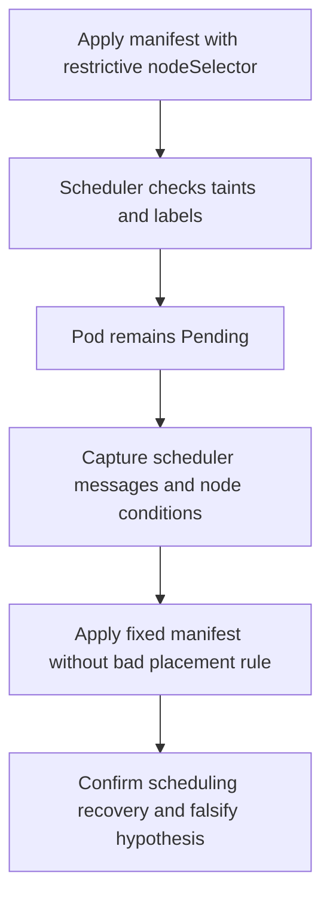

---
content_sources:
  diagrams:
    - id: fault-lab-05-node-pressure-scheduling
      type: flowchart
      source: self-generated
      justification: Synthesized lab flow based on AKS node and scheduler troubleshooting guidance.
      based_on:
        - https://learn.microsoft.com/en-us/troubleshoot/azure/azure-kubernetes/welcome-azure-kubernetes
        - https://learn.microsoft.com/en-us/azure/aks/use-system-pools
        - https://learn.microsoft.com/en-us/azure/aks/operator-best-practices-scheduler
---

# Fault Lab 05: Node Pressure and Scheduling Boundaries

Use this falsification lab to prove that a pod is unschedulable because of node-pool placement rules and taints, not because the node is `NotReady` or the image is broken.

## Lab Metadata

| Field | Value |
|---|---|
| Difficulty | Intermediate |
| Estimated duration | 20-30 minutes |
| Lab tier | AKS node and scheduling falsification lab |
| Failure class | Scheduler constraint / taint mismatch |
| Namespace | `workload` |
| Companion assets | `labs/node-pressure-scheduling/` |
| Paired playbook | [Node Not Ready](../../troubleshooting/playbooks/node-issues/node-not-ready.md) |

## 1) Background

AKS system pools are commonly tainted to reserve them for critical add-ons. This lab intentionally forces the sample app toward a system-pool scheduling boundary so you can distinguish node-health evidence from scheduler-constraint evidence.

<!-- diagram-id: fault-lab-05-node-pressure-scheduling -->


## 2) Hypothesis

If the workload is forced onto nodes that do not tolerate or satisfy the target pool constraints, then the pod will remain `Pending`, and scheduler events will cite node selector or taint mismatch rather than node `NotReady` conditions.

## 3) Runbook

1. Build and push the Python sample image, then export `IMAGE_REPOSITORY`.
2. Trigger the broken scheduling scenario:

    ```bash
    ./labs/node-pressure-scheduling/trigger-scenario.sh
    ```

3. Capture the pending state before remediation:

    ```bash
    ./labs/node-pressure-scheduling/verify.sh
    ```

4. Apply the fixed manifest:

    ```bash
    ./labs/node-pressure-scheduling/trigger-fix.sh
    ```

5. Re-run verification and compare scheduler messages with post-fix pod placement.

## 4) Experiment Log

This log stays blank until you execute the lab for real.

| Timestamp (UTC) | Action | Expected observation | Actual observation |
|---|---|---|---|
| _fill after real run_ | Apply broken manifest | Pod stays `Pending` with scheduler warnings | _fill after real run_ |
| _fill after real run_ | Capture evidence | Nodes remain `Ready`, disproving node failure | _fill after real run_ |
| _fill after real run_ | Apply fixed manifest | Pod schedules successfully | _fill after real run_ |

## Expected Evidence

- `kubectl describe pod` shows taint or selector mismatch messages instead of image or crash-loop errors.
- `kubectl get nodes` and `kubectl describe node` show the nodes are still `Ready`, helping disprove a node-health incident.
- After the fixed manifest removes the bad placement rule, the same image schedules successfully.
- **Falsification-after-fix:** if the pod still does not schedule after removing the placement mismatch, the original hypothesis is false or incomplete, and you should investigate capacity pressure, autoscaler limits, or real node degradation.

## Clean Up

```bash
./labs/node-pressure-scheduling/cleanup.sh
```

## Related Playbook

- [Node Not Ready](../../troubleshooting/playbooks/node-issues/node-not-ready.md)

## See Also

- [Evidence Packs](../../troubleshooting/evidence-packs/index.md)
- [Node Pools](../../platform/node-pools.md)
- [Node Pool Operations](../../operations/node-pool-operations.md)

## Sources

- [Troubleshoot AKS clusters](https://learn.microsoft.com/en-us/troubleshoot/azure/azure-kubernetes/welcome-azure-kubernetes)
- [System node pools in AKS](https://learn.microsoft.com/en-us/azure/aks/use-system-pools)
- [Scheduler best practices for AKS](https://learn.microsoft.com/en-us/azure/aks/operator-best-practices-scheduler)
