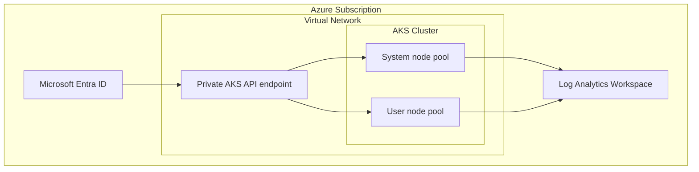

---
content_sources:
  diagrams:
  - id: tutorials-lab-guides-lab-01-aks-cluster-deployment
    type: flowchart
    source: mslearn-adapted
    mslearn_url: https://learn.microsoft.com/en-us/azure/aks/learn/quick-kubernetes-deploy-cli
    based_on:
    - https://learn.microsoft.com/en-us/azure/aks/learn/quick-kubernetes-deploy-cli
    - https://learn.microsoft.com/en-us/azure/aks/concepts-network
    - https://learn.microsoft.com/en-us/azure/aks/csi-secrets-store-driver
    - https://learn.microsoft.com/en-us/azure/governance/policy/concepts/policy-for-kubernetes
    - https://learn.microsoft.com/en-us/azure/azure-monitor/containers/container-insights-overview
---


# Lab 01: AKS Cluster Deployment

This lab walks through a production-oriented AKS deployment using a private cluster, Azure CNI Overlay, Microsoft Entra integration, and Container Insights. The goal is to create a repeatable cluster baseline rather than a throwaway demo.

## Prerequisites

- Azure subscription with permission to create AKS, networking, and monitoring resources
- Azure CLI, `kubectl`, and a shell environment capable of exporting variables
- Existing or planned variable set for `$RG`, `$CLUSTER_NAME`, `$LOCATION`, and any lab-specific names
- A Log Analytics workspace resource ID stored in `$WORKSPACE_ID` for Container Insights validation
- Awareness that all commands use long flags only so they are easy to read and automate later

## Architecture Diagram

<!-- diagram-id: tutorials-lab-guides-lab-01-aks-cluster-deployment -->


## Step-by-Step Instructions

### Step 1: Create resource group and workspace

```bash
az group create \
    --name "$RG" \
    --location "$LOCATION"

az monitor log-analytics workspace create \
    --resource-group "$RG" \
    --workspace-name "$WORKSPACE_NAME" \
    --location "$LOCATION"
```

This step is important because it establishes the control point for **create resource group and workspace**. After running it, pause and verify the Azure resource state before moving on so you do not compound errors later in the lab.

### Step 2: Create virtual network and subnet

```bash
az network vnet create \
    --resource-group "$RG" \
    --name "$VNET_NAME" \
    --address-prefixes 10.40.0.0/16 \
    --subnet-name "$AKS_SUBNET_NAME" \
    --subnet-prefixes 10.40.0.0/22
```

This step is important because it establishes the control point for **create virtual network and subnet**. After running it, pause and verify the Azure resource state before moving on so you do not compound errors later in the lab.

### Step 3: Deploy the private AKS cluster

```bash
az aks create \
    --resource-group "$RG" \
    --name "$CLUSTER_NAME" \
    --location "$LOCATION" \
    --enable-private-cluster \
    --network-plugin azure \
    --network-plugin-mode overlay \
    --vnet-subnet-id "$AKS_SUBNET_ID" \
    --nodepool-name system \
    --node-count 3 \
    --node-vm-size Standard_D4s_v5 \
    --enable-cluster-autoscaler \
    --min-count 3 \
    --max-count 6 \
    --enable-managed-identity \
    --enable-aad \
    --enable-azure-rbac \
    --enable-oidc-issuer \
    --enable-workload-identity \
    --workspace-resource-id "$WORKSPACE_ID"
```

This step is important because it establishes the control point for **deploy the private aks cluster**. After running it, pause and verify the Azure resource state before moving on so you do not compound errors later in the lab.

### Step 4: Fetch credentials and inspect the cluster

```bash
az aks get-credentials \
    --resource-group "$RG" \
    --name "$CLUSTER_NAME" \
    --overwrite-existing

kubectl get nodes \
    --output wide
```

This step is important because it establishes the control point for **fetch credentials and inspect the cluster**. After running it, pause and verify the Azure resource state before moving on so you do not compound errors later in the lab.

### Step 5: Add a user node pool and labels

```bash
az aks nodepool add \
    --resource-group "$RG" \
    --cluster-name "$CLUSTER_NAME" \
    --name apps \
    --mode User \
    --node-vm-size Standard_D8s_v5 \
    --node-count 2 \
    --enable-cluster-autoscaler \
    --min-count 2 \
    --max-count 10 \
    --labels workload=app environment=lab
```

This step is important because it establishes the control point for **add a user node pool and labels**. After running it, pause and verify the Azure resource state before moving on so you do not compound errors later in the lab.

## Validation Steps

Use the following validation flow after the deployment steps complete:

- Confirm the AKS cluster and all required node pools are visible with `kubectl get nodes --output wide`.
- Confirm the Azure resource provisioning state is `Succeeded` for any new network, gateway, identity, or policy resource.
- Run at least one Container Insights query to prove telemetry is flowing before you declare the lab complete.
- Capture screenshots or exported JSON only after sanitizing identifiers such as subscription IDs or object IDs.

Example validation commands:

```bash
kubectl get pods \
    --all-namespaces \
    --output wide
```

```bash
az aks show \
    --resource-group "$RG" \
    --name "$CLUSTER_NAME" \
    --query "{name:name,provisioningState:provisioningState,kubernetesVersion:kubernetesVersion}" \
    --output json
```

```bash
az monitor log-analytics query \
    --workspace "$WORKSPACE_ID" \
    --analytics-query "KubeNodeInventory | where TimeGenerated > ago(15m) | summarize Nodes=dcount(Computer) by ClusterName" \
    --timespan "PT15M"
```

## Cleanup Instructions

Delete lab resources when you are finished to avoid unnecessary spend. If the lab created shared resources that other exercises still need, remove only the lab-specific objects first.

```bash
az group delete \
    --name "$RG" \
    --yes \
    --no-wait
```

If you created secondary resource groups, Application Gateway, or user-assigned identities, delete those resources as part of the same cleanup workflow or document why they remain.

## See Also

- [Production Baseline](../../best-practices/production-baseline.md)
- [Node Pools](../../platform/node-pools.md)

## Sources

- [Azure / Aks / Learn / Quick Kubernetes Deploy Cli](https://learn.microsoft.com/azure/aks/learn/quick-kubernetes-deploy-cli)
- [Azure / Aks / Concepts Network](https://learn.microsoft.com/azure/aks/concepts-network)
- [Azure / Aks / Csi Secrets Store Driver](https://learn.microsoft.com/azure/aks/csi-secrets-store-driver)
- [Azure / Governance / Policy / Concepts / Policy For Kubernetes](https://learn.microsoft.com/azure/governance/policy/concepts/policy-for-kubernetes)
- [Azure / Azure Monitor / Containers / Container Insights Overview](https://learn.microsoft.com/azure/azure-monitor/containers/container-insights-overview)
