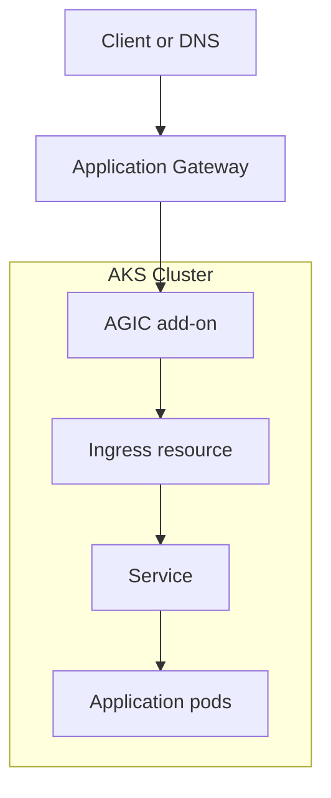

---
content_sources:
  diagrams:
  - id: tutorials-lab-guides-lab-02-application-gateway-ingress
    type: flowchart
    source: mslearn-adapted
    mslearn_url: https://learn.microsoft.com/en-us/azure/aks/learn/quick-kubernetes-deploy-cli
    based_on:
    - https://learn.microsoft.com/en-us/azure/aks/learn/quick-kubernetes-deploy-cli
    - https://learn.microsoft.com/en-us/azure/aks/concepts-network
    - https://learn.microsoft.com/en-us/azure/aks/csi-secrets-store-driver
    - https://learn.microsoft.com/en-us/azure/governance/policy/concepts/policy-for-kubernetes
    - https://learn.microsoft.com/en-us/azure/azure-monitor/containers/container-insights-overview
---


# Tutorial 02: Application Gateway Ingress

This tutorial deploys Application Gateway Ingress Controller (AGIC) for north-south traffic so you can validate listener, backend, TLS, and DNS behavior in a controlled way.

If you are planning a new Azure-managed ingress standard instead of validating an existing AGIC pattern, also review [Application Gateway for Containers](../../platform/application-gateway-for-containers.md) as the newer Azure-managed alternative.

## Prerequisites

- Azure subscription with permission to create AKS, networking, and monitoring resources
- Azure CLI, `kubectl`, and a shell environment capable of exporting variables
- Existing or planned variable set for `$RG`, `$CLUSTER_NAME`, `$LOCATION`, and any lab-specific names
- A Log Analytics workspace resource ID stored in `$WORKSPACE_ID` for Container Insights validation
- Awareness that all commands use long flags only so they are easy to read and automate later

## Architecture Diagram

<!-- diagram-id: tutorials-lab-guides-lab-02-application-gateway-ingress -->


## Step-by-Step Instructions

### Step 1: Create the Application Gateway subnet

```bash
az network vnet subnet create \
    --resource-group "$RG" \
    --vnet-name "$VNET_NAME" \
    --name "$APPGW_SUBNET_NAME" \
    --address-prefixes 10.40.8.0/24
```

| Command | Purpose |
| --- | --- |
| `az network vnet subnet create` | Create the Application Gateway subnet. |
| `--resource-group` | Resource group that contains the virtual network. |
| `--vnet-name` | Name of the virtual network. |
| `--name` | Name of the Application Gateway subnet. |
| `--address-prefixes` | Address range for the subnet. |

This step is important because it establishes the control point for **create the application gateway subnet**. After running it, pause and verify the Azure resource state before moving on so you do not compound errors later in the lab.

### Step 2: Deploy Application Gateway

```bash
az network application-gateway create \
    --resource-group "$RG" \
    --name "$APPGW_NAME" \
    --location "$LOCATION" \
    --vnet-name "$VNET_NAME" \
    --subnet "$APPGW_SUBNET_NAME" \
    --capacity 2 \
    --sku WAF_v2
```

| Command | Purpose |
| --- | --- |
| `az network application-gateway create` | Create the Application Gateway with WAF. |
| `--resource-group` | Resource group that contains the Application Gateway. |
| `--name` | Name of the Application Gateway. |
| `--location` | Azure region for the gateway. |
| `--vnet-name` | Virtual network for the gateway. |
| `--subnet` | Subnet dedicated to the gateway. |
| `--capacity` | Number of gateway instances. |
| `--sku` | Gateway SKU, WAF_v2 for the web application firewall. |

This step is important because it establishes the control point for **deploy application gateway**. After running it, pause and verify the Azure resource state before moving on so you do not compound errors later in the lab.

### Step 3: Enable AGIC on AKS

```bash
az aks enable-addons \
    --resource-group "$RG" \
    --name "$CLUSTER_NAME" \
    --addons ingress-appgw \
    --appgw-id "$APPGW_ID"
```

| Command | Purpose |
| --- | --- |
| `az aks enable-addons` | Enable the Application Gateway ingress controller add-on. |
| `--resource-group` | Resource group that contains the AKS cluster. |
| `--name` | Name of the AKS cluster. |
| `--addons` | Add-on to enable, ingress-appgw. |
| `--appgw-id` | Resource ID of the Application Gateway. |

This step is important because it establishes the control point for **enable agic on aks**. After running it, pause and verify the Azure resource state before moving on so you do not compound errors later in the lab.

### Step 4: Deploy a sample application and ingress

```bash
kubectl apply \
    --filename appgw-namespace.yaml

kubectl apply \
    --filename appgw-deployment.yaml

kubectl apply \
    --filename appgw-service.yaml

kubectl apply \
    --filename appgw-ingress.yaml
```

This step is important because it establishes the control point for **deploy a sample application and ingress**. After running it, pause and verify the Azure resource state before moving on so you do not compound errors later in the lab.

### Step 5: Inspect ingress and gateway health

```bash
kubectl get ingress \
    --all-namespaces \
    --output wide

az network application-gateway show-backend-health \
    --resource-group "$RG" \
    --name "$APPGW_NAME"
```

| Command | Purpose |
| --- | --- |
| `kubectl get ingress` | List Ingress resources across namespaces. |
| `az network application-gateway show-backend-health` | Show backend health of the Application Gateway. |
| `--resource-group` | Resource group that contains the Application Gateway. |
| `--name` | Name of the Application Gateway. |

This step is important because it establishes the control point for **inspect ingress and gateway health**. After running it, pause and verify the Azure resource state before moving on so you do not compound errors later in the lab.

## Validation Steps

Use the following validation flow after the deployment steps complete:

- Confirm the AKS cluster and all required node pools are visible with `kubectl get nodes --output wide`.
- Confirm the Azure resource provisioning state is `Succeeded` for any new network, gateway, identity, or policy resource.
- Run at least one Container Insights query to prove telemetry is flowing before you declare the lab complete.
- Capture screenshots or exported JSON only after sanitizing identifiers such as subscription IDs or object IDs.

Example validation commands:

```bash
kubectl get pods \
    --all-namespaces \
    --output wide
```

```bash
az aks show \
    --resource-group "$RG" \
    --name "$CLUSTER_NAME" \
    --query "{name:name,provisioningState:provisioningState,kubernetesVersion:kubernetesVersion}" \
    --output json
```

| Command | Purpose |
| --- | --- |
| `az aks show` | Show core cluster properties. |
| `--resource-group` | Resource group that contains the AKS cluster. |
| `--name` | Name of the AKS cluster. |
| `--query` | Selects name, provisioning state, and version. |
| `--output` | Output format for the result. |

```bash
az monitor log-analytics query \
    --workspace "$WORKSPACE_ID" \
    --analytics-query "KubeNodeInventory | where TimeGenerated > ago(15m) | summarize Nodes=dcount(Computer) by ClusterName" \
    --timespan "PT15M"
```

| Command | Purpose |
| --- | --- |
| `az monitor log-analytics query` | Query node inventory counts by cluster. |
| `--workspace` | Log Analytics workspace to query. |
| `--analytics-query` | KQL query text to execute. |
| `--timespan` | Time range for the query. |

## Cleanup Instructions

Delete lab resources when you are finished to avoid unnecessary spend. If the lab created shared resources that other exercises still need, remove only the lab-specific objects first.

```bash
az group delete \
    --name "$RG" \
    --yes \
    --no-wait
```

| Command | Purpose |
| --- | --- |
| `az group delete` | Delete the lab resource group and its resources. |
| `--name` | Name of the resource group to delete. |
| `--yes` | Skip the confirmation prompt. |
| `--no-wait` | Return without waiting for deletion to finish. |

If you created secondary resource groups, Application Gateway, or user-assigned identities, delete those resources as part of the same cleanup workflow or document why they remain.

## See Also

- [Networking](../../best-practices/networking.md)
- [Ingress Not Working](../../troubleshooting/playbooks/ingress-not-working.md)

## Sources

- [Azure / Aks / Learn / Quick Kubernetes Deploy Cli](https://learn.microsoft.com/en-us/azure/aks/learn/quick-kubernetes-deploy-cli)
- [Azure / Aks / Concepts Network](https://learn.microsoft.com/en-us/azure/aks/concepts-network)
- [Azure / Aks / Csi Secrets Store Driver](https://learn.microsoft.com/en-us/azure/aks/csi-secrets-store-driver)
- [Azure / Governance / Policy / Concepts / Policy For Kubernetes](https://learn.microsoft.com/en-us/azure/governance/policy/concepts/policy-for-kubernetes)
- [Azure / Azure Monitor / Containers / Container Insights Overview](https://learn.microsoft.com/en-us/azure/azure-monitor/containers/container-insights-overview)
