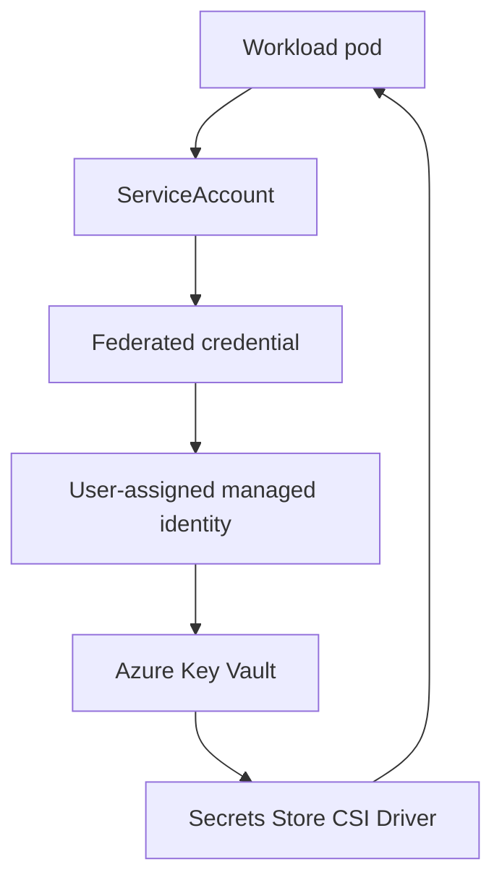

---
content_sources:
  diagrams:
  - id: tutorials-lab-guides-lab-03-azure-key-vault-csi-driver
    type: flowchart
    source: mslearn-adapted
    mslearn_url: https://learn.microsoft.com/en-us/azure/aks/learn/quick-kubernetes-deploy-cli
    based_on:
    - https://learn.microsoft.com/en-us/azure/aks/learn/quick-kubernetes-deploy-cli
    - https://learn.microsoft.com/en-us/azure/aks/concepts-network
    - https://learn.microsoft.com/en-us/azure/aks/csi-secrets-store-driver
    - https://learn.microsoft.com/en-us/azure/governance/policy/concepts/policy-for-kubernetes
    - https://learn.microsoft.com/en-us/azure/azure-monitor/containers/container-insights-overview
---


# Tutorial 03: Azure Key Vault CSI Driver

This tutorial integrates the Azure Key Vault provider for Secrets Store CSI Driver so workloads can mount certificates and secrets without embedding static credentials in Kubernetes manifests.

## Prerequisites

- Azure subscription with permission to create AKS, networking, and monitoring resources
- Azure CLI, `kubectl`, and a shell environment capable of exporting variables
- Existing or planned variable set for `$RG`, `$CLUSTER_NAME`, `$LOCATION`, and any lab-specific names
- A Log Analytics workspace resource ID stored in `$WORKSPACE_ID` for Container Insights validation
- Awareness that all commands use long flags only so they are easy to read and automate later

## Architecture Diagram

<!-- diagram-id: tutorials-lab-guides-lab-03-azure-key-vault-csi-driver -->


## Step-by-Step Instructions

### Step 1: Create Key Vault and a secret

```bash
az keyvault create \
    --resource-group "$RG" \
    --name "$KEYVAULT_NAME" \
    --location "$LOCATION"

az keyvault secret set \
    --vault-name "$KEYVAULT_NAME" \
    --name app-secret \
    --value "demo-value"
```

| Command | Purpose |
| --- | --- |
| `az keyvault create` | Create the Key Vault for the lab. |
| `--resource-group` | Resource group that contains the Key Vault. |
| `--name` | Name of the Key Vault. |
| `--location` | Azure region for the Key Vault. |
| `az keyvault secret set` | Store a demo secret in the Key Vault. |
| `--vault-name` | Key Vault that stores the secret. |
| `--name` | Name of the secret. |
| `--value` | Value of the secret. |

This step is important because it establishes the control point for **create key vault and a secret**. After running it, pause and verify the Azure resource state before moving on so you do not compound errors later in the lab.

### Step 2: Enable the CSI driver add-on

```bash
az aks enable-addons \
    --resource-group "$RG" \
    --name "$CLUSTER_NAME" \
    --addons azure-keyvault-secrets-provider
```

| Command | Purpose |
| --- | --- |
| `az aks enable-addons` | Enable the Azure Key Vault secrets provider add-on. |
| `--resource-group` | Resource group that contains the AKS cluster. |
| `--name` | Name of the AKS cluster. |
| `--addons` | Add-on to enable, the Key Vault secrets provider. |

This step is important because it establishes the control point for **enable the csi driver add-on**. After running it, pause and verify the Azure resource state before moving on so you do not compound errors later in the lab.

### Step 3: Create user-assigned identity and federated credential

```bash
az identity create \
    --resource-group "$RG" \
    --name "$IDENTITY_NAME"

az identity federated-credential create \
    --resource-group "$RG" \
    --identity-name "$IDENTITY_NAME" \
    --name aks-csi-federation \
    --issuer "$OIDC_ISSUER" \
    --subject system:serviceaccount:workload:keyvault-reader
```

| Command | Purpose |
| --- | --- |
| `az identity create` | Create the user-assigned managed identity. |
| `--resource-group` | Resource group that contains the identity. |
| `--name` | Name of the managed identity. |
| `az identity federated-credential create` | Federate the identity with the service account. |
| `--resource-group` | Resource group that contains the identity. |
| `--identity-name` | Managed identity to federate. |
| `--name` | Name of the federated credential. |
| `--issuer` | OIDC issuer URL of the cluster. |
| `--subject` | Kubernetes service account subject to trust. |

This step is important because it establishes the control point for **create user-assigned identity and federated credential**. After running it, pause and verify the Azure resource state before moving on so you do not compound errors later in the lab.

### Step 4: Grant Key Vault access and apply manifests

```bash
az role assignment create \
    --assignee-object-id "$IDENTITY_PRINCIPAL_ID" \
    --assignee-principal-type ServicePrincipal \
    --role "Key Vault Secrets User" \
    --scope "$KEYVAULT_ID"

kubectl apply \
    --filename keyvault-serviceaccount.yaml

kubectl apply \
    --filename secretproviderclass.yaml

kubectl apply \
    --filename keyvault-pod.yaml
```

| Command | Purpose |
| --- | --- |
| `az role assignment create` | Grant the identity access to Key Vault secrets. |
| `--assignee-object-id` | Object ID of the identity to grant. |
| `--assignee-principal-type` | Principal type of the assignee. |
| `--role` | Role to assign. |
| `--scope` | Resource scope the role applies to. |
| `kubectl apply` | Apply the workload manifests to the cluster. |

This step is important because it establishes the control point for **grant key vault access and apply manifests**. After running it, pause and verify the Azure resource state before moving on so you do not compound errors later in the lab.

### Step 5: Verify mounted secret content

```bash
kubectl exec \
    --namespace workload \
    --stdin \
    --tty keyvault-reader \
    -- cat /mnt/secrets-store/app-secret
```

This step is important because it establishes the control point for **verify mounted secret content**. After running it, pause and verify the Azure resource state before moving on so you do not compound errors later in the lab.

## Validation Steps

Use the following validation flow after the deployment steps complete:

- Confirm the AKS cluster and all required node pools are visible with `kubectl get nodes --output wide`.
- Confirm the Azure resource provisioning state is `Succeeded` for any new network, gateway, identity, or policy resource.
- Run at least one Container Insights query to prove telemetry is flowing before you declare the lab complete.
- Capture screenshots or exported JSON only after sanitizing identifiers such as subscription IDs or object IDs.

Example validation commands:

```bash
kubectl get pods \
    --all-namespaces \
    --output wide
```

```bash
az aks show \
    --resource-group "$RG" \
    --name "$CLUSTER_NAME" \
    --query "{name:name,provisioningState:provisioningState,kubernetesVersion:kubernetesVersion}" \
    --output json
```

| Command | Purpose |
| --- | --- |
| `az aks show` | Show core cluster properties. |
| `--resource-group` | Resource group that contains the AKS cluster. |
| `--name` | Name of the AKS cluster. |
| `--query` | Selects name, provisioning state, and version. |
| `--output` | Output format for the result. |

```bash
az monitor log-analytics query \
    --workspace "$WORKSPACE_ID" \
    --analytics-query "KubeNodeInventory | where TimeGenerated > ago(15m) | summarize Nodes=dcount(Computer) by ClusterName" \
    --timespan "PT15M"
```

| Command | Purpose |
| --- | --- |
| `az monitor log-analytics query` | Query node inventory counts by cluster. |
| `--workspace` | Log Analytics workspace to query. |
| `--analytics-query` | KQL query text to execute. |
| `--timespan` | Time range for the query. |

## Cleanup Instructions

Delete lab resources when you are finished to avoid unnecessary spend. If the lab created shared resources that other exercises still need, remove only the lab-specific objects first.

```bash
az group delete \
    --name "$RG" \
    --yes \
    --no-wait
```

| Command | Purpose |
| --- | --- |
| `az group delete` | Delete the lab resource group and its resources. |
| `--name` | Name of the resource group to delete. |
| `--yes` | Skip the confirmation prompt. |
| `--no-wait` | Return without waiting for deletion to finish. |

If you created secondary resource groups, Application Gateway, or user-assigned identities, delete those resources as part of the same cleanup workflow or document why they remain.

## See Also

- [Security](../../best-practices/security.md)
- [Identity and Secrets](../../platform/identity-and-secrets.md)

## Sources

- [Azure / Aks / Learn / Quick Kubernetes Deploy Cli](https://learn.microsoft.com/azure/aks/learn/quick-kubernetes-deploy-cli)
- [Azure / Aks / Concepts Network](https://learn.microsoft.com/azure/aks/concepts-network)
- [Azure / Aks / Csi Secrets Store Driver](https://learn.microsoft.com/azure/aks/csi-secrets-store-driver)
- [Azure / Governance / Policy / Concepts / Policy For Kubernetes](https://learn.microsoft.com/azure/governance/policy/concepts/policy-for-kubernetes)
- [Azure / Azure Monitor / Containers / Container Insights Overview](https://learn.microsoft.com/azure/azure-monitor/containers/container-insights-overview)
