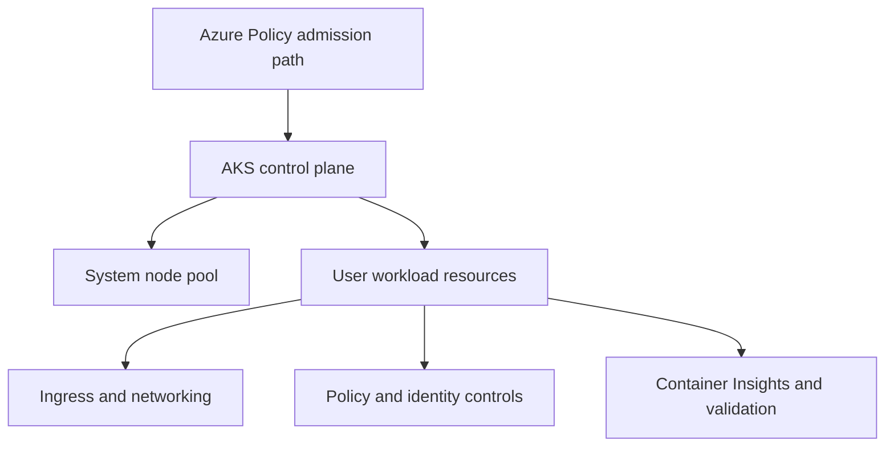

---
hide:
  - toc
---

# Lab 04: Azure Policy for AKS

This lab enables Azure Policy for Kubernetes and validates how policy guardrails can enforce baseline controls such as allowed images, label requirements, and restricted pod settings.

## Prerequisites

- Azure subscription with permission to create AKS, networking, and monitoring resources
- Azure CLI, `kubectl`, and a shell environment capable of exporting variables
- Existing or planned variable set for `$RG`, `$CLUSTER_NAME`, `$LOCATION`, and any lab-specific names
- A Log Analytics workspace resource ID stored in `$WORKSPACE_ID` for Container Insights validation
- Awareness that all commands use long flags only so they are easy to read and automate later

## Architecture Diagram



## Step-by-Step Instructions

### Step 1: Enable Azure Policy add-on

```bash
az aks enable-addons \
    --resource-group "$RG" \
    --name "$CLUSTER_NAME" \
    --addons azure-policy
```

This step is important because it establishes the control point for **enable azure policy add-on**. After running it, pause and verify the Azure resource state before moving on so you do not compound errors later in the lab.

### Step 2: Assign a built-in AKS policy initiative

```bash
az policy assignment create \
    --name aks-baseline-lab \
    --scope "$CLUSTER_ID" \
    --policy-set-definition "/providers/Microsoft.Authorization/policySetDefinitions/<policy-set-id>"
```

This step is important because it establishes the control point for **assign a built-in aks policy initiative**. After running it, pause and verify the Azure resource state before moving on so you do not compound errors later in the lab.

### Step 3: Create a test namespace and non-compliant manifest

```bash
kubectl create namespace governance-lab

kubectl apply \
    --filename privileged-pod.yaml
```

This step is important because it establishes the control point for **create a test namespace and non-compliant manifest**. After running it, pause and verify the Azure resource state before moving on so you do not compound errors later in the lab.

### Step 4: Review policy states and violations

```bash
az policy state list \
    --resource "$CLUSTER_ID" \
    --query "[].{policyDefinitionName:policyDefinitionName,complianceState:complianceState}" \
    --output table

kubectl get constrainttemplates \
    --output wide
```

This step is important because it establishes the control point for **review policy states and violations**. After running it, pause and verify the Azure resource state before moving on so you do not compound errors later in the lab.

### Step 5: Correct the manifest and redeploy

```bash
kubectl apply \
    --filename compliant-pod.yaml
```

This step is important because it establishes the control point for **correct the manifest and redeploy**. After running it, pause and verify the Azure resource state before moving on so you do not compound errors later in the lab.

## Validation Steps

Use the following validation flow after the deployment steps complete:

- Confirm the AKS cluster and all required node pools are visible with `kubectl get nodes --output wide`.
- Confirm the Azure resource provisioning state is `Succeeded` for any new network, gateway, identity, or policy resource.
- Run at least one Container Insights query to prove telemetry is flowing before you declare the lab complete.
- Capture screenshots or exported JSON only after sanitizing identifiers such as subscription IDs or object IDs.

Example validation commands:

```bash
kubectl get pods \
    --all-namespaces \
    --output wide
```

```bash
az aks show \
    --resource-group "$RG" \
    --name "$CLUSTER_NAME" \
    --query "{name:name,provisioningState:provisioningState,kubernetesVersion:kubernetesVersion}" \
    --output json
```

```bash
az monitor log-analytics query \
    --workspace "$WORKSPACE_ID" \
    --analytics-query "KubeNodeInventory | where TimeGenerated > ago(15m) | summarize Nodes=dcount(Computer) by ClusterName" \
    --timespan "PT15M"
```

## Cleanup Instructions

Delete lab resources when you are finished to avoid unnecessary spend. If the lab created shared resources that other exercises still need, remove only the lab-specific objects first.

```bash
az group delete \
    --name "$RG" \
    --yes \
    --no-wait
```

If you created secondary resource groups, Application Gateway, or user-assigned identities, delete those resources as part of the same cleanup workflow or document why they remain.

## See Also

- [Resource Governance](../../best-practices/resource-governance.md)
- [Common Anti-Patterns](../../best-practices/common-anti-patterns.md)

## Sources

- [Azure / Aks / Learn / Quick Kubernetes Deploy Cli](https://learn.microsoft.com/azure/aks/learn/quick-kubernetes-deploy-cli)
- [Azure / Aks / Concepts Network](https://learn.microsoft.com/azure/aks/concepts-network)
- [Azure / Aks / Csi Secrets Store Driver](https://learn.microsoft.com/azure/aks/csi-secrets-store-driver)
- [Azure / Governance / Policy / Concepts / Policy For Kubernetes](https://learn.microsoft.com/azure/governance/policy/concepts/policy-for-kubernetes)
- [Azure / Azure Monitor / Containers / Container Insights Overview](https://learn.microsoft.com/azure/azure-monitor/containers/container-insights-overview)
