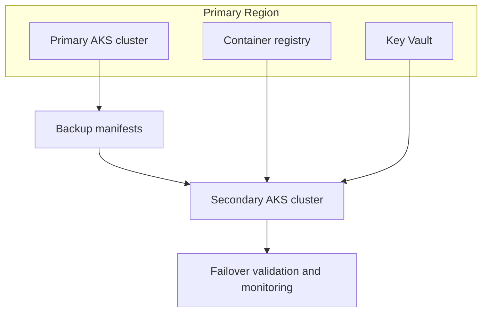

---
content_sources:
  diagrams:
  - id: tutorials-lab-guides-lab-05-aks-disaster-recovery
    type: flowchart
    source: mslearn-adapted
    mslearn_url: https://learn.microsoft.com/en-us/azure/aks/learn/quick-kubernetes-deploy-cli
    based_on:
    - https://learn.microsoft.com/en-us/azure/aks/learn/quick-kubernetes-deploy-cli
    - https://learn.microsoft.com/en-us/azure/aks/concepts-network
    - https://learn.microsoft.com/en-us/azure/aks/csi-secrets-store-driver
    - https://learn.microsoft.com/en-us/azure/governance/policy/concepts/policy-for-kubernetes
    - https://learn.microsoft.com/en-us/azure/azure-monitor/containers/container-insights-overview
---


# Lab 05: AKS Disaster Recovery

This lab simulates AKS disaster recovery planning by backing up cluster configuration, validating cross-region image and secret readiness, and rehearsing failover to a secondary cluster.

## Prerequisites

- Azure subscription with permission to create AKS, networking, and monitoring resources
- Azure CLI, `kubectl`, and a shell environment capable of exporting variables
- Existing or planned variable set for `$RG`, `$CLUSTER_NAME`, `$LOCATION`, and any lab-specific names
- A Log Analytics workspace resource ID stored in `$WORKSPACE_ID` for Container Insights validation
- Awareness that all commands use long flags only so they are easy to read and automate later

## Architecture Diagram

<!-- diagram-id: tutorials-lab-guides-lab-05-aks-disaster-recovery -->


## Step-by-Step Instructions

### Step 1: Deploy a secondary resource group and cluster

```bash
az group create \
    --name "$DR_RG" \
    --location "$DR_LOCATION"

az aks create \
    --resource-group "$DR_RG" \
    --name "$DR_CLUSTER_NAME" \
    --location "$DR_LOCATION" \
    --network-plugin azure \
    --network-plugin-mode overlay \
    --nodepool-name system \
    --node-count 3 \
    --enable-managed-identity \
    --enable-aad \
    --enable-azure-rbac
```

This step is important because it establishes the control point for **deploy a secondary resource group and cluster**. After running it, pause and verify the Azure resource state before moving on so you do not compound errors later in the lab.

### Step 2: Export manifests and backup cluster objects

```bash
kubectl get namespace \
    --output yaml > namespaces-backup.yaml

kubectl get deployment \
    --all-namespaces \
    --output yaml > deployments-backup.yaml

kubectl get ingress \
    --all-namespaces \
    --output yaml > ingress-backup.yaml
```

This step is important because it establishes the control point for **export manifests and backup cluster objects**. After running it, pause and verify the Azure resource state before moving on so you do not compound errors later in the lab.

### Step 3: Replicate container images and secret references

```bash
az acr import \
    --name "$DR_ACR_NAME" \
    --source "$PRIMARY_ACR_LOGIN_SERVER/app:v1" \
    --image app:v1

az keyvault secret backup \
    --vault-name "$KEYVAULT_NAME" \
    --name app-secret \
    --file app-secret-backup.bin
```

This step is important because it establishes the control point for **replicate container images and secret references**. After running it, pause and verify the Azure resource state before moving on so you do not compound errors later in the lab.

### Step 4: Restore workloads to the secondary cluster

```bash
az aks get-credentials \
    --resource-group "$DR_RG" \
    --name "$DR_CLUSTER_NAME" \
    --overwrite-existing

kubectl apply \
    --filename namespaces-backup.yaml

kubectl apply \
    --filename deployments-backup.yaml

kubectl apply \
    --filename ingress-backup.yaml
```

This step is important because it establishes the control point for **restore workloads to the secondary cluster**. After running it, pause and verify the Azure resource state before moving on so you do not compound errors later in the lab.

### Step 5: Validate failover and monitoring

```bash
kubectl get pods \
    --all-namespaces \
    --output wide

az monitor log-analytics query \
    --workspace "$WORKSPACE_ID" \
    --analytics-query "KubeNodeInventory | where TimeGenerated > ago(15m) | summarize Nodes=dcount(Computer) by ClusterName" \
    --timespan "PT15M"
```

This step is important because it establishes the control point for **validate failover and monitoring**. After running it, pause and verify the Azure resource state before moving on so you do not compound errors later in the lab.

## Validation Steps

Use the following validation flow after the deployment steps complete:

- Confirm the AKS cluster and all required node pools are visible with `kubectl get nodes --output wide`.
- Confirm the Azure resource provisioning state is `Succeeded` for any new network, gateway, identity, or policy resource.
- Run at least one Container Insights query to prove telemetry is flowing before you declare the lab complete.
- Capture screenshots or exported JSON only after sanitizing identifiers such as subscription IDs or object IDs.

Example validation commands:

```bash
kubectl get pods \
    --all-namespaces \
    --output wide
```

```bash
az aks show \
    --resource-group "$RG" \
    --name "$CLUSTER_NAME" \
    --query "{name:name,provisioningState:provisioningState,kubernetesVersion:kubernetesVersion}" \
    --output json
```

```bash
az monitor log-analytics query \
    --workspace "$WORKSPACE_ID" \
    --analytics-query "KubeNodeInventory | where TimeGenerated > ago(15m) | summarize Nodes=dcount(Computer) by ClusterName" \
    --timespan "PT15M"
```

## Cleanup Instructions

Delete lab resources when you are finished to avoid unnecessary spend. If the lab created shared resources that other exercises still need, remove only the lab-specific objects first.

```bash
az group delete \
    --name "$RG" \
    --yes \
    --no-wait
```

If you created secondary resource groups, Application Gateway, or user-assigned identities, delete those resources as part of the same cleanup workflow or document why they remain.

## See Also

- [Reliability](../../best-practices/reliability.md)
- [Upgrades](../../operations/upgrades.md)

## Sources

- [Azure / Aks / Learn / Quick Kubernetes Deploy Cli](https://learn.microsoft.com/azure/aks/learn/quick-kubernetes-deploy-cli)
- [Azure / Aks / Concepts Network](https://learn.microsoft.com/azure/aks/concepts-network)
- [Azure / Aks / Csi Secrets Store Driver](https://learn.microsoft.com/azure/aks/csi-secrets-store-driver)
- [Azure / Governance / Policy / Concepts / Policy For Kubernetes](https://learn.microsoft.com/azure/governance/policy/concepts/policy-for-kubernetes)
- [Azure / Azure Monitor / Containers / Container Insights Overview](https://learn.microsoft.com/azure/azure-monitor/containers/container-insights-overview)
