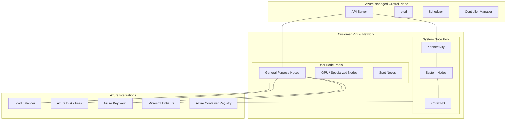

---
content_sources:
  diagrams:
  - id: visualization-architecture-map
    type: flowchart
    source: self-generated
    justification: Synthesized AKS architecture overview combining control plane, node pools, and core Azure integrations.
    based_on:
    - https://learn.microsoft.com/en-us/azure/aks/concepts-clusters-workloads
    - https://learn.microsoft.com/en-us/azure/architecture/reference-architectures/containers/aks/secure-baseline-aks
---

# Architecture Map

This map visualizes the relationship between the AKS control plane, various node pool types, and core Azure infrastructure integrations.

## AKS Component Relationships

<!-- diagram-id: visualization-architecture-map -->

## How to Read This Map

- **Control Plane**: Fully managed by Azure; you interact with it via the API Server.
- **Node Pools**: Separated into System (for cluster-critical services) and User (for your applications) pools.
- **Integrations**: Standard Azure services that provide identity, storage, networking, and image hosting.

## Where to Go Deeper

- [Cluster Architecture](../platform/cluster-architecture.md)
- [Node Pools](../platform/node-pools.md)
- [Identity and Secrets](../platform/identity-and-secrets.md)

## See Also

- [Platform Overview](../platform/index.md)
- [Production Baseline](../best-practices/production-baseline.md)

## Sources

- [AKS core concepts](https://learn.microsoft.com/en-us/azure/aks/concepts-clusters-workloads)
- [Azure Kubernetes Service (AKS) baseline architecture](https://learn.microsoft.com/en-us/azure/architecture/reference-architectures/containers/aks/secure-baseline-aks)
