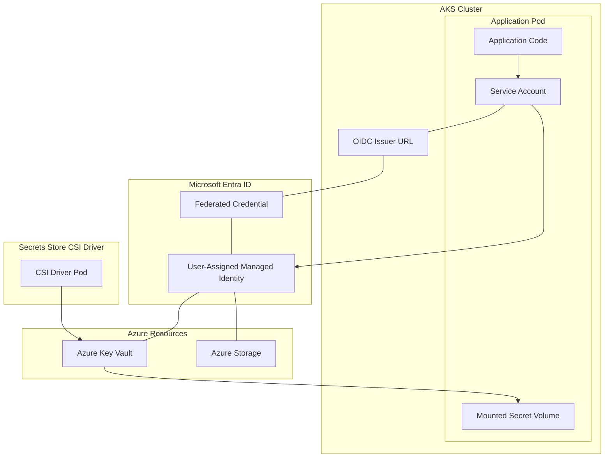

---
content_sources:
  diagrams:
  - id: visualization-identity-map
    type: flowchart
    source: self-generated
    justification: Map of Microsoft Entra Workload Identity components and their relationship to Azure Key Vault.
    based_on:
    - https://learn.microsoft.com/en-us/azure/aks/workload-identity-overview
    - https://learn.microsoft.com/en-us/azure/aks/csi-secrets-store-driver
    - https://learn.microsoft.com/en-us/azure/aks/workload-identity-deploy-cluster
---

# Identity Map

Microsoft Entra Workload Identity allows Kubernetes workloads to authenticate with Azure services using managed identities, removing the need for static secrets.

## Workload Identity and Secret Access Flow

<!-- diagram-id: visualization-identity-map -->

## How to Read This Map

- **Workload Identity Flow**: The Pod uses a Service Account which is linked to a User-Assigned Managed Identity (UAMI) via a Federated Credential. Entra ID trusts the AKS OIDC Issuer to validate the Pod's identity.
- **Secret Access Flow**: The Secrets Store CSI Driver uses the managed identity to fetch secrets from Azure Key Vault and mounts them as a volume into the Application Pod.
- **Application Code**: The app can use the Azure SDK (e.g., Python's `DefaultAzureCredential`) to interact directly with Azure resources using this identity.

## Where to Go Deeper

- [Identity and Secrets](../platform/identity-and-secrets.md)
- [Best Practices: Security](../best-practices/security.md)
- [Tutorial: Azure Key Vault CSI Driver](../tutorials/lab-guides/lab-03-azure-key-vault-csi-driver.md)

## See Also

- [Credential Rotation](../operations/credential-rotation.md)
- [Image Pull Failure](../troubleshooting/playbooks/pod-issues/image-pull-failure.md)

## Sources

- [Workload Identity overview](https://learn.microsoft.com/en-us/azure/aks/workload-identity-overview)
- [Secrets Store CSI Driver in AKS](https://learn.microsoft.com/en-us/azure/aks/csi-secrets-store-driver)
- [Deploy Workload Identity](https://learn.microsoft.com/en-us/azure/aks/workload-identity-deploy-cluster)
