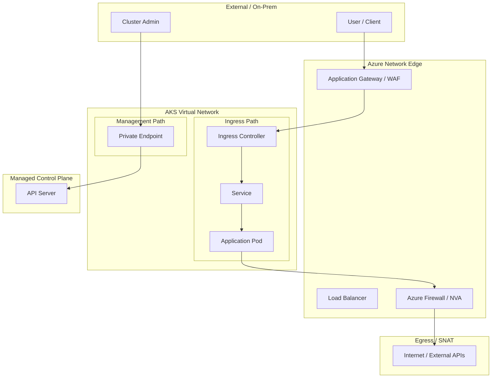

---
content_sources:
  diagrams:
  - id: visualization-networking-path-map
    type: flowchart
    source: self-generated
    justification: Map of common AKS traffic paths including ingress, egress, and private management.
    based_on:
    - https://learn.microsoft.com/en-us/azure/aks/concepts-network
    - https://learn.microsoft.com/en-us/azure/aks/private-clusters
    - https://learn.microsoft.com/en-us/azure/aks/egress-outboundtype
---

# Networking Path Map

Understanding the flow of traffic through an AKS cluster is critical for configuring security rules and troubleshooting connectivity.

## Traffic Flow Paths

<!-- diagram-id: visualization-networking-path-map -->

## How to Read This Map

- **Ingress Path**: External traffic flows through a Load Balancer or Application Gateway, hits the Ingress Controller (like AGIC or Nginx), and is routed to the Pod via a Service.
- **Management Path**: In a private cluster, the API Server is accessed via a Private Endpoint within the VNet.
- **Egress Path**: Outbound traffic from Pods typically flows through a Firewall or NAT Gateway for controlled internet access.

## Where to Go Deeper

- [Networking Models](../platform/networking-models.md)
- [Ingress and Load Balancing](../platform/ingress-load-balancing.md)
- [Best Practices: Networking](../best-practices/networking.md)

## See Also

- [Troubleshooting Connectivity](../troubleshooting/first-10-minutes/connectivity.md)
- [CNI IP Exhaustion](../troubleshooting/playbooks/node-issues/cni-ip-exhaustion.md)

## Sources

- [AKS network concepts](https://learn.microsoft.com/en-us/azure/aks/concepts-network)
- [Private AKS clusters](https://learn.microsoft.com/en-us/azure/aks/private-clusters)
- [Control outbound traffic in AKS](https://learn.microsoft.com/en-us/azure/aks/egress-outboundtype)
