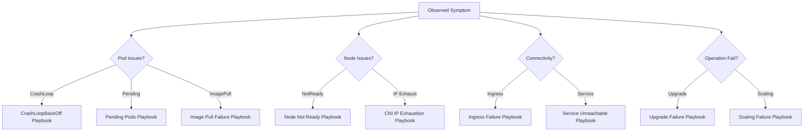

---
content_sources:
  diagrams:
  - id: visualization-troubleshooting-map
    type: flowchart
    source: self-generated
    justification: Visual routing map to navigate from high-level symptoms to specific troubleshooting playbooks.
    based_on:
    - https://learn.microsoft.com/en-us/troubleshoot/azure/azure-kubernetes/welcome-azure-kubernetes
    - https://learn.microsoft.com/en-us/azure/aks/troubleshooting
---

# Troubleshooting Decision Map

Use this map to quickly route from an observed symptom to the relevant diagnostic playbook.

## Symptom to Playbook Routing

<!-- diagram-id: visualization-troubleshooting-map -->

## How to Read This Map

1. **Identify the category**: Start by classifying your symptom into Pod, Node, Connectivity, or Operation categories.
2. **Refine the symptom**: Follow the path that most closely matches the specific error message or behavior observed.
3. **Jump to the playbook**: Click the node in the diagram or follow the links below to start the step-by-step diagnostic procedure.

## Where to Go Deeper

- [Troubleshooting Decision Tree](../troubleshooting/decision-tree.md)
- [First 10 Minutes: Quick Diagnosis](../troubleshooting/first-10-minutes/index.md)
- [Mental Model for Troubleshooting](../troubleshooting/mental-model.md)

## See Also

- [Diagnostic Commands](../reference/diagnostic-commands.md)
- [CLI Cheatsheet](../reference/cli-cheatsheet.md)

## Sources

- [Troubleshoot AKS clusters](https://learn.microsoft.com/en-us/troubleshoot/azure/azure-kubernetes/welcome-azure-kubernetes)
- [AKS troubleshooting overview](https://learn.microsoft.com/en-us/azure/aks/troubleshooting)
