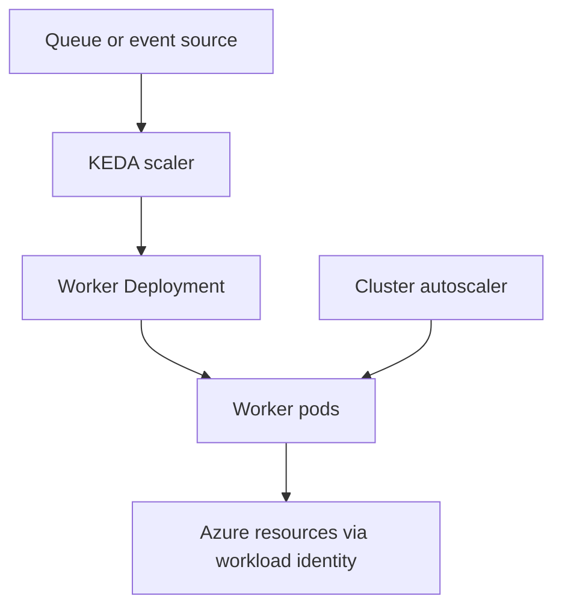

# Background Worker

Use this pattern for asynchronous processing where work is pulled from a queue, event stream, or other backlog rather than served directly over a synchronous request path. The workload shape is defined by decoupled consumption and burst-driven scale behavior, not by a public service endpoint.

## When to Use

- The application processes messages, jobs, or events outside the caller's request path.
- Work arrival is spiky and you want workers to scale based on backlog or event pressure.
- Temporary delay is acceptable as long as the system drains work reliably.
- The workload can run many interchangeable consumers without stable pod identity.

Avoid this shape when each unit of work must run on a strict time schedule, which is a CronJob concern, or when processing depends on stable attached storage per replica.

## Deployment Shape

Most event-driven workers run as a `Deployment` with one or more replicas, even when the scale target eventually reaches zero. KEDA then adjusts the replica count according to an external scaler signal.

<!-- diagram-id: workload-guides-background-worker -->

Recommended shape:

| Component | Role | Guidance |
|---|---|---|
| `Deployment` | Worker replica set | Use interchangeable workers that can process independent work items |
| KEDA scaler | External signal to replicas | Scale on queue length, event backlog, or similar source metrics |
| cluster autoscaler | Node capacity | Adds or removes nodes when worker pods create real scheduling demand |
| Service account | Azure authentication boundary | Bind a workload-specific identity for queue access or downstream Azure calls |

Keep job state outside the pod. A worker should be able to stop and restart without losing the authoritative record of unprocessed work.

## Scaling

KEDA is the primary AKS-native fit for this workload shape because it scales from external event signals rather than only resource metrics.

- Use KEDA when queue depth, lag, or event source pressure is the right scale indicator.
- Use cluster autoscaler alongside KEDA so node capacity can expand when worker replicas increase.
- Define realistic upper bounds so burst handling does not exhaust downstream dependencies.
- Validate the drain model: scale-up speed, message lock duration, retry policy, and graceful termination all interact.

Unlike stateless APIs, more replicas are not always better. Over-scaling workers can intensify downstream throttling, duplicate work retries, or lock contention. Tune the scaler to the end-to-end system, not only to the queue.

## Probes and Health

Background workers usually do not need HTTP edge-style readiness, but they still need health semantics.

- **Readiness probe** should indicate whether the worker can begin consuming work safely.
- **Liveness probe** should restart the worker only when it is stuck rather than merely busy.

Design probes carefully for long-running handlers. A worker that is actively processing a large message can look idle or delayed from the outside. Probe logic that assumes short request-response cycles often causes unnecessary restarts and duplicate processing.

Graceful shutdown matters as much as probes for this pattern. The pod termination window must allow the worker to stop taking new work and either finish or safely abandon in-flight work according to the queue semantics.

## Networking

Many background workers do not need a Kubernetes Service at all because they do not receive direct inbound application traffic.

- Keep the workload private unless there is an explicit administrative or callback requirement.
- Focus network design on egress reachability to the queue or event source and to any downstream dependencies.
- If the worker calls private services inside the cluster, use normal service discovery through `ClusterIP` Services.

Because this shape is egress-oriented, networking failures often present as stalled backlog growth rather than as direct client-visible errors.

## Identity

Use Microsoft Entra Workload Identity for queue access and downstream Azure resource access. This is especially important for workers because they often run unattended and continuously, making static secret sprawl harder to detect and rotate.

Identity guidance for this shape:

- assign a dedicated service account per worker class when authorization differs
- scope Azure roles to the exact queue, storage, or messaging resource needed
- avoid sharing one credential across unrelated consumers simply because they run in the same namespace

Use [Identity and Secrets](../platform/identity-and-secrets.md) for the implementation pattern. When KEDA or the workload cannot authenticate correctly, begin with [Token Exchange Failure](../troubleshooting/playbooks/identity/token-exchange-failure.md).

## Observability

Container Insights provides the cluster and pod context, but worker observability must also include backlog behavior.

Key signals:

| Signal | Why it matters |
|---|---|
| queue depth or lag | shows whether consumers are keeping up |
| replica count over time | confirms KEDA is responding as expected |
| pending pods | reveals whether cluster autoscaler capacity is the bottleneck |
| restart count | indicates crash loops, bad probes, or poison-work handling issues |
| message failure or retry trend | distinguishes transient bursts from unhealthy consumer logic |

For this shape, the most important question is usually not "is the pod running" but "is the backlog draining at the required rate without causing downstream harm".

## Failure Modes

| Symptom | Likely pattern failure | First place to look |
|---|---|---|
| backlog grows while replica count stays flat | KEDA trigger misconfiguration or auth failure | scaler status, workload identity, KEDA events |
| backlog grows and pods stay Pending | cluster autoscaler cannot add capacity fast enough or placement is constrained | pending pod reasons, node pool capacity, autoscaler status |
| workers restart during long tasks | liveness probe or termination handling is too aggressive | probe configuration, restart history, handler duration |
| downstream system throttles or errors spike | worker scale is outrunning dependency limits | scaler bounds, downstream quotas, retry logic |
| duplicate processing increases after rollout | shutdown semantics or message visibility timing is incorrect | termination grace period, queue lock or ack behavior |

## See Also

- [Workload Guides](index.md)
- [Identity and Secrets](../platform/identity-and-secrets.md)
- [Networking Models](../platform/networking-models.md)
- [Operations](../operations/index.md)
- [Security](../best-practices/security.md)
- [KEDA on AKS](../platform/keda-on-aks.md)
- [KEDA Scaler Not Triggering](../troubleshooting/playbooks/scaling/keda-scaler-not-triggering.md)
- [Token Exchange Failure](../troubleshooting/playbooks/identity/token-exchange-failure.md)

## Sources

- https://learn.microsoft.com/en-us/azure/aks/keda-about
- https://learn.microsoft.com/en-us/azure/aks/cluster-autoscaler
- https://learn.microsoft.com/en-us/azure/aks/workload-identity-overview
- https://learn.microsoft.com/en-us/azure/azure-monitor/containers/container-insights-overview
